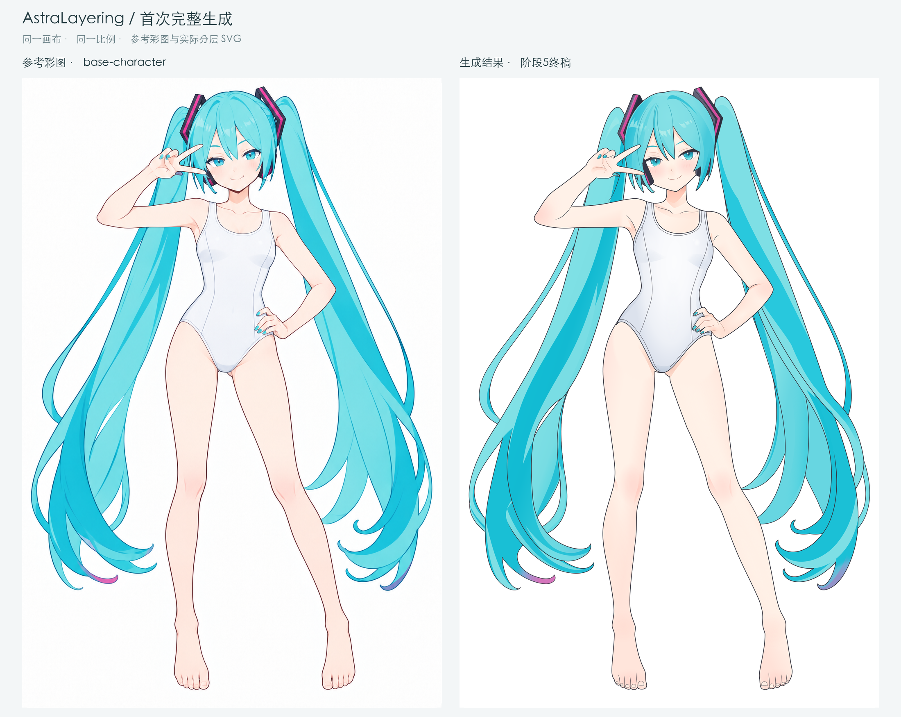
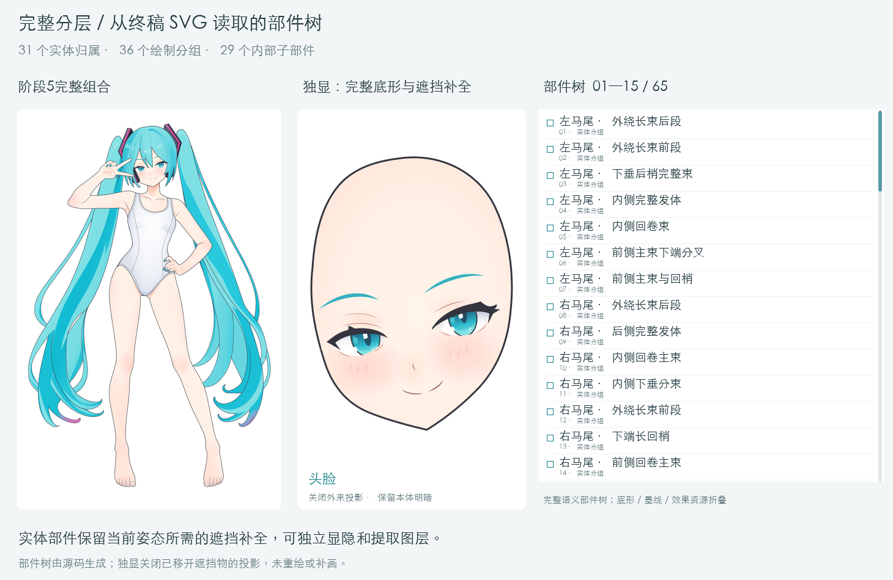

# SVG Layering工作流资料包

调度入口：[svg-layering skill](../SKILL.md)。先按[流程表](../references/流程.md)准备前置0—5，再依次运行主阶段；每个stage／step／review的模型直接标在同目录 `.model` 文件名中。

本目录随skill保存各节点提示词、输入说明、参考素材和工具。使用方法见[项目首页](../../../../readme.md#使用svg-layering)，修改节点资料直接在本目录进行。

**首个完整生成结果已完成。** 基础连体服角色已走通阶段1—5，得到可编辑、具备遮挡补全的完整分层彩图SVG。人物整体形体保持较好；局部线稿、配件构造、虹膜分层和头发颜色仍需改进，按具体误差定位对应阶段。

[开发进度与未来展望](./开发进度.md) · [首例完整展示](../../../../demos/first-complete-case/readme.md) · [终稿SVG](../../../../outputs/case1_miku/step05-base-character/05-2_局部色彩与材质.svg) · [SVG预览器](../../../../loading/svg-preview.html)

最新复测：[miku_v3](../../../../outputs/miku_v3/readme.md)已完成阶段1—5产物，阶段3新五步已实际运行。脸型、头型及包脸关系明显改善；眼睑睫毛、手足线条和头发材质仍有局部差异，见[本轮复核](../../../../analysis/miku-v3-review/readme.md)。本次已将阶段2、阶段3 step2后、阶段4及阶段5 step1的独立审查拆成review入口；由总控调度，worker负责自查与返修，阶段5 step2改为自查。新组织待实际重跑验证，见[总控入口](./orchestrator/readme.md)与[各审查节点的工具](./orchestrator/readme.md#工具与证据)。上一轮[case3_miku_v2](../../../../outputs/case3_miku_v2/readme.md)保留在阶段4。

2026-09-15：阶段2保留原单步绘制，加入线稿参考与叠加校准后，用户反馈头发、发卡改善；局部脸颊仍偏外。[提示词](./2.建立完整部件与遮挡/生成提示词.txt)进一步收紧面部曲线检查与局部返修，新增要求待重跑；已撤回的两步[试验复核](../../../../analysis/stage2-visible-shape-review/2026-09-15_两步复测.md)作为历史记录保留。

## 首次完整结果

左栏为主流程使用的基础角色彩图，右栏为实际阶段5终稿；使用相同画布与比例。点击查看大图，可进一步观察头发的色带、光泽与边缘。

[](../../../../demos/first-complete-case/reference-vs-svg.png)

**每个实体部件均保留完整底形，并补全当前姿态下被其他部件遮挡的区域，可独立显隐、单独提取图层。** 下方展示从实际SVG读取的完整语义部件树，以及移开前景后看到的完整头脸、衣下躯干和发束等独显示例。



[完整部件树静态长图](../../../../demos/first-complete-case/parts-tree-full.png) · [独显示例大图](../../../../demos/first-complete-case/isolated-parts.png)

31个实体归属因前后穿插组织成36个绘制分组，另有29个内部子部件；动图展示全部65个语义节点。底形、墨线、明暗和材质资源保留在所属部件内，不重复计为实体。跨层发束保留同一归属，提取完整部件时需一并保留相关分段。交互查看统一使用现有[svg-preview](../../../../loading/svg-preview.html)。

## 流程总览

```text
参考准备：前置0 → 前置1 → 前置2 → 前置3 → 前置4 → 前置5
          角色简化／服装／基础彩图／色块／线稿／色盘
    ↓
阶段1：确认基础角色与补全范围
    ↓
阶段2：建立完整部件与遮挡 → 独立review／必要返修
    ↓
阶段3：头型与发型 → 面部与表情 → 头部独立review／必要返修
       → 其余主轮廓 → 其余内部结构线 → 全局线条精修与自查
    ↓
阶段4：完整底形与基础填色 → 独立review／必要返修
    ↓
阶段5：大明暗与体积 → 独立review／必要返修 → 局部色彩与材质（自查）
    ↓
首次完整分层彩图（已完成）
    └─ 后续候选：阶段6的最终线色与边缘收尾
```

彩图负责可见造型、实际遮挡和绘画效果，色块图负责可见部件归属。Astra在主流程中构建隐藏区域完整的SVG实体，再逐步加入线条与色彩；阶段6尚未编写正式提示词或执行。

## 前置流程

| 环节 | 输入与用途 | 入口 |
| --- | --- | --- |
| 前置0：人物平涂生成 | 从角色参考准备平涂人物图；检查人物一致性 | [提示词](./前置0.人物平涂生成/提示词.txt) |
| 前置1：贴身服装生成 | 准备独立的基础连体服款式，可复用已有结果 | [提示词](./前置1.贴身服装生成/贴身服装生成prompt.txt)、[可复用结果](./前置1.贴身服装生成/可复用结果.jpg) |
| 前置2：人物服装替换 | 角色图＋服装单品图，生成姿势与身份保持一致的基础角色彩图 | [提示词](./前置2.人物服装替换/生成提示词.txt) |
| 前置3：人物部件色块拆分图 | 基础角色彩图，单轮生成可见部件色块参考 | [提示词](./前置3.人物部件色块拆分图/提示词.txt) |
| 前置4：身形角色线稿 | 同一基础角色彩图，单轮生成白底线稿；辅助阶段2辨认头脸与发束轮廓、阶段3观察线的位置与笔触 | [提示词](./前置4.身形角色线稿/提示词.txt)、[输入输出与试用](./前置4.身形角色线稿/readme.md) |
| 前置5：基础配色色盘 | 基础角色彩图，agent选择区域、程序读取色值，生成阶段4辅助色盘 | [执行提示词](./前置5.基础配色色盘/生成提示词.txt)、[工具与输入输出](./前置5.基础配色色盘/readme.md) |

2026-09-14：前置3已由用户简化为单轮生图，色块归属仍由SVG绘制者结合原彩图判断。前置4线稿已用于旧版阶段3，用户反馈有一定改善；新版阶段3的头部前两轮加入原彩图共同核对。前置5色盘已用于阶段4，用户反馈配色帮助明显。三个辅助前置均直接使用前置2彩图，不串联转换，也不补全隐藏部分。实测范围与遗留问题见[case3记录](../../../../analysis/case3-miku-v2-review/readme.md)。

本次验证的角色参考链路：[原始输入](../../../../outputs/case1_miku/references/original-input.jpg) → [前置0：平涂输出](../../../../outputs/case1_miku/references/flat-color-output.jpg) → [前置2：基础连体服角色](../../../../outputs/case1_miku/references/base-character.png) → [前置3：部件色块图](../../../../outputs/case1_miku/references/part-colors.jpg)。前置1另行提供服装款式；主流程阶段1、阶段2以换装后的基础角色彩图为形状依据。

## 主流程入口与开发状态

| 阶段 | 输入 → 输出 | 当前状态与入口 |
| --- | --- | --- |
| 1. 确定基础角色与补全范围 | 基础角色彩图 → 关键点、补全范围、关键遮挡Markdown | 首例已完成；[提示词](./1.确定基础角色与补全范围/生成提示词.txt) |
| 2. 建立完整部件与遮挡 | 彩图＋色块图＋线稿＋阶段1规划 → 完整分层色块SVG与检查图 | v3已重跑，脸缘外鼓明显收回；[提示词](./2.建立完整部件与遮挡/生成提示词.txt)、[本轮复核](../../../../analysis/miku-v3-review/readme.md) |
| 3. 建立可用线稿 | 前两轮：彩图＋线稿＋上一轮SVG；后三轮：线稿＋上一轮SVG → 五轮线稿SVG与检查图 | v3已完成新五步，头脸改善、局部线质待改进；[总说明](./3.建立可用线稿/readme.md)、[头型发型](./3.建立可用线稿/step1/生成提示词.txt)、[面部表情](./3.建立可用线稿/step2/生成提示词.txt)、[其余轮廓](./3.建立可用线稿/step3/生成提示词.txt)、[其余内部线](./3.建立可用线稿/step4/生成提示词.txt)、[全局精修](./3.建立可用线稿/step5/生成提示词.txt) |
| 4. 完整底形与基础填色 | 前置2彩图＋阶段3终稿，可附前置5色盘 → 分层平涂SVG与检查图 | case3、v3已实测；v3保留了已有头脸几何；[提示词](./4.完整底形与基础填色/生成提示词.txt)、[色盘前置](./前置5.基础配色色盘/readme.md) |
| 5. 大明暗与材质 | 同一彩图＋阶段4平涂 → 两轮彩图SVG与检查图 | case1完成过独立审查；v3两轮产物已生成，终稿注明独立审查不可用；[阶段说明](./5.大明暗与材质/readme.md)、[大明暗与体积](./5.大明暗与材质/step1/生成提示词.txt)、[局部色彩与材质](./5.大明暗与材质/step2/生成提示词.txt) |
| 6. 最终边缘与细节 | 完成彩图 → 线色、边缘与必要焦点整理 | 已评估单轮收尾价值，尚未制定、执行；具体错误按所属阶段处理 |

当前阶段产物和文件位置见[outputs](../../../../outputs/readme.md)，里程碑、已知不足和后续工作统一记录在[开发进度](./开发进度.md)。首次成功不等于已经验证跨角色稳定复现。

## 当前不足如何引用和追溯

整体形体保持较好，放大后的具体差异应分别追溯。最新报告已纳入用户4张原始截图与头发取色数据。

| 观察到的问题 | 对应改进位置 | 分析入口 |
| --- | --- | --- |
| 耳机占位与补全粗糙，发卡环内被填实 | 阶段2／3，校准外形、厚度与真实孔洞 | [构造追溯](../../../../analysis/stage5-final-review/2026-09-13_阶段5终稿差异与流程链路分析.md#geometry-lineage) |
| 头顶发线、睫毛叠压、脚踝与胯部接线不同 | 阶段3；胯部另核对阶段4右腿回修 | [用户原图与逐项定位](../../../../analysis/stage5-final-review/2026-09-13_阶段5终稿差异与流程链路分析.md) |
| 虹膜上下色域和头发颜色／亮暗带未贴近参考 | 阶段5，分别校准颜色和覆盖面积 | [虹膜分层](../../../../analysis/stage5-final-review/2026-09-13_阶段5终稿差异与流程链路分析.md#eye-color)、[头发取色](../../../../analysis/stage5-final-review/2026-09-13_阶段5终稿差异与流程链路分析.md#hair-detail) |
| 隐藏刘海后脸上投影仍在 | 阶段5 step1的投影组织＋预览器来源联动 | [投影归属说明](../../../../analysis/stage5-final-review/2026-09-13_阶段5终稿差异与流程链路分析.md#cast-shadow) |
| 画准后的线色与边缘收尾 | 阶段6候选范围，不能代替上述基础修复 | [线色诊断实验](../../../../analysis/stage5-final-review/10_阶段6线色诊断.png)，非正式产物 |

[终稿复核与链路分析](../../../../analysis/stage5-final-review/2026-09-13_阶段5终稿差异与流程链路分析.md)按9项问题给出证据和阶段定位；原长篇技术核验移至[历史详细复核](../../../../analysis/stage5-final-review/历史详细复核.md)。analysis用于解释观察和安排实验；历史问题、诊断副本与正式交付应明确区分。

## 执行与验收原则

- **保留完整实体。** 阶段2的曲线和局部分段允许在阶段3校准。完整底形与墨线分开，人为封口不描黑，隐藏自然轮廓仍归所属部件；线稿阶段用不透明白色底形维持遮挡，阶段4再赋基础色。
- **按绘画作用增加内容。** 阶段4只做基础填色；阶段5 step1建立主要受光、体积和接触关系，step2恢复局部色彩、内部层次与材质。复杂度和高光数量不作为完成标准。
- **区分实体与效果。** 明暗、光泽随所属部件保存；外来投影与自身体积明暗分开。效果关闭、独显、组合和原稿保留核对各自回答不同问题，不互相替代。
- **总控调度独立审查。** 阶段2、阶段3 step2后、阶段4和阶段5 step1设review入口。阶段3优先确认头型发型与五官组合，后续若回改已审关键关系才定向复验。worker负责绘制、自查和返修；总控独立派发reviewer，将问题发回同一个worker。reviewer默认复用并复验最后候选。其余步骤自查。见[调度约定](./orchestrator/readme.md)。
- **创作工具按需选择。** 可用脚本、编辑器、拟合及诊断工具辅助制作，阶段5允许尝试SVG局部滤镜；验收关注真实可编辑分层、参考还原与实际渲染，不以工具类别判优劣。
- **按变化检查相关关系。** 结合整图、原图像素尺度和适度放大的局部对照，分别判断参考贴合、绘制质量和结构完整。新增五官、甲片或色面后回查受影响邻居，不增加全身部位穷举。

线条组织和复杂度取舍可参考[Suzuran绘画分析](../../../../analysis/suzuran-analysis/绘画策略分析.md)与[physics-band线稿分析](../../../../analysis/physics-band-analysis/线稿方法分析.md)。曲线干净和原图贴合应分别验证。

## 未来展望

- **更高的人物还原度控制**：强化可见轮廓、关键点和邻接空间约束，使脸、手、配件与发束更忠于参考。
- **更好的色彩还原**：继续改善底色、明暗、局部色彩、材质光泽和软硬边在整图与大图中的一致表现。
- **衣服自由更替**：利用完整身体底形和独立衣片，探索多套衣服适配、遮挡关系及换装后的明暗更新。
- **动画领域的探索**：进一步验证Live2D／2D动画的导入、网格、动作与表情变形，以及动态遮挡。

以上方向的具体落点和当前能力边界见[开发进度与后续方向](./开发进度.md)。

## 如何提供输入

- `.placeholder`说明输入要求，执行时通过路径或附件提供实际素材。
- 前置3、前置4均提供基础角色彩图与本目录提示词。
- 前置5将基础角色彩图交给agent，由agent选区域并运行取色程序；色盘作为阶段4可选输入。
- 阶段2提供同版基础彩图、色块图、前置4线稿，以及主流程阶段1的规划Markdown；“阶段1”与“前置1”不同。
- 阶段3前两轮提供原彩图、同一张前置4线稿与上一轮实际SVG；后三轮以线稿＋上一轮SVG为主，疑点或头脸回改再核对原彩图。阶段4、5继续使用基础角色彩图。
- 旧[prompt.txt](../../../../prompt.txt)仅作历史参考，不作为现行执行入口。
