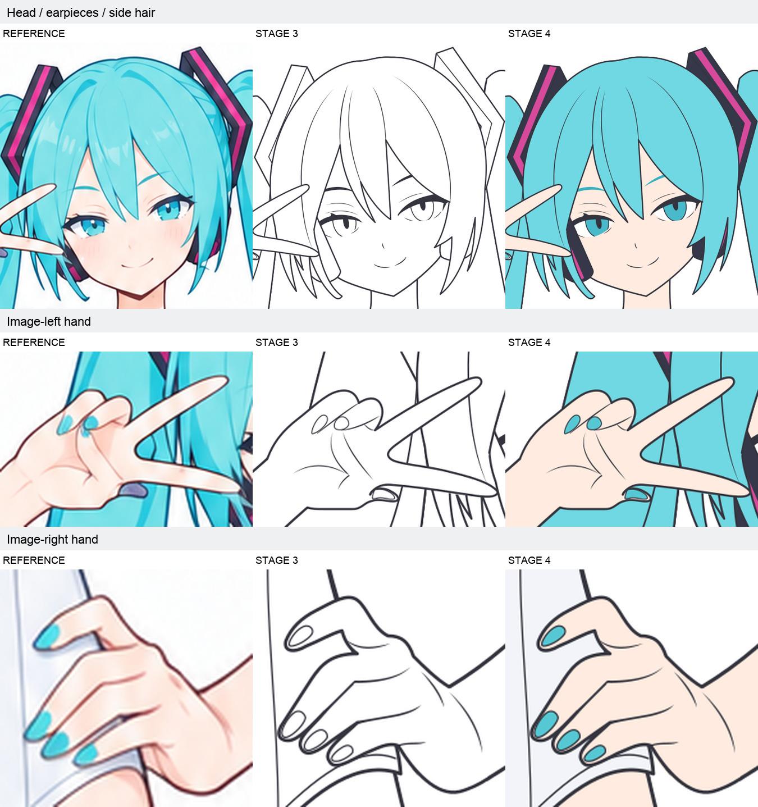

# 基础角色局部贴合问题记录

记录日期：2026-09-12。按用户要求，本轮检查阶段4的平涂结果，并记录此前遗留的局部贴合偏差；不修改现有SVG，也不在本轮开展针对性重绘。

## 当前判断

阶段4的基础填色符合当前范围：完整底形使用不透明纯色，保留必要内部色区，没有制作阴影、高光、柔和红晕或材质纹理。这个结论只说明本轮填色方向成立，不代表角色局部造型已与参考充分吻合。

重新从实际SVG渲染整图、同坐标局部和31个逻辑部件的独显，查看色面及所属墨线。原37个顶层绘制组和全部原ID保留；新增7条色区路径，分别用于配件饰条与发梢异色。源码没有渐变、滤镜、透明叠色或嵌入位图；新增色区在两倍渲染下的强不透明像素未发现越出所属底形。上述检查不替代对造型贴合程度的判断。

| 检查项 | 本轮结论 |
| --- | --- |
| 配色与色区 | 基本符合平涂目标；发梢粉紫、蓝紫异色按固有色区表达，其中固有色与受光色偏的区分仍有不确定性，源SVG也已注明，暂不认定为已证实的配色错误 |
| 归属与补全 | 独显可见各部件及隐藏区域已延续所属底色，新增色区仍归各自部件；本次未发现明显的新漏填或色面越界 |
| 线稿与遮挡 | 阶段4与阶段3相比，既有路径几何仅改变一处右腿口轮廓及对应底形；手部、耳侧配件、鬓发的贴合问题仍然存在，不能给出整稿无遗留的通过结论 |

## 用户发现与本次复核

用户通过透明叠加及滑动比较发现：其称为“image2.5”的生成图在部分局部更贴近原图，而“astra6”的部件分区可能更好。此项保留为用户观察；本轮未锁定并重新比较image2.5的具体文件、输入和版本，因此不据此给出模型整体能力的比较结论。

本次同坐标、同比例并排查看参考、阶段3和阶段4，能够看到下列偏差。左右均按画面方向表述。

| 部位 | 观察到的现象 | 后续核对重点 |
| --- | --- | --- |
| 手部 | 甲片的形状、大小及与指尖的相对关系存在差异；部分折指、掌纹与指根的表达也偏离参考，手势可读不等于局部贴合 | 指尖与指甲的位置、朝向和间距，折指连接，指根及掌部转折；区分必要结构与参考中的柔和明暗 |
| 耳机／耳侧配件 | 外壳的可见形状及与脸、眼角的关系偏离参考；画面左侧配件上端进入外眼角附近，赋深色后尤其明显。饰条也需随外壳一起核准 | 外壳的真实可见边界、眼角到外壳的空间、前方鬓发实际遮挡范围，以及内部饰条的位置与宽度 |
| 两侧鬓发 | 贴脸发尖的落点、束形及相邻空隙存在差异，并会改变耳机的露出面积 | 发尖端点、贴脸侧缘、束间空隙，及对耳机和眼角附近的覆盖关系 |

用户进一步指出：早期部件图没有五官，耳机多占一点原本眼睛所在的空间不易被察觉；补出五官后，问题才变得明显。这个解释与本轮对照相符，应作为后续验收设计的重点。

这是一项已有贴合偏差及验收漏检记录。阶段3、阶段4的对应局部都能看到问题，但本轮没有逐版确认首次引入时间，因此暂不认定具体由哪次修改造成回归。

## 对此前验收的修正

此前复核已看过局部，但对结构可读、部件完整与合理简化的判断过宽，未充分区分“形体成立”与“忠于参考”。之前的通过结论不能覆盖本次已经确认的局部贴合问题。

缺少五官时，耳机与脸部的相对位置少了关键参照；纯白底形也弱化了部分边界。补出眼睛并给配件填深色后，原有偏差更容易辨认。不能把这种显现直接当成阶段4新画错，也不能因为偏差来自早期而认为它已经解决。

## 留待后续的优化方向

1. 早期部件阶段即参考彩图中的眼位、脸廓等关键位置，核对邻接配件与头发的占用范围；可以使用临时对照辅助，不要求提前增加正式五官图层。
2. 新增五官等关键结构后，复核它与相邻部件的关系。眼睛需要连带检查耳机、鬓发和脸廓；不能只验证新增路径本身。以这种关联检查原则覆盖其他部位，不扩展为穷举身体零件的清单。
3. 将同坐标、同倍率的参考对照与透明叠加切换用于局部位置核准，独显用于归属和补全核准；分别给出结论。出现明确偏差时回改所属底形及墨线，不依赖后续细节、填色或明暗掩盖。
4. 日后比较image2.5与astra6结果时，先固定实际输入、版本、画布和比较范围，再分别评估局部贴合、部件分区、隐藏补全与可编辑性。

本轮仅记录这些方向，尚未修改提示词或执行修复。

## 对照与版本

下图各行均为同坐标范围、同比例显示，列顺序为参考、阶段3、阶段4；从本轮读取的参考图片和实际SVG渲染生成。

- [阶段3输入](../../outputs/step03-base-character/03_完整分层线稿.svg)，SHA-256：`1d8c1a1b84e73258c8da61376e5d4dcd2dca6061a475255f81a7189c2100f41b`。
- [阶段4结果](../../outputs/step04-base-character/04_完整分层平涂.svg)，SHA-256：`fdf7e13c2d94353cfe17899f26a84b7dd0e05f9875eb19280aed2f2e4e5c61aa`。
- 本轮外部基础角色彩图的SHA-256：`30d278d1bc9b39559e67da0e397668d7676993f3a660f7edc69cc2590b1efb4e`；上图保留了本次所核对的参考局部。

以上源文件后续可能更新，核对本次记录时应同时检查哈希；这里的对照PNG保留的是本轮版本。
