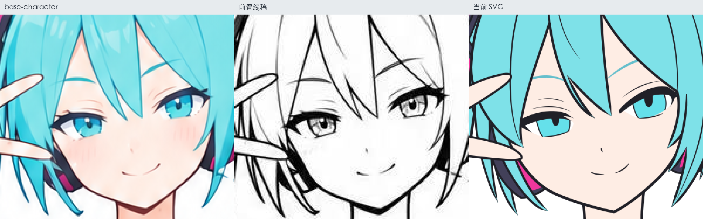
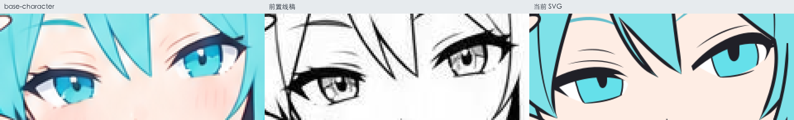
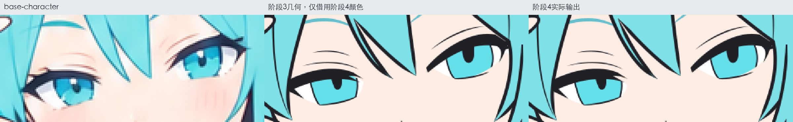

# Miku v2：阶段4归档与下一轮计划

2026-09-14。当前结果收纳在[case3_miku_v2](../../outputs/case3_miku_v2/readme.md)，已到阶段4；阶段5尚未重跑。本记录作为下一轮修改阶段3之前的基线。

## 这轮尝试了什么

| 改动 | 想解决的旧问题 | 实际反馈与结论 |
| --- | --- | --- |
| 加长前置3和阶段2的几何、归属与补全要求 | 头发穿插、发卡镂空和后侧遮挡不准 | 出现头发回退，阶段2提示词已恢复到`3b4a4a6`版本；前置3后来由用户简化为单轮提示词。增加规则没有带来稳定改善 |
| 简化前置3色块图 | 避免生图时过度合并或重构发束 | 用户多次尝试后认为部件逻辑仍不稳定；继续作为辅助，分层判断主要由SVG绘制者完成 |
| 增加前置4线稿参考，接入阶段3原有三个step | 原彩图中的光影干扰描线，发线、睫毛、手足等局部画法不够准确 | 用户反馈线稿生成更稳定，SVG有一定改善，但提升有限；头脸还原问题仍明显 |
| 增加前置5程序取色色盘，接入阶段4 | 底色依赖目测，头发等颜色与参考偏离 | 工具已核对12处实际来源色值；用户完成阶段4后反馈配色帮助明显。此为本例实测反馈，未做控制变量重复实验 |
| 重写首例阶段5复核，补截图与取色证据 | 问题描述笼统，难以判断应在哪个阶段修复 | 已按投影、虹膜色域、发线、手足衣缘、配件与发色分别定位，保留旧详细分析供追溯 |

相关入口：[色块图失败复测](../part-color-review/2026-09-13_首次优化复测.md)、[阶段2第二次复测](../stage2-reference-retest/第二次复测/复核.md)、[前置4](../../workflows/前置4.身形角色线稿/readme.md)、[前置5](../../workflows/前置5.基础配色色盘/readme.md)、[首例阶段5复核](../stage5-final-review/2026-09-13_阶段5终稿差异与流程链路分析.md)。

## 新发现：头脸几何没有跟上参考

比较对象为本案例[base-character](../../outputs/case3_miku_v2/references/base-character.png)、[前置线稿](../../outputs/case3_miku_v2/references/outline.jpg)与[阶段4实际SVG](../../outputs/case3_miku_v2/step04-base-character/04_完整分层平涂.svg)。三者均按1024×1536画布的同坐标范围裁图，没有单独缩放或重新对齐头部。

| 问题 | 观察与源码追溯 | 应改的位置 |
| --- | --- | --- |
| 脸显得偏大 | 画面左侧脸颊到下颌向外扩，鬓发包脸范围也不同，面部留白变大。阶段2已有偏差；阶段3 step1仅小幅调整，`body-head-shape-1`的路径从step1到阶段4完全相同 | 阶段3首先联合校准脸缘、发型和可见脸部范围 |
| 眼白偏少，眼神更眯 | 虹膜相对眼睛开口占得更满，两侧眼白留白收窄，上眼睑与睫毛也影响开口。SVG有完整眼白底形，实际露出范围由虹膜和眼睑覆盖共同决定 | 阶段3绘制五官时检查组合后的比例；不能只确认眼球、虹膜和眼睑各自存在 |
| 上色阶段仍会改眼部几何 | 阶段4保持虹膜路径，却改了`upper-eyelid-l-shape`和`upper-eyelid-r-shape`。用阶段3原几何借用阶段4颜色作诊断，可见眼白不足主要已经存在，上色改动又略微收窄了部分区域 | 后续上色若改动头脸路径，要回查原图与已确认线稿 |

最后一图中栏是临时诊断：保留阶段3几何，只按相同ID借用阶段4填色，方便看清眼白和虹膜。它不是新的正式产物，也不代表执行过另一轮阶段4。

## 归档时的下一轮计划：阶段3拆为五步

后续进展：五步现已在[miku_v3](../miku-v3-review/readme.md)完成实际生成，见[现行阶段3](../../workflows/3.建立可用线稿/readme.md)。下文保留提交20a893c时的计划与归档范围；本案例仍对应旧三步产物。

| 新步骤 | 范围 |
| --- | --- |
| 1. 头型与发型还原 | 校准脸部轮廓、头部外形、主要发束和配件遮挡；此时就参照五官位置判断比例 |
| 2. 面部与表情还原 | 校准五官、眼睛开口、虹膜占比、眼白留白与睫毛覆盖，必要时联动调整脸缘和刘海 |
| 3. 其余部件主轮廓 | 身体、手足、服装及其余配件的轮廓和完整底形 |
| 4. 其余内部结构线 | 手足、甲片、服装和配件的必要内部结构 |
| 5. 全局线条精修与复核 | 线宽、收尖、接头与重复线；确认前面校准的头脸没有退步 |

头部前两步提供base-character与前置线稿，并使用程序裁出的同坐标头部局部。彩图核对人物观感，线稿辅助几何与笔触；验收包含并排和透明叠加，眼部可临时区分虹膜与眼白。可见还原与隐藏补全分别检查。

提示词写“还原参考中的比例与覆盖关系”，不固定要求缩脸、放大眼白或套某个人物的比例。本次提交仅记录需求，保留已经实测的三步提示词，下一轮再改写与验证。

## 仍待解决

- **阶段2／3**：发卡完整构造与透视、耳机细节、发束接续、手足及衣缘线条仍需局部复核。新线稿参考不能视为这些旧问题均已解决。
- **阶段3／4**：先解决上述脸型、头发覆盖和眼白比例，再验证后续精修与上色能否保持造型。
- **阶段5**：本案例尚无明暗与材质结果。旧case1的投影来源与承影面归属、虹膜上下色域比例、头发明暗带和光泽范围仍需验证；色盘改善底色不等于这些问题已解决。当前平涂缺少高光、红晕和体积光影属于阶段4范围。
- **阶段6**：仍为最终线色与边缘收尾候选，尚未制定或执行，不能承接前面未修好的造型问题。

## 本次归档范围

case3的SVG和检查图原样移动，首例`case1_miku`正式产物保留。工作区已有的`case2`参考与阶段1—2结果一并纳入版本控制，保持独立案例，本次未追加视觉验收。开发进度、案例索引与前置说明同步到已实测状态。

归档文件的原路径和SHA-256见[清单](../../outputs/case3_miku_v2/归档清单.json)。14份移动或复制文件的哈希均保持一致；新增SVG、图片与JSON可正常解析，文档本地链接已核对。取色程序从归档后的彩图复跑，12处色值与原样例一致。上述检查确认归档与工具可用，造型遗留问题仍以上文视觉复核为准。

返回[开发进度](../../workflows/开发进度.md)。
