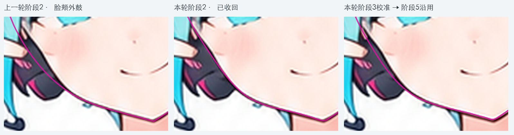
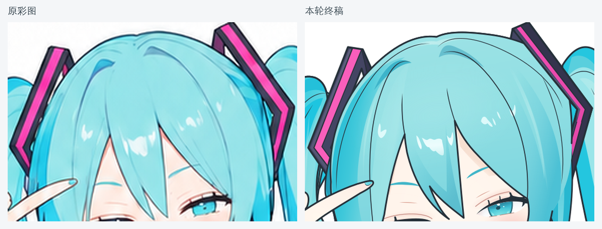
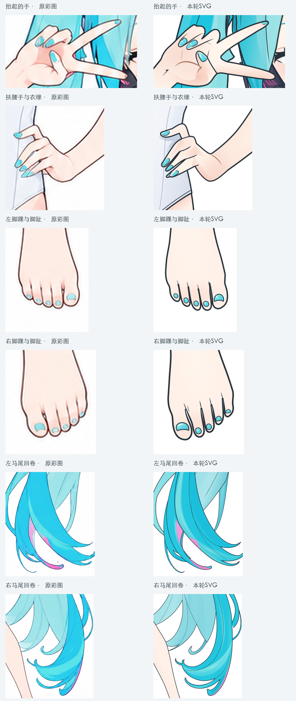

# Miku v3：本轮改进与遗留问题

2026-09-17。结果已归档到[outputs/miku_v3](../../outputs/miku_v3/readme.md)，阶段1—5均有产物。本轮复核支持用户的判断：**脸型与头型的还原有明显进步，头脸的整体观感已经更接近本轮原图。** 后续重点转向局部线条画法和色面，而不是继续整体改脸或重构分层路线。

## 对照依据

本轮[基础彩图](../../outputs/miku_v3/references/base-character.png)和各阶段SVG均为1037×1517。下方本轮对照使用相同画布、相同裁切、相同比例，未单独移动或缩放头部。展示来自实际SVG渲染；透明叠加先正常合成，再降低整张图的不透明度。

v2采用另一张1024×1536彩图，不能直接叠在v3上计算还原度。跨版本结论结合[v2已记录的偏差](../case3-miku-v2-review/readme.md)，分别检查各自对原图的贴合；不报告一个混合参考的百分比。线稿参考、流程拆分和提示词同时调整过，也不能把全部收益归因于某一条提示词。

## 这次实际改善了什么

| 改进 | 实际依据 | 对应阶段 |
| --- | --- | --- |
| 左脸颊的外鼓明显收回 | 上一轮脸缘侵入耳机区域；本轮阶段2的连续曲线已靠近原图，阶段3再调整收颌弧度。下巴与下颌整体位置保持贴合 | 阶段2面部逐段校准＋阶段3 step1 |
| 头型、刘海及包脸范围更准确 | 头顶外形、刘海尖梢和左右鬓发与脸的关系更加接近参考，早期“头发大致相似、露出的脸却明显变大”的问题减轻 | 阶段2＋阶段3 step1 |
| 头脸改进没有在后续着色中丢失 | `head-face-shape-01`在阶段3 step1调整后一直保留到阶段5终稿；阶段3 step2已有的脸底与眼部共26条路径，其`d`在后续各步一致 | 阶段3—5几何继承 |
| 发卡开口与配件层次改善 | 当前组合能看到框内露出的头发，框体与头发的穿插比早期填实版本合理；耳机也已有壳体与内部面板表达 | 阶段2／3；隐藏全构造仍需专项复核 |
| 完整彩图已形成 | 眼部层次和高光、皮肤局部红润、头发色面与光泽均已加入，本轮不再停留在平涂 | 阶段4＋阶段5两步 |

路径一致只说明已有几何没有被改写，不代表新增明暗或覆盖对视觉毫无影响。眼睛也仍有下节记录的画法偏差。

洋红线为SVG脸型路径。左栏来自9月15日上次复核保存的诊断路径，另外两栏来自本轮实际SVG；三栏叠在同一张彩图上。诊断路径存于[JSON](./脸缘诊断路径.json)，旧路径不是重新生成的角色稿。可见左侧曲线向耳机扩出的部分明显减少，最终仍有细小弧度差异，不称为完全重合。

## 放大后仍然存在的问题

| 问题 | 具体表现 | 优先定位 |
| --- | --- | --- |
| 眼睑与睫毛画法仍有差异 | SVG上眼睑更直、更硬，几根睫毛呈明显竖向短刺；原图的睫毛与眼线有更自然的叠压和粗细变化。两侧眼白分配、虹膜位置也未完全贴合，不能只认为“露出眼白就通过” | 阶段3 step2、step5；眼内明暗另归阶段5 step2 |
| 手足线条偏硬 | 手指交叠、掌纹与甲片概括较重；脚趾分界较长、较黑，局部呈双线，和原图较轻的线色与收笔不同 | 阶段3 step3—5；不靠后续光影掩盖 |
| 头发色带与光泽仍有距离 | 主发束轮廓已接近，但原图有更多蓝青层次、柔和过渡和随束变化的亮带；SVG一些长束仍显得较均匀，头顶亮斑形状、面积和位置也有差异 | 阶段5 step1／step2；个别内部发线归阶段3 |
| 皮肤和服装局部质感不同 | 脸颊已有红润，但软硬过渡与眼下细节不同；躯干、腿部整体较均匀，衣服部分线条和色面更生硬 | 线条归阶段3，色面与柔和程度归阶段5 |

此次改进应保留为后续基线。大图仍能看出上述差异，但不宜据此否定头脸几何的进步，也不把所有问题继续归因于部件拆分。

## 只记录，暂不实施：线稿独立审查与工作投入

- 用户希望在线稿阶段加入独立审查subagent，让另一名审查者对照实际原图与最终SVG，发现绘制者漏掉的局部问题。
- 用户观察到xhigh有时十几分钟就结束，希望增加观察、局部对照和返修投入。这里记录为用户体验，尚无逐轮执行日志统计；文件修改时间不能用来推算实际工作时长。
- 后续可评估“候选稿→独立只读审查→主agent局部返修→最终复验”。重点验证审查是否发现并纠正问题、是否保住已贴合区域，再评估所需时间。本次不新增步骤、不启用subagent、不设最低耗时，也不修改执行提示词。

## 交付记录中还需区分的事项

终稿`metadata`明确写有`independent_review: not available in this tool environment`。因此本轮记为“已生成并完成本次视觉复核”，不能沿用case1的“已执行独立审查”结论。将来若采用独立审查，需要记录实际执行情况。

终稿根`title`、`desc`仍写阶段5 step1，与实际05-2材质内容和metadata不一致。这属于交付描述未更新；归档保留原字节，只记录问题。

外来投影与自身体积已分组，脸部投影说明中也写明了刘海和侧发来源，这是组织上的改善；隐藏头发时是否正确联动投影仍需专门验证，本次不登记为已解决。

## 归档核对

26份输入和产物原样移入`outputs/miku_v3`，逐文件SHA-256保持一致，旧案例未覆盖。9份SVG均可解析，未发现重复ID或嵌入位图，实际渲染已用于上述对照。这些结构检查不替代视觉验收，也不证明全部隐藏补全和动画适用性。

[归档文件与清单](../../outputs/miku_v3/readme.md) · [开发进度](../../workflows/开发进度.md) · [现有SVG预览器](../../loading/svg-preview.html)
