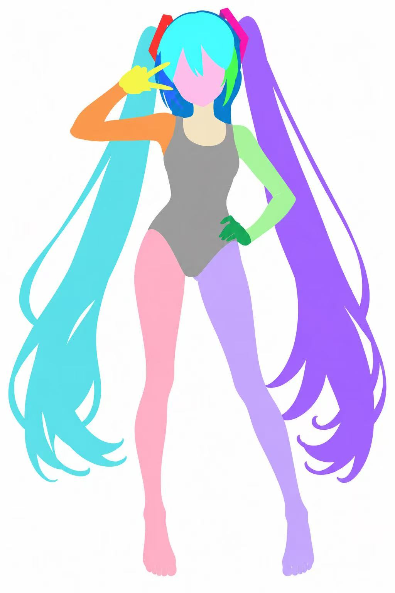

# part-color首次优化复测

2026-09-13，用户提供首次加长版的实际生图结果。该次优化未达到目标，主要问题集中在头发的可见分区。

对照[原彩图](../../outputs/case1_miku/references/base-character.png)及[旧色块图](../../outputs/case1_miku/references/part-colors.jpg)：头顶刘海色块范围改变、脸侧发区过度概括，耳侧配件未清楚区分；发卡开口仍未解决。画面更平、描边更少本身不算失败，主要判断依据是部件归属与可见几何回退。

用户提交的step1观察还存在以下问题：将指间开口笼统描述为“均露出背景”；未提及发卡开口；清单只有“左右马尾”，没有落实观察中提到的主要回卷分束。文字观察未提供可靠的额外约束，部分内容与原图冲突。

保留[当时step1提示词](./首次加长版_step1.txt)和[当时step2提示词](./首次加长版_step2.txt)。这里只确认本次结果失败，不由一次运行推断模型稳定性或提示词长度的单独影响。

用户随后明确要求色块图保持辅助参考定位，提示词更简单、分色更自然。后续又由用户精简为[单轮提示词](../../workflows/前置3.人物部件色块拆分图/提示词.txt)，原两步目录已移除。多次尝试后，用户仍认为部件逻辑不够稳定，主要依赖SVG绘制者判断；见[后续迭代记录](../case3-miku-v2-review/readme.md)。
