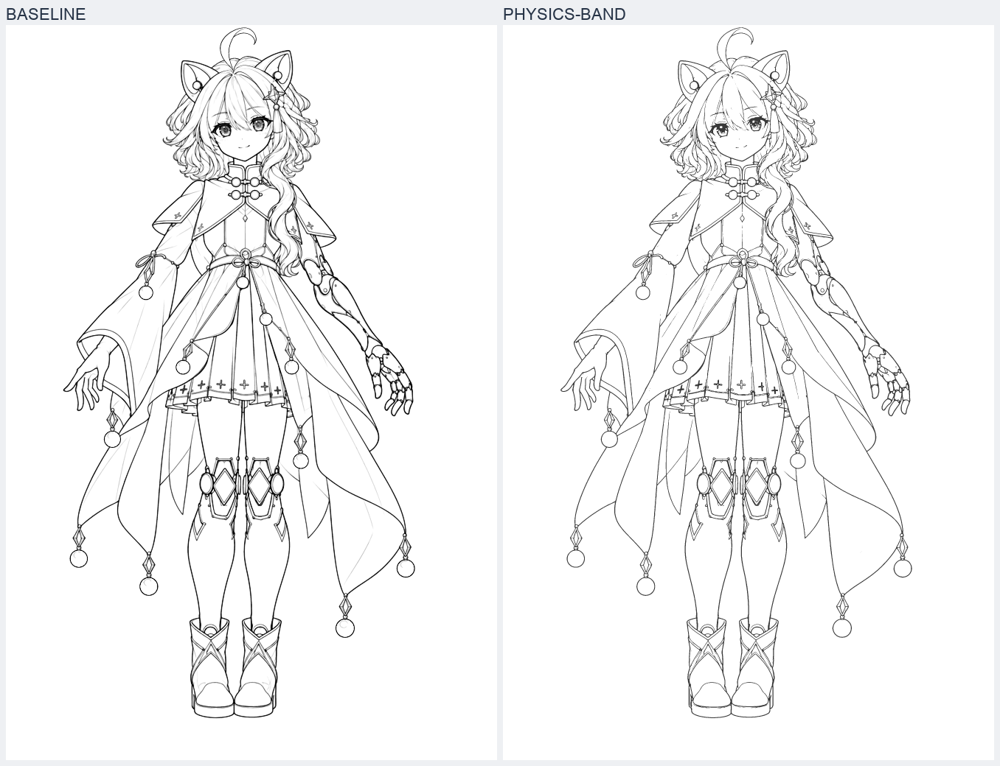
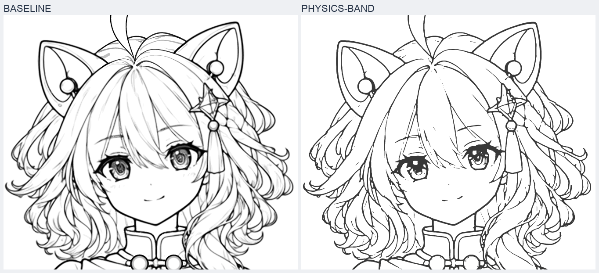
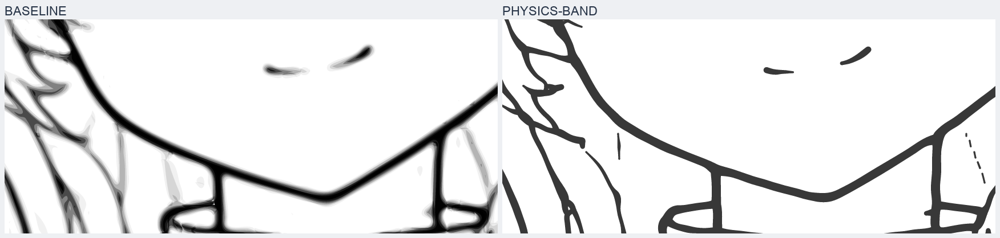
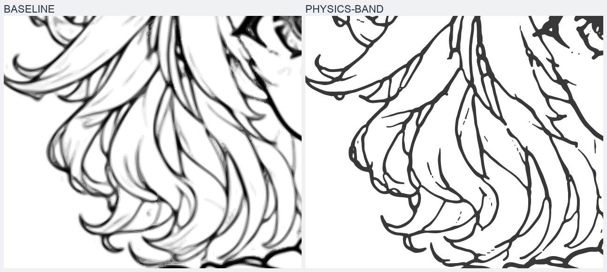
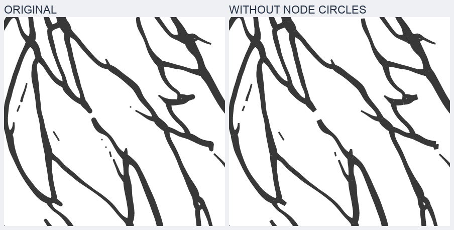
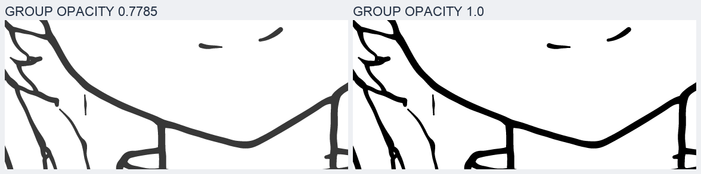
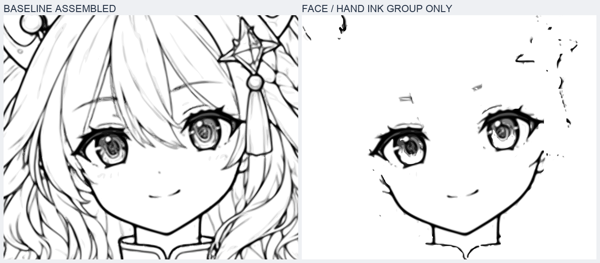
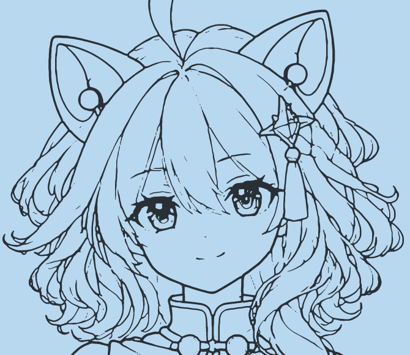
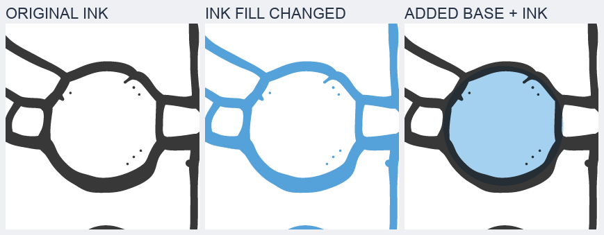

# 从 baseline 到 physics-band：线条表示、视觉变化与流程适配

**physics-band 在“干净、明确的墨线”这个方向上有明显进步，值得作为阶段3的描线方法候选；它需要与我们已有的完整部件底形结合。** 当前成品是一张由线带构成的整图线稿，尚不具备完整身体、独立服装和隐藏部件结构。后续基础填色在这种组合方式下是可行的。

分析对象为朋友提供的 [character_baseline.svg](./sources/character_baseline.svg) 和 [character-physics-band.svg](./sources/character-physics-band.svg)。两份源文件按原字节归档。没有提供原始临摹图片、生成代码、论文引用或多次运行记录，因此本次可以比较视觉表现和 SVG 表示，不能判断对原图的绝对还原度、真实优化流程或跨案例稳定性。

以下对照左为 baseline，右为 physics-band。局部图都从矢量重新渲染，没有把低分辨率 PNG 放大充数。



**视觉上的主要改善是灰色重影减少、线条边界明确，而非所有细节都得到了增强。**

| 部位 | baseline | physics-band | 判断 |
| --- | --- | --- | --- |
| 下颌、领口、长衣缘 | 深色核心旁叠有多档灰边，放大后像多圈轮廓 | 主要由一块明确的墨线形状构成，长弧更利落 | 新版的改善明确 |
| 发束与卷发 | 浅灰细线和深线同时存在，局部像带着未清理的草线 | 主发束容易辨认，线宽与断续更有手绘线稿的观感 | 新版更适合清线目标，但仍有小环和碎线 |
| 眼睛 | 虹膜保留更多灰度、环状细节和细线 | 更概括、更深，部分细节合并或消失 | 风格发生变化，不能统一判为新版更好 |
| 衣褶 | 大量浅线可见 | 一些浅线消失，另一些只剩零星短段 | 既有清理，也有信息损失，需参考原图取舍 |
| 机械手与复杂接点 | 局部灰边较多，接头形状复杂 | 墨线更干净，但部分连接仍偏粗、圆鼓或拥挤 | 需要局部精修，物理约束没有自动解决所有接头 |







这里不能把每个断点都解释为有意的收笔，也不能把所有不规则都当作手绘风格。physics-band 仍有孤立细点、小环、短碎段；是否保留，应由线条职责和原图决定。[衣褶对比](./images/05-folds.png) 与 [机械手对比](./images/06-hand.png) 展示了这些限制。

**文件变小是实质的几何简化，但 `<path>` 数量反而增加了。**

| 可核对指标 | baseline | physics-band |
| --- | ---: | ---: |
| 画布 | 1024 × 1536 | 1024 × 1536 |
| 文件字节 | 8,231,053 | 2,268,017 |
| gzip 后字节，统一压缩级别9 | 3,256,465 | 855,098 |
| `<path>` 元素 | 230 | 3,302 |
| path 中的子路径数量，按 `M` 计 | 23,374 | 3,302 |
| 三次贝塞尔段，按显式 `C` 计 | 154,937 | 37,687 |
| 单个 path 最多包含的子路径 | 1,430 | 1 |
| `<circle>` 元素，含定义 | 42 | 3,055 |
| `<g>` 元素，含定义与修饰组 | 78 | 1 |
| `mask / clipPath` | 3 / 30 | 0 / 0 |
| 线性与径向渐变定义 | 16 | 0 |
| `image / filter` | 0 / 0 | 0 / 0 |

physics-band 的文件体积减少 **72.45%**，三次贝塞尔段减少 **75.68%**。两份文件都使用真实矢量图元，没有内嵌位图。baseline 的像素拟合感来自其轮廓与透明度组织，不能据此说它偷偷嵌入了图片。

这些是包含定义区的源文件统计，不等于画家实际下笔次数、可动画部件数量或运行速度。baseline 把大量不相连的轮廓装进少数复合 path；physics-band 把线带分开保存。所以“path 少”本身不能证明文件更简单或更好编辑。

**baseline 用多档覆盖度轮廓表达灰度，physics-band 用两侧边界表达一段有宽度的墨线。**

baseline 的七个 `geometry-*` 组各有八个 `*-coverage-*` 路径，共56个。它们使用黑色填充、`evenodd` 规则和一组重复的透明度档位：

```text
0.05475440 → 0.11075298 → 0.15756088 → 0.28342581
→ 0.42593303 → 0.64883292 → 0.92644948 → 0.99996817
```

这些路径含大量复合轮廓，叠加后可表达深色核心、浅色边缘和零碎浅线。文件还另外组织了圆形扣件、虹膜和头顶线条，不能把全部内容都简化为同一种自动描摹。可以确认的是：多档半透明轮廓确实存在，也确实解释了放大时看见的层层灰边；具体如何从原图提取这些覆盖度，文件没有记录。

physics-band 的3,302个 path 全部具有以下命令结构：

```text
M → 一侧的若干 C → L 跨过端部 → 另一侧的若干 C → Z 封口
```

也就是走完墨线的一侧，再沿另一侧返回，封成一条窄带，使用 `fill="black"` 填实。它不依赖普通 `stroke-width` 产生宽度。窄带两侧的距离可以沿途变化，因此 SVG 能表达粗细变化的线条；一条笔画也不必限制为一个贝塞尔段。

理解这种表示的一个简单模型是：先有线的走向，再有沿线的宽度，最后生成左右两条边界。**这只是解释几何的模型；源 SVG 没有保留可直接编辑的中心线或连续宽度函数，不能宣称已恢复作者的内部参数。**

**圆形节点承担了封端与接合工作，有直接的几何证据。**

对每条线带计算首尾封口的中点与宽度，再与3,055个圆比对：

- 全部6,604个端点中点都能找到对应圆心，最大距离约 **0.000659 个画布单位**。
- 相应圆半径与端部半线宽的最大差约 **0.000607 个画布单位**。
- 路径坐标保留三位小数，圆参数保留五位小数，上述误差与这个量级的舍入一致。
- 有2,911个圆被这些端点使用，其中大量圆连接三条线带；另144个圆没有连接现有线带端点，作为独立小圆存在，来源不能仅凭文件确定。

例如 `band-665` 与 `band-738` 的一个端点中点都落在约 `(474.907, 278.049)`，共享同一个圆节点。这是下颌附近的真实文件几何，不是根据标题猜测“可能使用共享节点”。

删除节点圆、保留所有线带后，端头变成截断边，部分接合出现细缝或缺角：



因此，圆不是随机的纸张纹理。它能改善端头和接合，但也可能使某些发梢偏圆、三岔口偏鼓。共享节点保证几何相接，不自动保证切线流畅、视觉轻重合理或部件归属正确。

**“物理”这一说法有文件自述支持，但论文与求解方法仍不可核实。**

源文件描述写着：

> shared-node elastic ribbon optimization … Bending 0.4, width target 0.80.

共享节点与线带在输出中能得到验证。弯曲约束通常可以抑制曲线的高频摆动，宽度约束可以约束线条粗细；这种思路与本例减少冗余边界、明确墨线形状的结果相容。

但文件没有给出目标函数、采样方式、节点初始化、权重单位、求解器、迭代记录或论文名称。不能据此确认采用某一篇弹性曲线论文，也不能把 `0.4` 和 `0.80` 直接写成我们流程的通用参数。这里更有价值的研究方向是“对线条走向、宽度和连接施加约束”，不是在提示词里加入“物理”二字就期待稳定复现。

**较柔和的墨色还来自全组透明度，不能全部归功于曲线优化。**

所有线带与圆都在 `elastic-linework` 内，该组设为 `opacity="0.7785046"`。在白底上，实体内部大致表现为 `#383838` 的深灰。只把组透明度改为1，形状完全相同，视觉会明显更硬：



组透明度在组内图形合成后应用，线带与节点的重叠不会因此反复变深。移植时若把它机械改成每个 path 各自半透明，交叠处可能变深。采用部件内墨线组统一控制透明度，或采用不透明的深色墨线，都比随意分散透明度更可控。

**现有两份成品都不能直接充当我们的完整分层线稿。**

baseline 有分组，但 `brown-lines` 同时收纳脸部与手部，`violet-hair` 同时包含外层头发与耳部。独显脸部与手部线组后，露出的是可见线条，没有补成完整额头和发下头脸：



physics-band 更直接：一个白色背景矩形、一个全图墨线组，组内先放3,302条线带，再放3,055个圆。没有头脸、身体、服装等完整底形，也没有这些语义部件的独立分组。源文件的 DOM 顺序不能直接当作我们要求的“完整部件从后到前”绘制顺序。

把它唯一的白底矩形改成蓝色，脸、头发、衣服内部和外部背景一起变蓝，说明原先看起来像部件白面的地方实际都是背景透出：



**对阶段3，适合迁移的是线条构造方法，并且必须约束在已有部件内部。**

现有 [阶段3流程](../../workflows/3.建立可用线稿/readme.md) 允许深色闭合墨线，与线带表示在原则上兼容。需要区分的职责如下：

| 任务 | 由什么负责 | 对线带方法的要求 |
| --- | --- | --- |
| 身体、头脸、发束和服装的完整形体 | 阶段2底形，在阶段3中允许校正 | 保留完整实体，不能以当前可见轮廓截断底形 |
| 可见线条的位置与走向 | 人物参考＋阶段3精修 | 对照参考确定轮廓和关键转折，避免平滑过度导致跑形 |
| 必要隐藏线条 | 完整形体与合理延续 | 隐藏区域没有观测像素，需要另行构建；优化器不会自动补出 |
| 线宽、收笔与接合 | 局部线带构造或优化 | 按线条职责分配宽度，检查端头、岔口和细线残段 |
| 部件显隐与移动 | 每个部件自己的底形与墨线组 | 所有线带和节点圆随所属部件一起控制 |
| 从后到前的累计重放 | 各部件在 DOM 中的顺序 | 每个部件先底形后墨线，再绘制其上方部件 |

其中最需要新增注意的是：**视觉上碰在一起的线，不一定属于同一实体。** 头发压到脸上、衣服挡住手臂时，二维图上可能形成 T 形接点。全图共享节点若把这两件东西连接起来，会妨碍后续独立移动，也会固化当前遮挡。

因此，共享节点和连续曲线约束应优先用于同一部件内部的真实连接。跨部件接触由各自完整几何和前后覆盖形成；后方线条应在遮挡下继续，而不是在前方部件的边缘终止或焊死。肩根、腕根等人为封口也不能因此被转成墨线。

适合我们的阶段3局部执行顺序是：

1. 在已有部件内校正完整底形，确定哪些边是自然轮廓、哪些只是隐藏封口。
2. 对照参考整理可见线的走向、端点和线条职责，补足必要隐藏延续。
3. 构造线带或进行局部优化，控制弯曲、宽度和真实接点；保持部件身份与遮挡边界。
4. 把生成的线带与节点归入本部件墨线组，同步修正底形，使后续颜色边界贴合轮廓。
5. 检查组合图、独显部件、隐藏前方部件后的补全，以及正常尺寸与放大局部；清理碎段、鼓包和错误连接。

这仍然可以放在已有阶段3中，无需另增加一个主阶段。完整部件的白色底形先遮住后方部件，再显示自身墨线；之后将同一底形改为正式底色。

**对阶段4，线带与独立底形非常适合配合使用，但改变线带的 `fill` 并不会给人物内部上色。**

下面使用源图中的一个扣件局部验证：左为原墨线；中间只修改线带和节点的填充色，得到蓝色的线；右侧在原墨线下面增加一个独立的浅蓝闭合底形，内部才真正有了颜色。



右侧底形是为说明机制新增的近似圆形，不是从原文件恢复出的完整部件，也不是已完成的角色上色结果。这个实验验证的是 SVG 表达方式兼容，尚未验证作者优化器在我们人物和完整分层条件下的稳定表现。

由此，后续填色可以保持这些规则：

- 部件底形闭合，墨线可以自然断开。颜色由底形承载，不依赖对墨线间隙做油漆桶填充。
- 实体底形与墨线使用可辨识的分组或角色标记；线带即使使用 `fill`，也仍然属于墨线。
- 上色时修改底形，线色另行调整。轮廓精修后同步校正底形，避免色面从错误位置露出或留白缝。
- 头发、服装等前方实体仍自然遮挡下层完整几何。不能为方便填色把下层裁成当前可见碎片。
- 检查墨线在正式底色上的效果。半透明墨线会与底色混合，白底时的墨色不能直接代表最终表现。

按这套分工，线稿无需为了填色而全部封死，适当的消隐和断笔也可以保留。这一点与我们“完整底形先建立，线稿随后精修”的流程相吻合。

**建议先把它作为可验证的局部方法候选，保留两份样本作对照。** 最有价值的下一次实操是挑一个主发束、一个脸部轮廓和一个衣缘接点，在既有部件内比较：常规精修线与线带方法，是否同时提高观感、保持造型、保留隐藏延续，并能配合底形着色。不要只以文件体积或单张白底成图作为通过条件。

若能从朋友那里取得生成器或进一步说明，最有助于稳定复现的资料是：输入到底是彩图、清线图还是已提取的骨架；是否保留中心线与宽度；如何固定端点与真实转折；共享节点能否按部件约束；弱线和孤立节点如何筛除；元数据中的两个参数具体表示什么。论文名称有帮助，但这些实现细节更直接决定能否接入阶段3。

统计与实验由 [analyze.py](./analyze.py) 生成，机器可读证据见 [evidence.json](./evidence.json)。脚本仅读取归档源文件并生成检查图，不包含作者的原始优化算法。渲染使用 resvg；初步检查中 Skia SVGDOM 漏掉了 baseline 的受遮罩主体，因此未用其渲染结果作比较依据。
