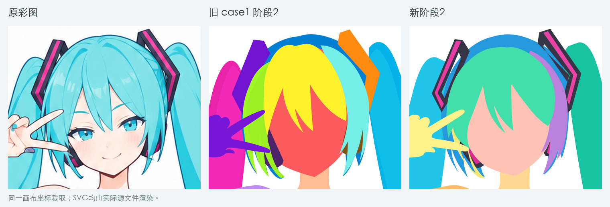
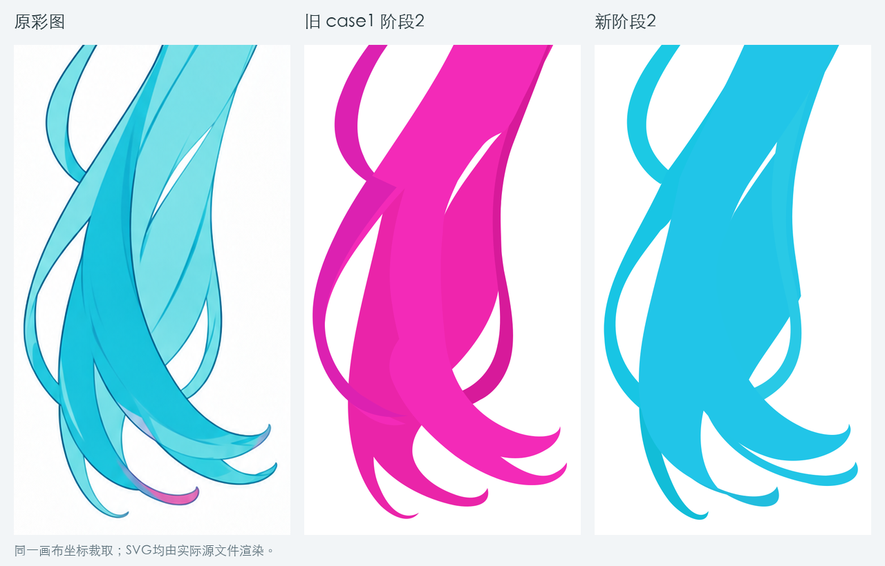
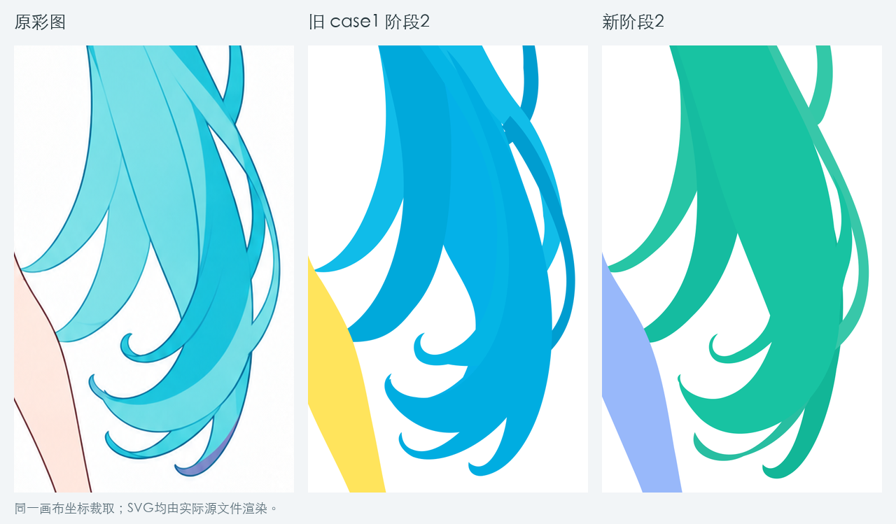
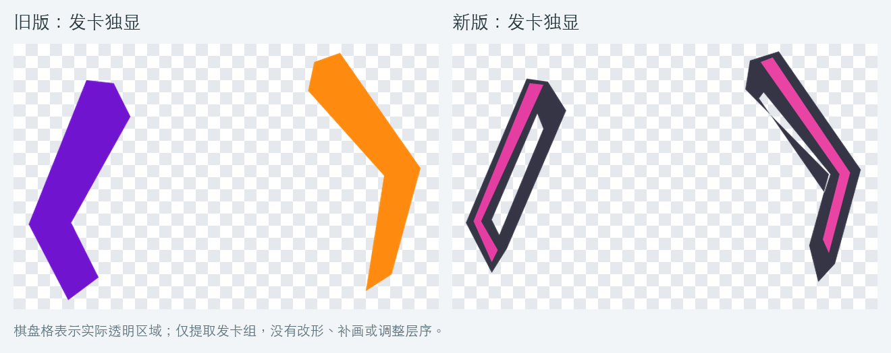

# 新旧阶段2：头发与发卡复核

版本说明：本文记录首次候选，截图仍对应当时版本。原同名输出已在随后重跑中被覆盖，完整源SVG未另存；第二次复测产物现归档于case3，不能作为本文首次候选的源文件。最新结果见[第二次复测](./第二次复测/复核.md)。

本次比较首次候选SVG（哈希以`e8f293`开头，现保留本文截图与[核对记录](./核对数据.json)）、[旧case1阶段2](../../outputs/case1_miku/step02-base-character/02_完整部件与遮挡.svg)，以[原彩图](../../outputs/case1_miku/references/base-character.png)为准。当时仅做诊断，未修改两份绘制源文件。

## 判断

**新版有局部改善，但不能判定头发关系整体更准确。左马尾的主弧线更连贯，左耳侧遮挡改善；右马尾的几段主要回卷被合入较大的主发体，分件表达变弱。发卡有了透明区域，但补全构造仍不合格。**

| 位置 | 与旧版相比 | 剩余问题 |
| --- | --- | --- |
| 头顶与刘海 | 中央刘海改为三个可独显主束，旧版头顶小漏隙未再出现；整体轮廓没有显著跃升 | 中央尖梢、右斜束下缘和鬓发边界仍需贴合原彩图；拆成更多组不等于更准确 |
| 左脸侧发束与耳机 | 旧版较大的耳侧色块被更合理地遮住，可见位置更接近参考 | 发根到鬓发的分区仍有较强概括，不能按当前检查色直接认定发束边界 |
| 左马尾 | 主束到下端回卷的大曲线更连贯，旧版部分突兀色块接头减少 | 外绕上段和低位外绕束变成两个独立实体，旧版同束前后分段的关联未保留；需核对它们是否确为不同发束 |
| 右马尾 | 大外轮廓、末梢和主要空隙仍大体保持 | 前侧主发体包含多个回卷尖梢；旧版独立斜穿束、回卷与跨层关系未逐一保留，不能只凭组合轮廓相近判定分件更好 |

## 头部对照

为避免新旧标记色不同造成误判，另看[统一颜色的头部轮廓诊断](./04_统一颜色头部轮廓诊断.png)：只在临时副本改色，几何和层序不变。新版增加黑粉装饰色使配件更像原图，但不能据此判断补全结构正确。

## 长发对照

[左马尾分件边界](./06_左马尾分件边界诊断.png)和[右马尾分件边界](./07_右马尾分件边界诊断.png)在临时副本为底形添加细边，帮助查看分件；不是正式线稿，人为封口不应照搬为可见墨线。

右马尾的差别尤其明显：新版`hair-tail-right-main`把数个主要卷梢纳入同一底形。关闭这个组会同时拿走这些卷梢。若它们应作为不同主发束独立处理，当前拆分就不足；仅添加内部线条不能恢复独立部件。

旧版左右外绕束分别用相同`data-part`关联前后绘制段；新版所有绘制组使用各自独立的`data-part`。这能确认拆分方案改变了，但不能只凭该字段断言所有新分束都错。应依原彩图逐处核准连续走向和遮挡。

## 发卡：有洞，仍未补对

源码中左右发卡是两个独立组，并非两只合在同一层。每只发卡各含黑色底形与粉色条，底形使用`fill-rule="evenodd"`。当前问题是每只都被概括为一个平面折角底形，未可靠建立被头发遮住的完整框体。

- **左侧**：相比旧实心块，确实有了封闭孔；但补成了窄长斜框，内侧回边与孔的范围不能由“挖出一个洞”直接判对，组合中露出的长槽与参考不一致。
- **右侧**：仍主要是折角条中的细缝。内孔路径的一段已跨出外框：内孔边上点`(598.5,82)`不在外框多边形内。这不是一个完整包在框内的孔，内侧框边被切开，属于明确几何问题。
- **透视与层序**：用户进一步指出，后侧框边本应被头发遮住，当前却在鬓发附近显露到前面。源码虽把整只发卡放在鬓发及刘海之前绘制，但它位于后脑发体之后，且补全边的形状与范围不正确，最终仍露出了应隐藏的部分。需要一起校准框体的透视、可见范围与局部层位；不能仅把整只发卡整体前移或后移。若同件的不同段跨过邻件前后，应分绘制段并保留共同逻辑归属。

一个逻辑发卡可以包含多个底形、不同表面或前后绘制段，是否需要拆层取决于实际穿插；分组数量本身不是问题。先核对原图可见的框边、厚度和孔内内容，再保守延续隐藏回边。隐藏形状没有唯一像素答案，但左右应有相容的实体构造，不能一边闭框、另一边仅留越界细缝就宣布补全完成。

建议保留新版作为候选：优先回修发卡、右马尾主束拆分与外绕束连续关系，再判断是否进入线稿。当前证据不足以直接用新版全面替换旧版，亦不应把有改善的部分一并丢弃。

当时后续决定：用户确认保留新版脸型，拟按通用规则优化阶段2并重新运行。后来[第二次复测](./第二次复测/复核.md)出现头发回退，提示词优化已撤销；[本例局部基准输入](./本例重跑说明.md)也已停用。当前状态见[阶段2说明](../../.agents/skills/svg-layering/workflows/2.建立完整部件与遮挡/readme.md)。

[源文件哈希与几何核对数据](./核对数据.json)。全部对照来自实际SVG渲染；诊断副本未覆盖源文件。
