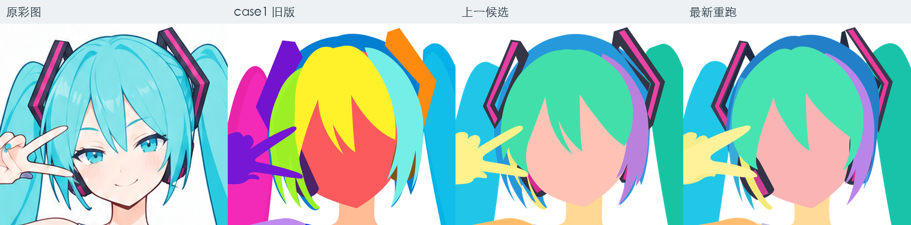
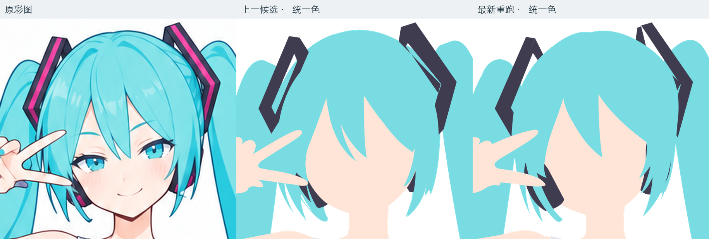
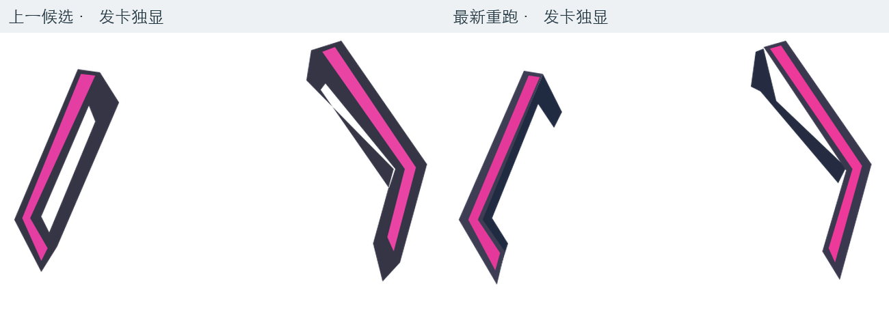
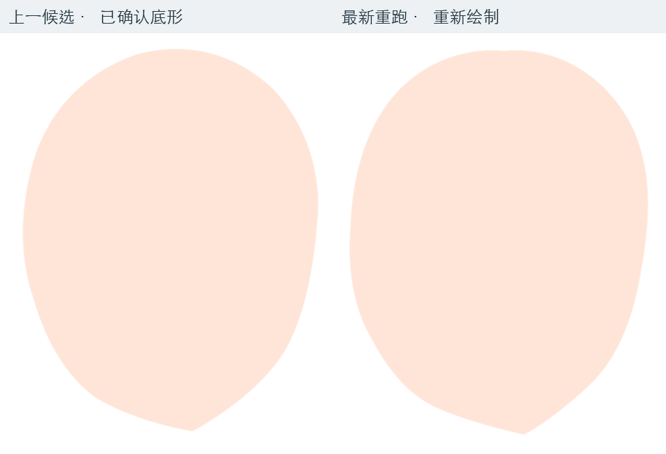
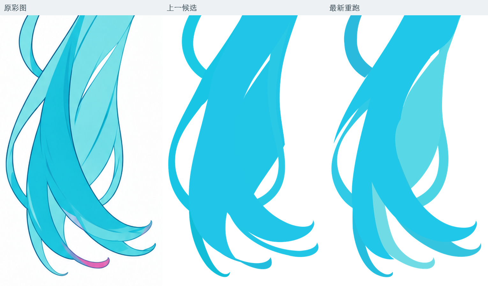
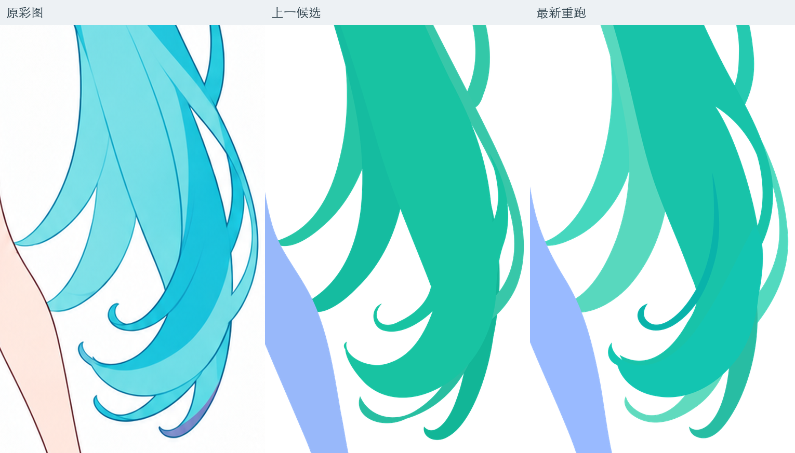

# 阶段2新提示词复测

后续决定：用户认为本轮头发明显崩坏，已要求回退全部提示词优化。前置3两个step、阶段2提示词及相关输入说明已恢复仓库原版；本文保留复测事实，不再推进文末的提示词重跑建议。

**有针对性的改善，也有新的回退；当前不建议直接判“通过”。** 发卡与头发的遮挡方向改善，右马尾的小回卷恢复了独立归属，但刘海与左马尾仍有形状问题，发卡独显也未解决完整结构。

本次比较原彩图、case1旧版、上一候选和最新重跑。基础彩图与生成任务所附PNG的像素完全一致。新版本已覆盖`outputs/step02-base-character`的同名文件；本次保存了[新SVG快照](./本轮SVG快照.svg)，上一候选依据上次实际渲染及诊断副本比较。未修改正式SVG或提示词。

2026-09-14归档：该轮SVG与检查图已移至[case3的阶段2](../../../outputs/case3_miku_v2/step02-base-character/02_完整部件与遮挡.svg)，SVG哈希与上述快照相同。后续阶段3、4沿此候选推进；已有问题仍保留在验收记录中。

## 具体判断

| 项目 | 相比上一候选 | 判断 |
| --- | --- | --- |
| 发卡与头发的前后关系 | 发卡整体改到后脑发体之前绘制，内侧边由头发遮住，原先整圈压在头发前的感觉明显减轻 | 有改善。可见内缘、正侧面宽度及顶部开口仍与原图不同，透视尚未完全对齐 |
| 发卡完整补全 | 上一版是构造不正确的闭框／细缝；本轮改成正面、侧面、嵌色带，独显呈开放折条 | 可见折角更合理，但源码明确只补到发下，未建立此前讨论的完整后侧框体。不能据此宣布完整配件已解决；隐藏结构仍需依据可见面保守延续 |
| 右马尾 | 小内卷独立为`tail-r-inner-tip`；主束前后段用相同`data-part`关联 | 分层表达比上一版进步。若干连接和卷梢仍有偏差，新增的绘制段不等于轮廓已准确 |
| 左马尾 | 后侧内卷与前侧主束更容易区分，下端部分回卷接续改善 | 仍有回退：中下段外缘新增尖叉，内部转折生硬，部分细束被并入主束后形成突兀尖头 |
| 中央刘海 | 上一候选的三组主发片合成一组，中央主尖梢旁原本可见的细尖束消失 | 属于底形／可见边界回退。合组本身不是错，丢失实际可见形状才是；不能全留给线稿阶段 |
| 脸型 | 最新版重新建立了头脸路径，脸颊与下颌曲线不同；下巴从约`(530,277)`变为`(529,279)` | 整体位置接近，但没有原样保留用户确认的脸型。此次任务带了通用提示词，没有附上指定局部基准的补充说明，因此该保留机制并未被实际测试 |

## 头部与发卡

上图统一了检查色，避免新旧配色影响判断。无五官和内部发线属于本阶段范围；中央细尖束缺失则是可见边界问题。

本轮把“错误补全的整圈”改成了“较合理的可见折条”。后侧不乱露出来是进步，但它与独显时完整不是同一个验收项。

已从上一候选的几何未变诊断副本保存[头脸底形](./上一候选头脸几何.svg)。这份文件只包含可核对的头脸几何，不是上一候选整图的恢复版。

## 马尾

可进一步看[左马尾边界诊断](./07_左马尾边界诊断.png)、[右马尾边界诊断](./08_右马尾边界诊断.png)。诊断线来自临时副本的底形边界，不是正式线稿，封口线不应照搬。

## 对这轮提示词的判断

提示词中的按实际穿插分组、风险局部对照已得到执行：本轮有46个绘制组、38个逻辑部件，交付检查图包含A—E。但这些只能证明结构组织和检查动作发生过，不能证明视觉验收足够严格。

生成任务给出“通过”，实际仍有上述可见问题。主要缺口是：检查图做出来后，仍未把参考中缺失的形状和独显补全不足转化成必须返修的事项。此轮也出现了对“保守补全”的过度收缩——只延伸进遮挡下便视为完整。

建议保留本轮对发卡遮挡和右马尾分层的进步，继续处理刘海可见形状、左马尾接续与配件完整性，再验收阶段2。下一次若要求保留上一候选脸型，应实际附上指定几何基准；不再只写“保持脸型”。

[版本与核对数据](./核对数据.json)
