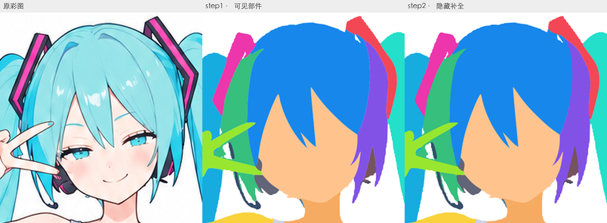
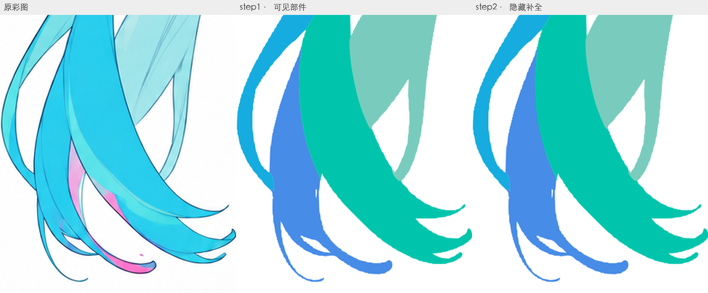
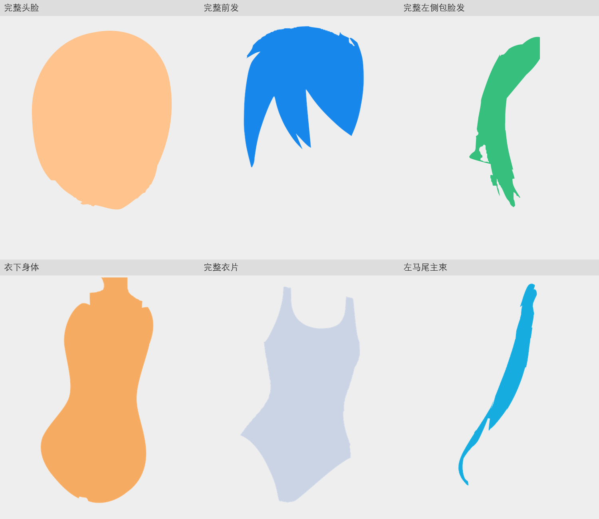

# 阶段2两步复测：毛边、路径膨胀与补全质量

后续决定：用户要求恢复原阶段2绘制流程，已撤回两步提示词。本文保留当时的实测与建议；文末的流程调整建议未实施，不作为现行方案。

结论：本轮不宜作为通过的阶段3底稿。可保留分组和位置参考，但需重新整理曲线及部分连接；目前没有证据表明“先交付可见片段，再补全”提高了整体质量。

## 实际结果

本轮两份SVG与彩图均为1037×1517，已排除前一次1024版参考混用。以下图片从实际文件渲染，使用相同坐标裁切。

毛边在step1已经存在。step2组合外观基本继承step1，主要增加隐藏区域，未解决现有毛刺、发卡简化和部分接头问题。

| 文件 | 文件大小（十进制） | 直线L指令 | 曲线C／Q指令 |
| --- | --- | --- | --- |
| case1原阶段2 | 24 KB | 32 | 432／0 |
| 本轮step1 | 358 KB | 12,038 | 0／4,424 |
| 本轮step2 | 1,091 KB | 53,029 | 0／0 |

本轮逻辑归属含背景均为31个，绘制组从31增至37。膨胀主要发生在路径表达，而不是增加了大量语义部件。case1参考版本不同，本表仅比较路径组织与复杂度，不据此量化人物还原度；具体文件哈希见[统计记录](./两步复测_路径统计.json)。

## 原因链路

1. **step1转向像素区域追踪。** 临时`astra-step02-visible/refine.py`从彩图颜色阈值提取前景，以已绘制分区分配像素，追踪相邻标签的网格边界，再输出路径。像素边缘起伏和区域分配残片被带进矢量；局部平滑与后续几何修复没有恢复自然曲线。
2. **step2将曲线打平成密集折线。** `astra-step2-20260915/common.py`按0.018画布单位的误差递归采样曲线，转为多边形；`path_d`只输出M/L/Z。最终SVG没有C或Q曲线，5.3万段直线直接保留在交付物中。
3. **补全依赖布尔拼接与修洞。** `build.py`将推断底形与上层覆盖区域求交，再与原可见区域合并；对小碎片用0.16单位半径的细连接条接到主形，部分孔洞按规则填掉。几何连通可以成立，但连接是否自然、独立部件是否好用仍需视觉判断。
4. **差分只能检查外观变化。** 本轮相同画布、2倍渲染的组合图中，任一RGBA通道变化超过16/255的像素占整幅画布约0.107%。这说明多数旧边界被保留，不能证明旧边界正确，也不能证明独显质量合格。

以上算法来自本轮实际临时脚本及最终路径结构，并非提示词明确要求采用。提示词的设计问题是要求先产出沿遮挡裁开的可见片段，再严格保持外观补回完整实体；这增加了重复边界、拼接和曲线退化的机会。执行者采用的像素追踪与折线布尔运算进一步放大了问题。

## 补全是否有用

确实得到发下完整头脸、衣下身体与完整衣片等内容。但头脸下缘、前发顶边仍有细小起伏或缺口；左侧包脸发在遮挡连接附近仍保留不自然的孔洞和接头。独显可以看到完整性与曲线质量并未同时达标。

这些文件仍是可解析、可分层的真实SVG，语义分组也有价值；问题在于继续编辑的成本。直接沿现有边界加墨线会继承毛刺，自动简化节点也不能自动修正分区、孔洞和连接。进入阶段3前，需要重拟合平顺轮廓并重新判断相关结构。

## 对两步设计的判断

本轮不能认定为成功，也不能把局部脸型收益直接归因于拆步：流程和绘制算法同时改变，尚无同输入、同画法的受控对照。

后续更值得验证的方向是：从完整、平顺的部件底形直接构建，先重点校准头部，再以单独一轮复核和修正可见边界与独显质量。可保留“造型检查”和“完整性检查”的分工，避免强制将第一轮交付物裁成可见拼图。核对证据应保留，曲线质量也必须进入验收。

本次仅审查和记录，未改提示词或两份输入SVG。
