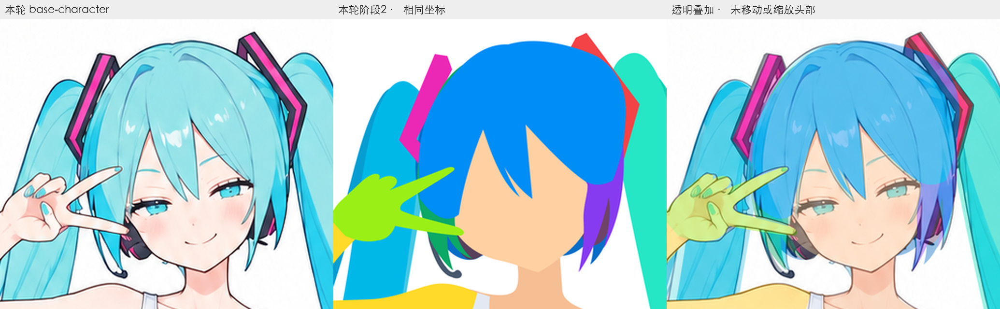
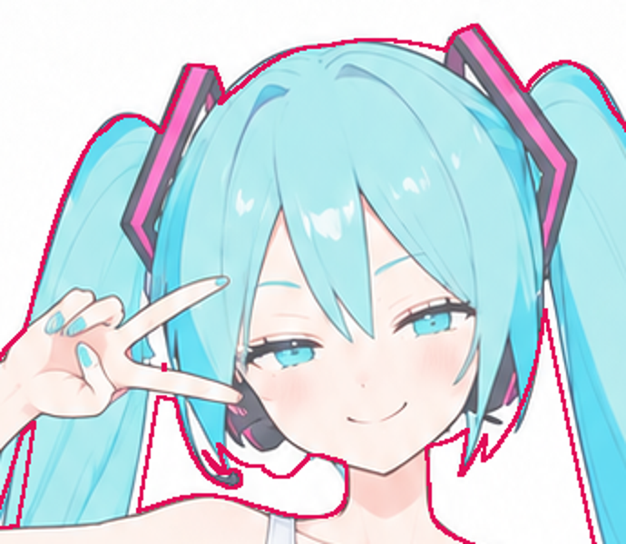

# 阶段2：可见造型复核与两步调整

**两步方案已撤回。** 2026-09-15，用户要求恢复原阶段2绘制流程，后续仅优化脸型和头发还原。[现行入口](../../workflows/2.建立完整部件与遮挡/readme.md)已恢复原单步提示词；本目录保留试验过程，不作为执行指令。

2026-09-14。依据用户提供的执行记录、当轮构建与修正脚本，以及实际参考图和最终SVG。

2026-09-15：[两步实测复核](./2026-09-15_两步复测.md)发现像素毛边和路径膨胀，补全后有5.3万段直线。本轮不宜作为通过的线稿底稿，尚不能证明拆步带来总体收益。以下保留9月14日调整时的依据与预期。

## 本次问题

本轮基础彩图为1037×1517，部件图为1055×1491；与case3归档的1024×1536彩图不是同一版本。因此本次只用当轮彩图判断还原，不把输入变化算作执行退步。

| 证据 | 说明 |
| --- | --- |
| 执行记录说明图2用于部件归属，SVG也沿用对应检查色与分区 | 不能说完全没有参考部件图，但结果未充分还原可见形状和相邻关系 |
| 对比初始构建脚本与最终SVG，头脸、中央刘海、左右鬓发、左右发卡共6组路径逐字一致 | 这些初稿几何没有在后续修复中得到校准；后续修改集中在马尾、叠放顺序等处 |
| 剪影检查用`a.min(2) < 245`合并所有非白像素，再提取前景边缘 | 能显示角色与背景的交界及背景空隙，看不到脸与刘海、不同发束之间的可见分界 |
| 最后结论强调闭合、无自交、唯一ID与DOM重建 | 结构检查不足以支持造型通过；本轮头部有明显偏差，不应据此通过 |

这张检查图里的五官和头发来自参考彩图；红线仅是SVG整体前景边界。它做了叠加，但没有覆盖本次关键问题，不能把图中的原图细节当作SVG还原证据。

## 本轮调整

[阶段2改为两个step](../../workflows/2.建立完整部件与遮挡/readme.md)，不增加必需图片：

1. **还原可见部件**：彩图＋部件图＋原规划，先做贴合参考的可见部件SVG。部件图提供归属及可见分界参考，彩图校准形状。检查组合后部件内部的可见交界，明确偏差先修正。
2. **补全隐藏部件与遮挡**：彩图＋step1 SVG＋原规划，在已校准底稿上延伸完整实体。比较补全前后外观，再独显检查隐藏形体；可见变化逐处回原图验证。

step1允许片段在遮挡边临时闭合，step2才恢复完整底形。最终文件名沿用`02_完整部件与遮挡.svg`；阶段3不接收中间可见片段稿。

预期差异：头脸和发束的可见边界会在补全之前得到专门校准；补全引起的外观变化能单独定位。阶段3仍处理五官、内部线条与线质，阶段2先承担基本造型责任。

**状态：提示词与入口已完成，尚未执行新版生成。** 一次通过也不能证明稳定性；下一轮先用本次相同彩图与部件图复测，查看可见边界是否更贴合、补全是否保持外观，以及实际返修是否落到错误部件上。历史产物与case3五步线稿改动保留。

## 证据范围

两张插图是本次诊断快照，第一张来自本轮彩图与SVG的同坐标裁切，第二张来自原agent的临时检查图。未重绘角色。运行时主参考与`outputs/references/base-character.png`像素一致，脚本对照来自用户执行记录指向的临时目录；临时脚本不作为工作流依赖。

本次文件SHA-256（用于识别版本，路径下后续重跑可能产生新文件）：

- `outputs/references/base-character.png`：`af2066f3cb9ef8add26645d90c93bebdbd0937c214c77fac335d5213be5affd3`
- `outputs/references/part-colors.png`：`c692f5d9f7a147ab77dd1889e0827561d9bab0f374d522e885b6bbc9dab2e85b`
- `outputs/step02-base-character/02_完整部件与遮挡.svg`：`baf1236fb087109e96dae1588ab09a6fb3d09980cf4f83d5910c90db9f8d1c34`
