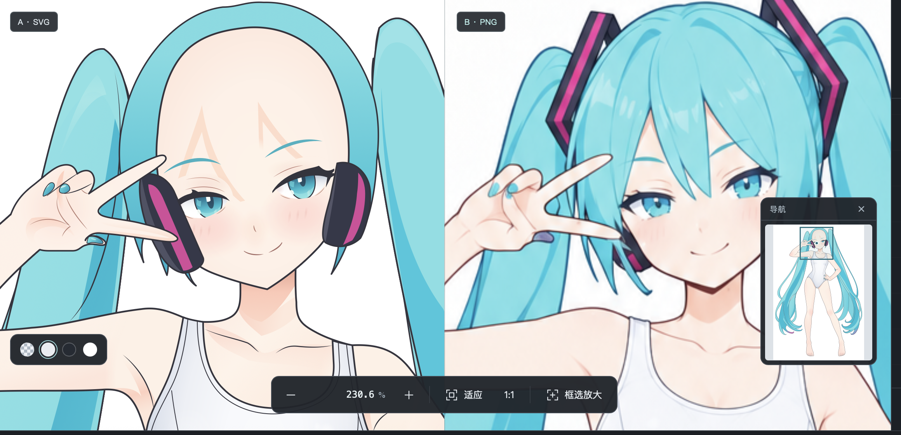
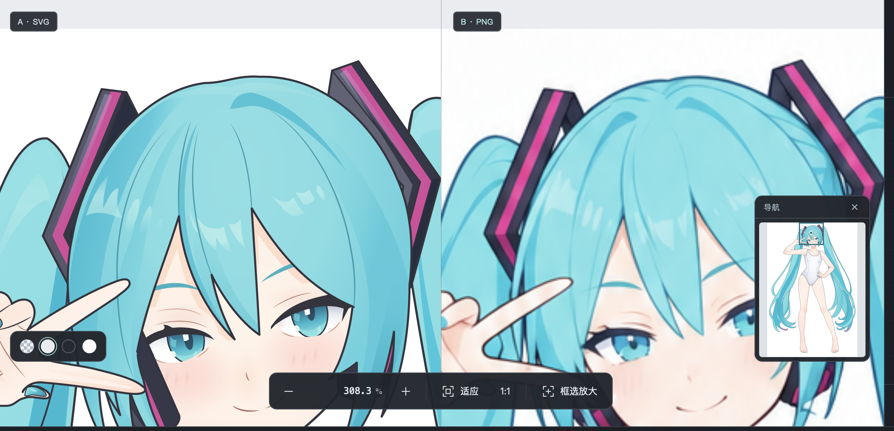
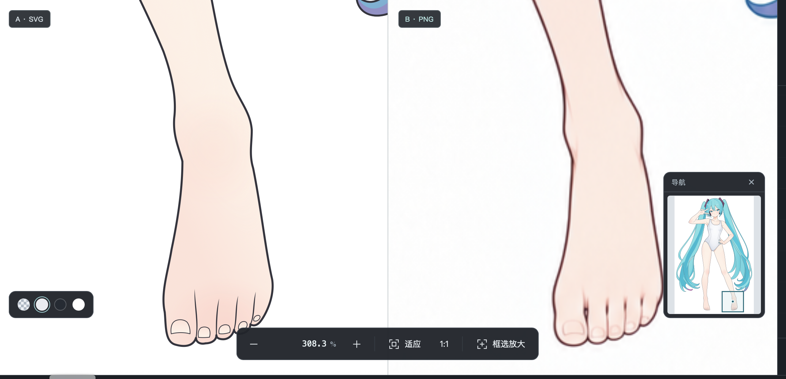
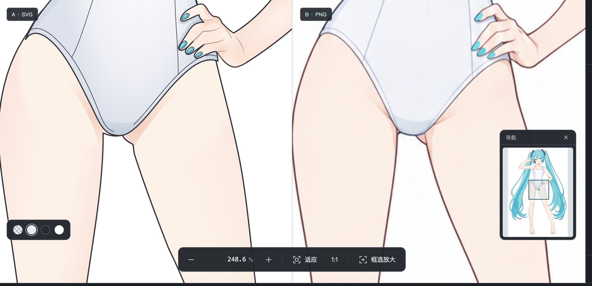

# 阶段5终稿：问题、证据与阶段定位

2026-09-13更新，纳入用户补充的4张原始截图。本文只复核和定位问题，未修改正式SVG或阶段提示词。

## 总体判断

**首次完整生成已经成功，人物整体形体、姿态和比例保持得很好。主要欠缺集中在局部线稿、配件构造，以及少数重要的着色关系。** 不能因为局部问题多就判成整个人物还原差，也不能因为小图接近就忽略大图中的具体差异。

此前“脸部已经差不多”的判断需要收窄：肤色、红晕和高光已经补上，但**虹膜上下色域的分配仍影响眼神**，不是继续加白点就能解决。

## 一眼看问题和对应阶段

| 编号 | 具体问题 | 主要定位 | 应改什么 |
| --- | --- | --- | --- |
| 1 | 隐藏刘海后，脸上仍留下刘海投影 | **阶段5 step1的投影组织＋预览器的显隐关联** | 区分本体明暗与外来投影，记录“谁投到谁”，隐藏来源时处理关联投影 |
| 2 | 眼部有高光，但上下颜色分层不如参考清楚，眼神不同 | **阶段5 step2** | 重配可见虹膜的上下色域、亮暗面积与过渡；眼形误差另归阶段3 |
| 3 | 头顶发线的分布、起点和走势与参考不同 | **阶段3 step2；step3精修** | 先画准主分束线的位置和疏密，再调线宽与收笔，不能只增加发丝 |
| 4 | 睫毛与眼睑的叠压、断续和留白没有还原 | **阶段3 step2；step3精修** | 补准可见段、被遮挡段、细尖和重叠关系，不能只拼成一条厚黑带 |
| 5 | 脚踝到脚背的局部轮廓不同，趾间线更长、更直 | **阶段3 step1／step2／step3** | 外轮廓校准、趾间结构与起止点、线条轻重分别处理 |
| 6 | 胯部衣缘、裆底与腿根的接线和收尾差异明显 | **阶段3为主；核对阶段4局部回修** | 先校准衣缘与腿根搭接，再处理线宽；暖色投影差异另归阶段5 |
| 7 | 耳机不只是占位不准，补全后的壳体也偏粗糙 | **阶段2＋阶段3 step1／step2** | 校准可见外形、壳体厚度和内部构造；隐藏部分应保守且连贯 |
| 8 | 发卡环内被填实，看不到背后的头发／空隙 | **阶段2底形；阶段3未纠正，阶段4沿用** | 保留真实镂空和框边，不能把环形部件画成实心块 |
| 9 | 头发蓝青色有偏差，部分亮暗带落在不同位置 | **阶段5为主，必要时核对阶段4底色** | 分开校准颜色数值和色面分布，不统一调蓝、调亮整片头发 |

阶段6原设想是最终边缘与细节整理，目前尚未制定或执行。适合承接画准后的线色与边缘收尾，不能代替上表中的造型、镂空或主要配色修复。

## 用户原始截图与具体观察

以下4张截图按原文件保存，未裁剪、改色或重画。**截图左栏是SVG，右栏是参考PNG。** [原文件来源与哈希](./用户截图/来源.json)

### 图1：投影残留与补全耳机——问题1、7

刘海已隐藏，额头却仍有两块尖角暖影。耳机完整露出后，外壳更像概括的大圆块，轮廓转折、厚度与内部构造不足。可见部分应忠于参考；参考看不到的部分不能要求逐像素一致，但也不能只靠“封闭、填满”判断补全质量。

**投影为什么放在“头脸”下面？** 这来自[阶段5 step1提示词](../../.agents/skills/svg-layering/workflows/5.大明暗与材质/step1/生成提示词.txt)的明确要求：“投影保留在承影部件内”。实际SVG也把它单独标为外来投影，并没有与脸的底色合成。

从绘制位置看，放在脸的范围内便于裁切和叠放；从独立部件的使用体验看，**把它仅作为脸的固定附属效果是不够的**。当前只在文字说明中写了投影来源，没有可供程序使用的来源关联；预览器按父子层级显隐，隐藏头发不会自动处理脸上的投影。

改进目标是明确“刘海 → 脸”的投影关系，并区分本体明暗与外来效果。隐藏来源时关闭关联投影；移动或换装后则需更新投影形状。仅把投影整个搬到头发组，仍不能自动解决承影裁切、层序与移动后的关系。之前修正的README独显示例只是手动关闭投影，尚未解决正式SVG和预览器之间的关联问题。

### 图2：发线、眼睛、睫毛与发卡——问题2、3、4、8

- **眼部配色**：参考的可见虹膜有较明确的上下两大色域，视觉上接近用户描述的“五五开”；当前更偏连续暗青渐变，下方亮区较窄，分层节奏不同。应在阶段5 step2调整面积、分界及颜色，而不是再加高光。“五五开”是本图的观察，不是所有眼睛都套用的固定比例。
- **头顶发线**：当前几条线在头顶偏集中，起点、弧线走向和展开距离与参考不同。已有5条主要发内线，不是单纯缺数量；需回到阶段3校准分束关系。
- **睫毛**：参考的可见笔画与眼睑、头发遮挡共同形成断续和细尖；当前黑带的起止、转折及叠压关系不同。要区分“存在但被遮住”与“本来就不画线”，把可见段和留白一起还原，才能保留立体感。

**SVG能不能有透明区域？能。** 它支持不填充、透明度，以及带孔洞的复合路径。发卡这里更准确的问题是“镂空没建出来”，不应把整个发卡调成半透明。应保留不透明的框边，让环内不填色，后面的头发自然显露；例如可以用内外轮廓配合填充规则表达孔洞。[SVG填充规范](https://www.w3.org/TR/SVG2/painting.html#FillRuleProperty)

当前两侧发卡底形都只有一条实心多边形轮廓，没有环内孔洞。问题在阶段2已出现，阶段3调整外轮廓后仍未补出。提示词要求“完整、不透明底形”是为了保留真实实体，**不意味着真实孔洞也要填满**；现有提示词虽要求保留空隙，但没有充分避免这种误读。

### 图3：脚踝、脚背和脚趾——问题5

整体腿形保持良好，差异集中在踝部内外侧转折、脚背向前掌的过渡，以及趾缝的长度和收笔。当前趾间线更像几条细长直线，甲缘也更机械。外轮廓对应阶段3 step1，趾间结构与甲片对应step2，线宽和收尾对应step3；仅把线色调浅不能校准这些形状。

### 图4：胯部、衣缘与腿根——问题6

需要看的不是整个胯部比例，而是衣缘双线如何结束、裆底如何接到两条腿，以及线条重叠处如何转折。当前接头更硬，与参考的线条取舍不同。

主要检查阶段3的外轮廓和服装结构线。另有一项已确认的版本事实：阶段4修改过右腿底形及对应轮廓，因此不能把这里所有差异都直接算作阶段3。皮肤上的暖色楔形投影属于阶段5，应与接线问题分开处理。

## 头发颜色：实际取样结果——问题9

直接读取原参考和1024×1536的SVG渲染，在相同坐标取9×9像素的RGB逐通道中位数，没有从用户截图取色。

| 区域与坐标 | 参考 | 当前SVG | 判断 |
| --- | --- | --- | --- |
| A 头顶亮面（540,90） | `#82E3E8` | `#82DFE5` | 差异较小，当前稍暗 |
| B 左长发暗面（270,600） | `#24C9DF` | `#12BAD2` | 当前暗面更暗，颜色也不同 |
| C 左长发浅色区（200,850） | `#82E4E9` | `#7CDEE4` | 当前稍暗、稍灰，差异较小 |
| D 左下回卷（185,1060） | `#16C2DB` | `#67D7E0` | 差异较大：参考暗区在当前变成了浅色带 |

**有色差，但不是整片头发都朝同一方向偏色。** 亮面相对接近；部分暗面偏暗；回卷处还叠加了色带位置不同的问题。优先在阶段5校准明暗色和覆盖范围，若多个对应基础色区仍同向偏色，再核对阶段4。上述取样是最终观感色，不能直接当作真实固有色。

[取样位置、局部与色卡对照](./11_头发颜色取样.png) · [原始数据](./头发取色数据.json) · [可复现取样脚本](./颜色取样.py) · [长发整体色带对照](./05_发束明暗与光泽.png)

## 已确认的源码定位

| 内容 | 能确认的事实 |
| --- | --- |
| 刘海投影 | `s051-body-head-face-cast`是脸内的独立投影组；来源只写在说明中，预览器没有来源联动 |
| 虹膜颜色 | `s052-…-iris-depth`在阶段5 step2加入上下渐变；因此眼内色域比例应在本步改 |
| 上睫毛 | `face-eye-left-upper-lash`在阶段3 step2建立，之后路径到阶段5终稿保持相同 |
| 耳机壳体 | 左右`accessory-…-temple-shape-1`在阶段3 step1后几何保持相同，后续着色没有补准造型 |
| 发卡孔洞 | 左右`accessory-…-root-shape-1`从阶段2就没有环内孔洞；阶段3 step1后几何保持相同 |
| 右腿局部 | 阶段4确实改动`body-right-leg-shape-1`与`body-right-leg-contour-1` |

这些事实支持“去哪个阶段改”，不等于已经证明该阶段的唯一成因。

## 对流程的判断与改进顺序

**线稿阶段的局部还原是当前主要改进点之一。** 需要改善的不是全局形体，而是线的位置、疏密、断续、收笔、部件厚度及真实孔洞。眼内色域、头发颜色和投影联动则另有明确职责，不能全部归为线稿问题。

“给阶段3更清晰的线稿参考”值得验证，但目前只能作为改进假设：阶段3原本已输入同一张彩图，这些差异在彩图里也能辨认。更直接的执行问题是没有准确落实参考里的局部关系，验收也未及时拦截。新生成的线稿同样可能改形，仍需与主参考核对。

建议先做小范围对照实验：

1. **阶段2／3**：选发卡孔洞、耳机壳体、睫毛和头顶分束，验证更清楚的局部参考是否提高还原，而不改变整体人物形体。
2. **阶段3**：按现有彩图回修脚踝与胯部接线，检查曲率、端点、相邻间距和线条断续。
3. **阶段5**：重新组织眼内上下色域、头发颜色和亮暗带；完善投影来源与承影面的使用规则。
4. **阶段6**：在上述关系准确后做线色与边缘收尾，不继续堆高光或纹理替代基础修复。

验收统一采用“同坐标参考＋结果＋明确差异”，分开看整图形体与放大后的局部质量。检查变化涉及的关系，不穷举全身零件。

## 版本与补充证据

当前[终稿SVG](../../outputs/case1_miku/step05-base-character/05-2_局部色彩与材质.svg)与演示区`miku.svg`字节相同，SHA-256为`88b7b01fe5d24957c1997fbcca6e7d2a80661476a2273cbfb0894e5e3c2c59e9`。主要参考为[base-character.png](../../outputs/case1_miku/references/base-character.png)。阶段文件现已归入`outputs/case1_miku/`。

本次保留全部原图与源码，4张用户截图按原字节归档。此前的几何继承、原稿恢复、审查返修和10组对照仍可在[历史详细复核](./历史详细复核.md)及[核验数据](./核验数据.json)查阅；历史的“眼部已基本完成”等宽泛判断以本报告具体问题为准。
