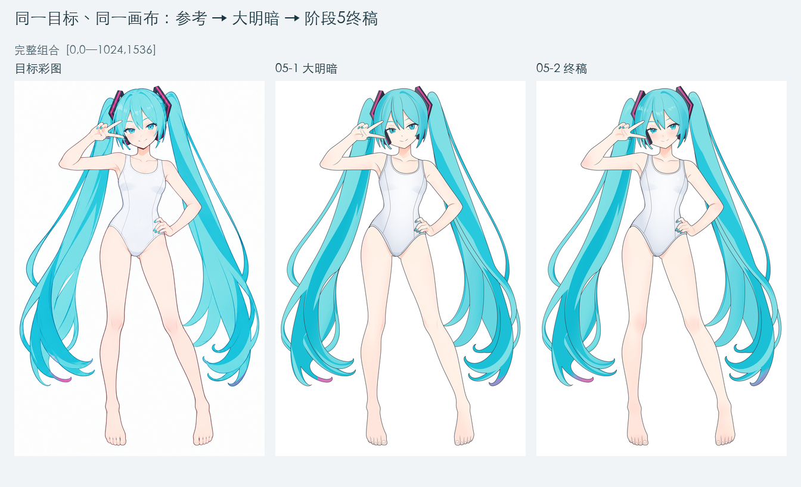
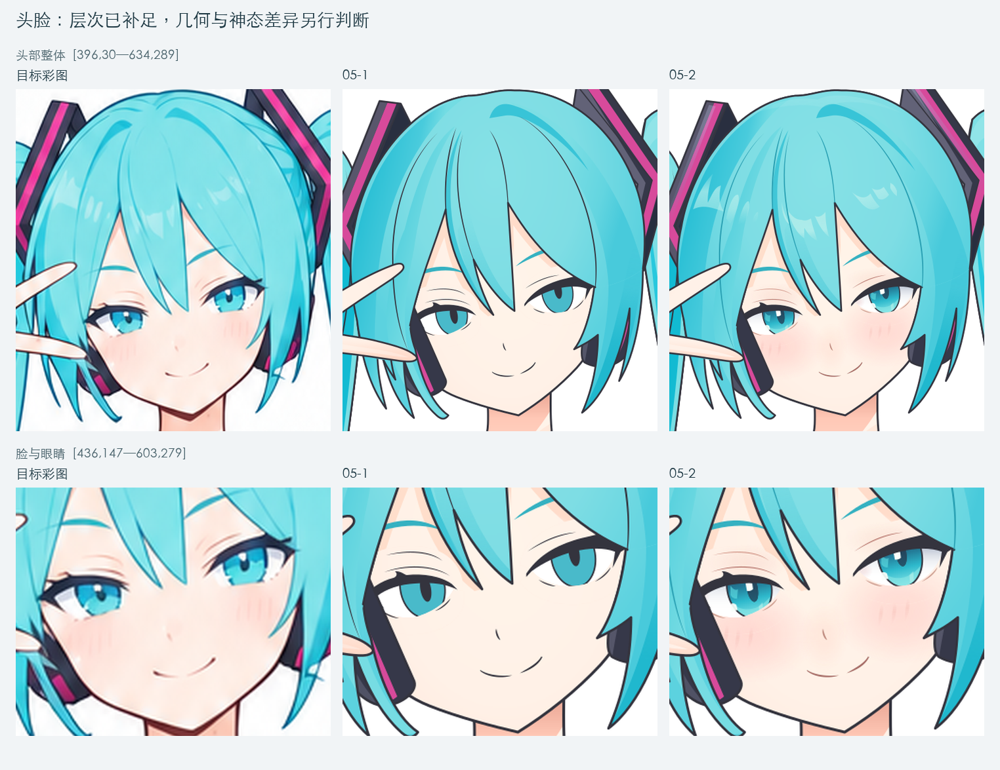
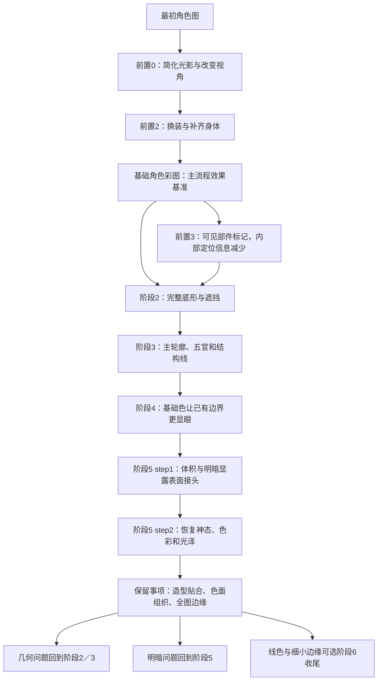
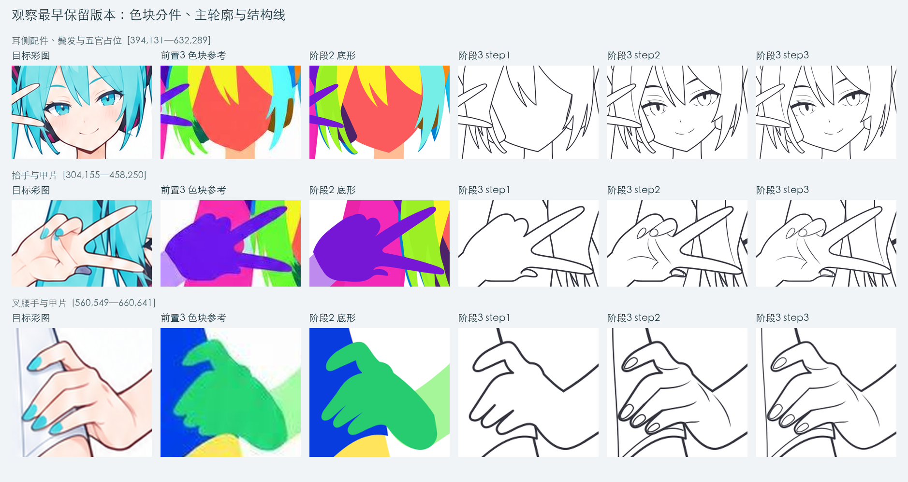
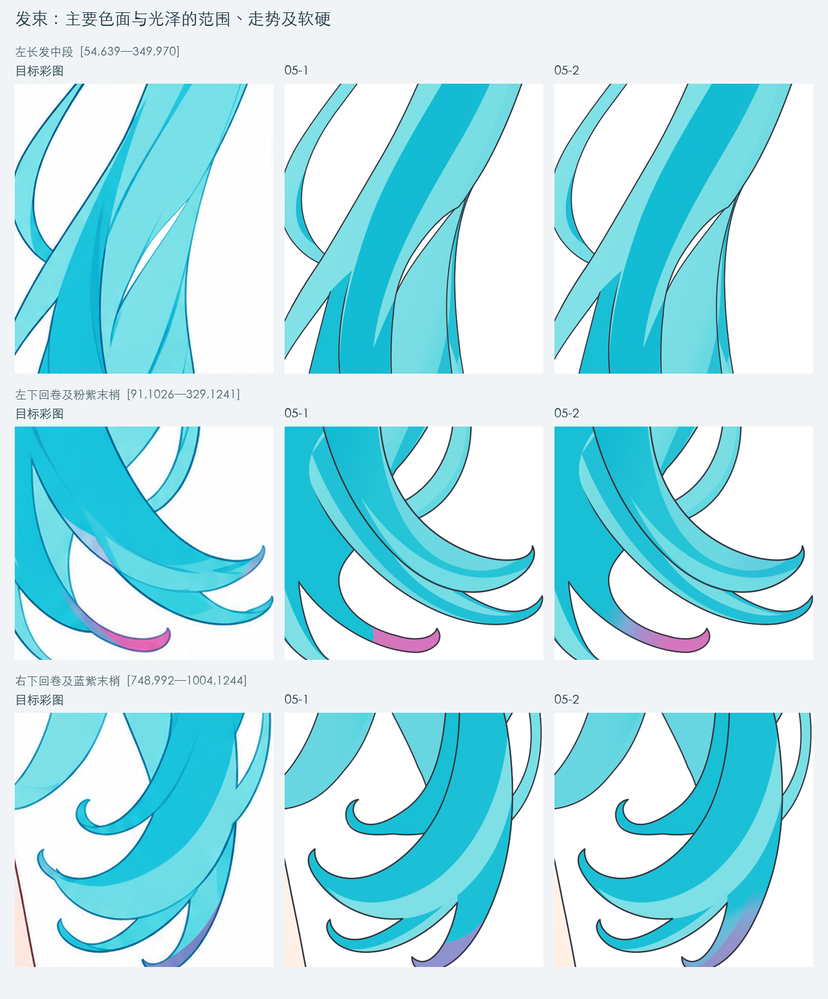
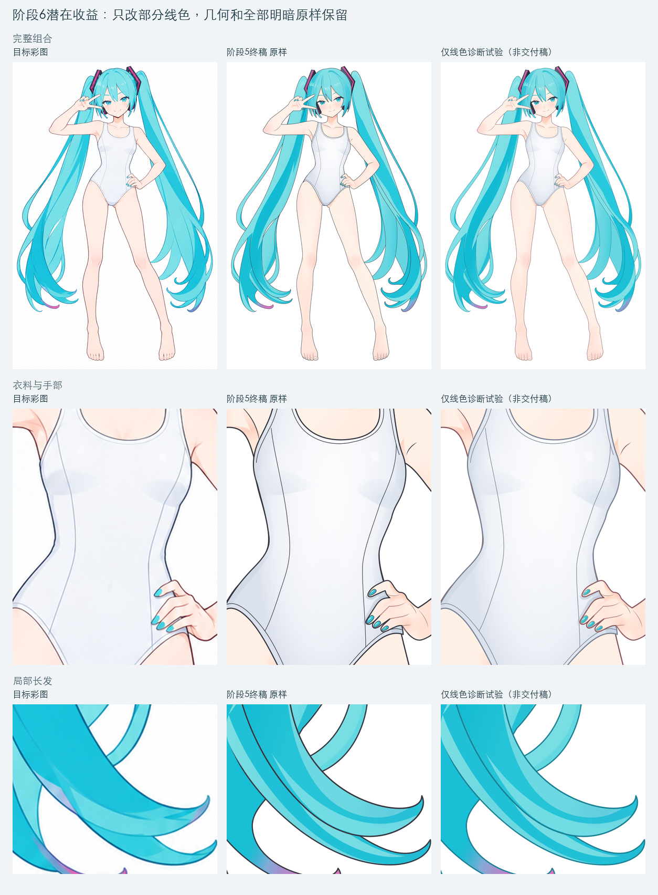

> 历史详细记录：保留首次复核的过程与技术证据。眼部分层、投影联动、发卡镂空等结论已由用户补充截图后的[当前报告](./2026-09-13_阶段5终稿差异与流程链路分析.md)更新，不以本文件旧优先级代替现行判断。

# 阶段5终稿差异与流程链路分析

2026-09-13。对象：最新`05-2_局部色彩与材质.svg`、实际目标彩图及现存的阶段2—5源文件。本文是对作品、流程和验收的综合复盘，不修改正式SVG，也不执行阶段6。

## 1. 核心判断

**当前整图的还原度已经较高，阶段5完成了从基础明暗到主要彩图表现的推进，脸部的改善成立。接下来最值得投入的是放大后可见的头发局部实现：明暗带的宽窄与接续、顺发流的光泽，以及线条和色面的边缘关系。继续给脸加细节的收益已明显降低。**

终稿的眼内深浅、反光、眼周与脸颊暖色、鼻口线色已形成一组完整关系，头部不再停留在“单色虹膜＋浅肤色”的状态。双手原明暗的局部硬接、两侧异色发梢也得到回修。可编辑的完整底形和部件组织仍保留，新增效果确实来自矢量内容。

角色、姿态、主要配色和发束组织在整图尺度上已经接近目标。放大后，部分长发明暗更像均匀宽带，分叉和回卷处的收束、过渡及线色更显规则和生硬；这些是当前最突出的精细观感差距。耳侧配件占位、鬓发落点、部分五官和甲片形状也确有偏差，衣料及部分皮肤转面稍硬，但不应把逐项罗列的差异数量等同于整体还原差，或由此要求大范围回退。

**首个完整生成结果已经成立；后续按具体错误点定位对应阶段，不统一要求回退早期或全部交给末端精修。** 耳机占位偏差明确来自早期底形／主轮廓，应回到阶段2／3处理。头发表现适合小范围改进：线色和边缘属于阶段6，原明暗带需在阶段5所属色面中回修；若源头是发束曲率或分叉底形，则修改对应早期几何。阶段6作为单轮收尾具有实际价值，但不能代替这些分流判断。

本节依据用户指出的显示尺度差异进行了再次复核，并相应调整后文优先级。初版报告的来源追溯大体成立，但把“问题来自哪个阶段”和“现在应优先重做哪个阶段”联系得过强，也没有充分突出整图已经达到的还原程度。下面的局部问题清单应作为可定位的差异档案阅读，不作为整稿质量较低的判断。

## 2. 比较基准、方法与证据边界

### 两个“原图”要分别使用

主要验收目标是[前置2基础角色彩图](../../outputs/case1_miku/references/base-character.png)：它与当前SVG同为1024×1536，是阶段5应该接近的颜色、神态和材质依据。

[最初穿原服装的角色图](../../outputs/case1_miku/references/original-input.jpg)用于回溯前置处理造成的身份、视角、画风和细节变化。它的画布为832×1216，服装、鞋袜和光照处理也不同，不能把这些已被前置流程主动改变的内容直接算作阶段5遗漏。

此次执行任务使用的`base-character.png`文件哈希为`ae9d5a…`，此前附件存档为`30d278…`。本次独立比较确认，两图尺寸和解码后RGBA像素完全一致，像素SHA-256均为`c44d8761…`。之前仅因文件哈希不同而保留的参考版本疑问，在本例可以解除；文件重新编码不等于画面被换成另一版。

### 实际完成的核对

- 读取最新制作任务「完成局部色彩与材质表现」（`01a096b0-9813-70d3-b406-4663d18b372c`）及其交付记录，核对原独立审查报告的候选哈希与当前终稿。
- 重新渲染实际阶段2、阶段3三轮、阶段4、阶段5两轮SVG，以2048×3072统一查看；局部对照使用相同场景坐标、倍率和背景，不把参考轮廓变形配准到输出以掩盖误差。
- 查看头脸、双手、两侧长发及卷梢、衣料、膝腿、足趾；逐版比较关键原元素几何，区分首次出现、后续沿用和后来显现。
- 独立核对阶段5终稿的原ID、层级、原有子序、许可属性改动、资源引用和逆向恢复；另用去墨线及仅线色变化的临时诊断副本分离线条与色面的影响。

本文将直接可见差异、XML可验证的继承关系、对原因的推断分别说明。现存的阶段2文件是该阶段保留的产物，不代表内部第一版；没有全部中间候选时，只能说“最早保留稿已存在”，不能编造首次画错的具体时刻。当前提示词可能经过后续优化，也不能假定现存版本就是早期每次执行时的逐字输入。

本次没有重做所有隐藏部件的完整动画测试，也未验证Live2D导入、网格或变形。静态分层和原稿保留成立，不等于已可直接绑定使用。未给出全图相似度百分比：不同位置、线色与抗锯齿会混入同一数值，不利于定位当前问题。

## 3. 阶段5的实际成果与剩余差距

下表按位置和原因组织。当前优先处理头发在放大观看时的局部表现，其余项保留追溯；表内问题数量不代表整体差距大小，也不等于把每项差异都判成当前阶段不合格。

| 位置／视觉作用 | 已改善的内容 | 仍可观察的差距 | 主要归因与应修位置 |
| --- | --- | --- | --- |
| 脸与眼神 | 虹膜已有深浅、反光与瞳孔辨识；脸颊与眼周有轻暖色，鼻口内线柔和 | 眼睑弧度、眼角空间、脸廓仍不同；参考的神态和圆润感尚未完全重现 | 局部色彩目标基本成立。若要进一步贴近，优先阶段2／3的几何，不继续无目的增加腮红和白点 |
| 耳侧配件与鬓发 | 配色、遮挡关系可读 | 画面左侧深色配件向眼角附近伸得更高、更显眼；两侧发尖落点和可见配件面积不同 | 早期部件形状及相邻覆盖关系；保留为精确贴合的后续改进项，修复时需连带检查眼、脸、发和配件 |
| 双手及甲片 | 原右手背尖折暖影已收顺；抬手与前臂的明暗接痕得到处理；掌纹调色、甲面反光生效 | 几片甲片偏小、偏圆，贴近指尖的关系不准；折指与指根形状仍偏概括 | 外手形追溯阶段2／3 step1，甲片与指内结构主要追溯阶段3 step2；阶段5高光只沿用这些形状 |
| 头顶与刘海 | 主要受光和光泽已出现，内部发线改青色后减轻割裂 | 光泽形状较规则、分面感较强，部分亮暗范围与参考不同 | 阶段5可再校准光带与色面；轻微线色整合可留阶段6，无需增加逐根发丝 |
| 长发中段与回卷 | 大方向、主亮暗和分层可读；粉紫／蓝紫末梢过渡比step1自然 | 可见空隙、回卷曲率与端点仍不同；大块青色明暗更像均匀宽带，柔和衰减和局部转面不如参考 | 同时有阶段2／3的几何问题、阶段5 step1的色面组织问题，以及阶段6能处理的线色问题 |
| 衣料 | 冷白、侧转面和局部柔光已有表达 | 胸下楔形灰面、侧面与正面的边缘较清楚；轮廓和接缝较深，整体比参考更像图形化分面 | 明暗形状／边缘属于阶段5；接缝位置属于阶段3，线色轻重可由阶段6改善。不是缺织物纹理 |
| 身体与关节 | 肘膝等局部暖色补充，原主要明暗保留 | 一些转面仍偏硬或偏简；身体线条比手与脸的已调色内线更突出 | 明暗边缘与覆盖范围回到阶段5；外轮廓色彩和部分线条主次留阶段6 |
| 足趾与趾甲 | 浅粉甲色及少量层次保留 | 趾间细线显得较长、机械，甲缘与趾形更概括；与参考形状不完全一致 | 阶段3的结构表达及外形。调暖线色能减轻突兀，不能修正趾形和线的起止位置 |
| SVG交付信息 | 有独立的05-2版本记录，文件可自包含渲染 | 根级`data-stage`、title和desc仍写05-1，desc还声称不含step2红晕／高光，与实际内容冲突 | 交付元数据规则的小问题；不影响当前渲染，应允许更新文档级当前状态、另存历史来源 |

### 3.1 脸部可以停止“为了精致继续加细节”

终稿在眼内层次、眼表反光、眼周肤色和鼻口线色之间建立了配合，面颊留白仍在，改善在完整头部上可见。原先“脸平、眼空”的阶段性缺口已基本关闭。

剩余神态差异需要看眼形、脸形、耳侧空间与鬓发覆盖。让现有眼睛继续变亮、让腮红更浓，不会把这些空间关系调回参考，也可能破坏已经成立的亲和感。

### 3.2 双手证明“颜色修好了”与“形状修好了”是两件事

源码和实际渲染都确认：右手背的原明暗路径发生局部回修，左手的受光填充也有调整；并非只在原问题上加一层高光。两处修正比step1自然，属于合理的有限返修。

但当前叉腰手几片指甲依然是原有较小的封闭甲片，反光只使它们更像有光泽的小甲片。甲片大小、倾斜、贴边位置和指尖形体的差异仍在。[双手三列证据](./06_双手回修与残留造型.png)可以同时看到这两类结果。

### 3.3 剩余“硬”的感觉同时来自线条和色面

这里需要结合显示尺度：整图缩小看时，当前的主形和主要色块已足以传达相近效果；头发局部放大后，明暗带宽度变化偏少、长尖角收束、回卷亮带较规则和较深的外线才更显眼。参考也有硬边，并非整片柔焦；需要调整的是哪些边应清楚、哪些应衰减，以及色带如何沿发束转弯和结束。参考为位图，极高倍率下的抗锯齿与插值柔化不能全部当作应复刻的绘画细节。

[衣料、皮肤与足部对照](./04_衣料皮肤与线色.png)显示，阶段5 step2对衣料的修改较克制，而step1留下的主要灰色分面仍可辨认。参考也有明确分面，不能要求全部模糊；差距在于具体范围、走势、软硬交替，以及它们与线条共同形成的视觉强度。

我在临时副本中只关闭墨线组，保留全部底形、明暗和材质。结果是：深色轮廓消失后，衣料的楔形灰面和长发的宽色带仍然存在。[去墨线诊断](./07_去墨线诊断.png)据此排除了“全由线条过黑导致”的解释。

去掉全部墨线也损失了参考中必要的结构，所以这个实验不是修复方案。应分别处理：线色不协调就调线色；色面转折不对就改色面；形状不对就改底形与对应墨线。

## 4. 问题如何沿流程传递

### 4.1 前置0—2：当前目标本身已经是再创作后的参考

前置0现有提示词同时要求简化原图、生成“平涂版本”和改为平视角；实际产物仍保留部分光影和细节。因此它更接近简化彩图，不能理解成阶段4那样严格的纯色平涂。

前置2换装并补齐原服装遮挡的身体，保留了较简洁的光影和材质。最初图片中的彩色衣料反射、密集发丝、原鞋服细节以及部分视角感觉，在进入SVG前就已经改变或移除。阶段5没有恢复这些内容，不应列为对当前base-character的失职。

如果最终目标改为重现最初原服装图的绘画气质，就要重新审视参考链路；这不是阶段6补几个亮点能够达成的目标。当前先打通base-character的选择仍合理，只需明确效果目标的身份。[参考生成链路](./08_参考生成链路.png)

### 4.2 前置3—阶段2：归属判断与形状校准发生了偏重

色块图有效地提供了部件归属，但按设计去掉了五官、内部结构和细微色彩线索。它适合回答“这一块属于谁”，不能独立承担“边界精确在哪里”的校准。

现存阶段2中，耳侧配件靠近眼角的占位偏差、鬓发的落点差异、一些长发空隙和回卷形状已能观察到。与色块参考相比，阶段2也作了自己的完整形状推断，所以不能把全部偏差归咎于前置3。

阶段1其实提供了双眼中心等约坐标，还明确将耳侧配件连接列为待核对项。因此问题不只是“没有五官数据”，而是这些相邻关系没有在无五官的部件图验收中被充分用起来。隐藏补全推断获得了过多自由，而可见区域缺少足够严格的空间约束。

**后续应保持一个边界：隐藏处允许保守推断，可见轮廓与相邻空间要持续受彩图约束。** 阶段2不必提前制作正式眼睛图层，但可以在检查视图中临时标出眼角、眼位或与参考叠加，检查配件有没有侵占本应保留的空间。辅助验证不等于提前增加正式拆件。

### 4.3 阶段3：线条变干净，未同时充分纠正形状

主轮廓阶段允许重拟合底形，并没有把阶段2曲线锁死；但保留稿显示，耳侧配件、头脸和部分鬓发只作了有限调整，关键偏差随后长期沿用。

内部结构线阶段建立了眼白、虹膜和甲片。这些结构语义清楚、可编辑，但部分形状概括偏离参考。后续精修确实调整了线宽、收笔及部分路径，不能说完全没做事；问题是很多关键实体的几何没有进一步纠正。

| 可定位的原元素 | 现存版本之间能确认的继承关系 | 能支持的结论 |
| --- | --- | --- |
| `accessory-left-temple-shape-1`、`accessory-right-temple-shape-1` | 阶段2已有该部件；阶段3 step1小幅调整后，几何直到05-2完全相同 | 深色外壳占位不是阶段5新改坏，至少应回到阶段2／3 step1连带校准 |
| `body-head-face-shape-1` | 阶段3 step1调整后一直沿用到05-2 | 当前脸形差异不能归因于本轮腮红或高光改了底形 |
| 左侧前／后鬓发底形 | 阶段3 step1后保持相同 | 左侧落点与空隙问题被后续阶段保留 |
| `hair-right-fringe-shape-1` | 阶段3 step2另改过贴脸尖梢，之后未变 | 右侧鬓发不能全算作阶段2遗留，也包含阶段3的局部选择 |
| 眼白路径、虹膜椭圆 | 阶段3 step2出现，之后几何保持相同 | 阶段5在既定眼形内完善视觉表现；要进一步匹配眼形，应回到结构线阶段 |
| `hand-right-nail-index-shape`、`hand-right-nail-middle-shape`等甲片 | 阶段3 step2建立，之后底形保持相同；精修主要改变甲缘线宽 | 小甲片问题在填色之前已经存在，不属于高光没有画好的问题 |

[长发和足部追溯](./09_长发和足部构型追溯.png)补充了两个现象：长发可见空隙与回卷形状在阶段2已不同，阶段3局部调整后继续沿用；足趾内线与甲缘主要在结构线阶段出现，之后变得更细，但形状与参考的关系未因此自动改善。

这与之前physics-band研究的结论一致：平顺曲线、线带和干净接合能提高线质，不能自动保证原图贴合、解剖关系或部件归属。**“画成一条干净的曲线”和“这条曲线的位置与形状正确”必须分别验收。**

### 4.4 阶段4：颜色放大了旧问题，也固化了少量颜色解释

阶段4基础填色符合纯平涂范围。此次源码对比再次确认，其主要工作是赋色和增加必要色区；旧几何只有右腿口对应底形／轮廓的一处局部变化，不能据深色配件此时更显眼就认定它是阶段4画歪的。

深灰配件放到浅肤色旁边，提高了边界可见度；白底线稿中容易接受的占位偏差，在彩图中更难忽略。这是旧问题的显现。

另外，阶段4把发梢粉紫、蓝紫按独立固有色区表达。当时已注明固有色与受光色偏存在不确定性。最终step2通过顺发流过渡改善了横断端帽，但本例并不能证明这类颜色在所有参考里都应拆成硬固有色区。后续要记录“颜色为什么变化”，让底色区与受光／反射区别有据，而非只给每种颜色划一个闭合面。

### 4.5 阶段5 step1：逐件着色使潜在的人工分段显形

阶段4相同底色能掩盖人工封口。逐件加明暗后，交界两侧若没有同一表面的受光关系，就会出现亮暗台阶和色带错接。此前刘海、左长发、隐藏衣料、肩髋接头的问题都属于这一机制。

新的独立审查确实促成了这些接头修复；step2又局部回修双手。它们说明问题能被发现并改正，但也说明单件独显正确不足以保证邻接面组合正确。部件身份、绘制分段与连续受光表面不能简单等同。

现阶段剩余的主要色面差距更偏绘画组织：部分灰面和青色带的范围、宽窄、边缘衰减过于概括。它们在关闭墨线后仍在，应回到该明暗层修改，而不是等待末端线色调整。

### 4.6 阶段5 step2：职责发挥明显，同时受到既定几何边界限制

本轮优先处理脸和眼神是有效的。原属性变更包括26项内线fill调色、左手原受光的1项fill切换，以及右手原暖影的1项路径和1项fill调整，共29项。新增47个appearance组承接局部色彩与材质。眼、脸、手和刘海线色的变化共同改善观感。

独立审查首轮指出左右末梢的颜色接续问题，主agent在v2中修正，随后同一审查者复验通过。当前终稿与受审v2哈希一致。[首轮审查](./阶段5step2_原独立审查_v1.md)、[复验记录](./阶段5step2_原独立审查_v2.md)

因为本轮有意保留原实体和墨线几何，它不会解决早期甲片、眼形、脸廓和配件占位。这是当前打通流程的范围选择，不宜把“按范围完成”误读成“与参考全部匹配”。另一方面，像原明暗硬接这样会妨碍继续细化的问题，允许有限回修是必要的，不应因旧问题身份而一律豁免。

## 5. 为什么之前看过、检查过，仍有明显不足

### 5.1 可读性、忠实度、可编辑性混在了“通过”里

手势可读、眼睛有层次、部件完整、ID正确都是成果，但都不能单独证明局部临摹准确。之前的验收对“合理简化”和“已经成立”的容忍较宽，未充分锁住参考中的位置、大小、方向、端点和邻边间距。以前的[贴合问题记录](../base-character-fidelity-review/局部贴合问题记录.md)已承认这一点，本轮几何继承证据使它更具体。

后续应分别保留：当前阶段任务完成情况、对目标的可见贴合情况、分层完整性。允许暂缓旧造型问题时，它应在第二项中持续显示，不随新阶段通过而消失。

### 5.2 新结构加入后，没有充分重新约束邻居

早期没有五官，配件看上去仍能成立；正式加入眼睛后，眼角与配件的空间矛盾才明显。问题不在于必须提前画所有细节，而在于关键参照新增后，应回查相关邻居。

通用的关联检查可以覆盖：新增眼睛后看眼—发—脸—配件；新增甲片后看甲—指尖—邻指；新增明暗后看色面—接续部件—真实遮挡。按发生变化的关系扩展检查，比列出全身每个零件更直接，也更符合当前不穷举的需求。

### 5.3 每轮有所变化，但纠偏依据没有同等增强

各阶段源文件表明，SVG一直在变，不能说后续只是重复同一输入、没有实际工作。用户之前对“输入缺少新变化量”的担心，更准确地落在：是否产生了新的定位证据和可核验差距，而不只是把当前稿继续细化。

新增参考图只有在提供可靠信息时才有价值。image2.5生成的线稿可以作为实验性读图辅助，但它也会重新解释形状；还须与主参考核对位置和视角，不能以新生成图覆盖掉原目标。当前证据不足以给image2.5与Astra的模型能力做整体排名。

### 5.4 独立审查改善了执行，但不会消除标准中的宽判

阶段5两步都有实际审查和返修，不能说审查只是形式。它拦截了可定位的接缝、隐藏截断和末梢色块问题。但只要旧造型偏差被允许保留，或“边缘已合理”判得较宽，终稿仍可能在整体贴合和画风上有明显差距。

因此应改善审查所用的证据和问题归类：先由参考确认应有关系，再看候选；遇到差异明确归为几何、线条、色面、材质或阶段取舍；不能只沿着绘制者已经加过的图层检查。

## 6. 与前面研究经验的对应

| 已有经验 | 本轮证据支持什么 | 对流程的具体含义 |
| --- | --- | --- |
| 完整底形与表面墨线分开 | 阶段5保留了原实体，局部颜色和线色可以分别调整 | 保留这种结构；补隐藏轮廓不等于补新动作或嘴部内部 |
| physics-band能改善线质，但不自动校准造型 | 当前已有大量平顺矢量线和闭合墨线带，甲片与配件仍能偏离参考 | 先约束端点、走势、宽度和相邻间距，再做线带精修；不靠“物理”命名代替定位 |
| 超分／清线参考需要验证 | 本轮主要大差异是占位、曲率、色面关系，原彩图中已可辨认 | 可用超分或局部清线帮助辨读模糊细节，但它不能替代归属、隐藏补全与可见形状核对；收益须用固定局部实验验证 |
| Suzuran分析强调笔触职责、软硬边和复杂度主次 | 脸部的定向完善有效；长发、衣料仍存在均匀宽带及较强结构线 | 区分塑形色面、接触影、光泽、结构线；每笔有作用，不把所有表面都做同样的渐变／亮条 |
| 组合、独显、多尺度检查分别回答不同问题 | 接头能在独显无误后于组合显现；形状偏差在填色后更明显 | 保留中性底独显，增加相邻表面合看和同坐标参考；正常显示尺度决定实际观感，高倍检查技术边缘 |

参照：[physics-band线稿方法分析](../physics-band-analysis/线稿方法分析.md)、[Suzuran绘画策略分析](../suzuran-analysis/绘画策略分析.md)。本次未取得或运行朋友的原算法，不据成图反推其优化器或稳定性。

### 复杂度不是当前首要瓶颈

| 保留阶段 | 文件字节 | path数量（含定义） | 显式三次贝塞尔C/c命令数 |
| --- | ---: | ---: | ---: |
| 阶段2 | 24,099 | 36 | 432 |
| 阶段3 step1 | 57,412 | 96 | 916 |
| 阶段3 step2 | 183,010 | 192 | 2,807 |
| 阶段3 step3 | 220,908 | 192 | 2,813 |
| 阶段4 | 237,484 | 199 | 2,838 |
| 阶段5 step1 | 376,050 | 394 | 4,892 |
| 阶段5 step2 | 507,108 | 507 | 5,429 |

从阶段3内部结构线到精修，文件变大而path数量未变，主要有线宽、收笔和路径表达调整；从阶段5 step1到step2，更多增长来自局部效果与裁切／渐变资源。统计包含定义中的几何副本，不等于可见笔画或可动画实体数量，也不能直接量化好看程度。

当前画面已经具备表达目标主要效果所需的基本结构复杂度。继续普遍加密路径或添加微纹理，不能修正小甲片、错误占位和宽色带的范围。应先把已有形状、颜色和边缘组织正确，再针对实际遗漏补充。

## 7. 阶段6原本打算做什么，现在还值不值得做

### 原计划

现存工作流索引中的阶段6名称是**“最终边缘与细节”**，原描述是“调整线色、边缘与焦点细节，核对全图及局部”。当时只有方向，没有正式生成提示词和独立执行结果。

结合当时引用的绘画分析，其主要意图是：上色后重新协调线条与材料；整理边缘轻重、软硬和必要消隐；清理重复暗边、零碎色斑或过密细节；最后确认全图与焦点。它不承担重建主要明暗或修正整个人体／部件布局。

阶段5 step2已经承接了眼神、反光、红晕，以及鼻口、眼周、手纹和部分刘海内线的调色。因此原阶段6的“焦点点睛”已有相当部分完成，剩下的主要是全图线色与边缘整合。

### 本次做了一个可观察收益的诊断试验

在临时副本里，仅把部分皮肤线改为暖色、发线改为深青色、衣料线改为较弱冷灰色，改变79处颜色属性；保持全部几何、线宽、明暗和材质原样。这是为了分离线色变量，所选颜色不是通用色表，也不是正式阶段6产物。

结果：深灰轮廓的割裂感减轻，手、身体、衣料与发面更协调，说明阶段6确有可见收益。但衣料楔形灰面、长发宽色带、甲片大小和配件占位都还在。单一调色也未解决各条线应强应弱的具体取舍，不能把试验图直接判成最终稿。

| 下一步目标 | 是否值得做阶段6 | 建议范围 |
| --- | --- | --- |
| 把当前case整理成更自然的展示稿 | 值得，作为可选单轮收尾 | 选择性调全图线色和轻重，整理少量接头、边缘与重复细节；保留已经成立的脸部表现 |
| 让下一次角色临摹更忠于参考 | 收尾经验与早期纠偏均有价值 | 先用当前头发局部验证色面与边缘的收益，再针对已记录的几何偏差改进阶段2／3；不由局部误差推断整条流程需要重做 |
| 让当前终稿充分恢复参考中的形状与材质 | 仅阶段6不够 | 按问题回到所属层与原阶段：几何同步改底形和墨线，明暗改所属色面，最后再收尾 |
| 准备Live2D等可动资产 | 阶段6不能替代该验证 | 后续另核对导入、完整部件、投影处理、网格和动作需求；当前无依据证明这些已经完成 |

**建议保留阶段6的名称，以一轮局部收尾验证当前最突出的头发细节差距，不继续扩写成多step或“万能精修”。** 先从线色、边缘和顺发流的表现入手；若需要调整现有明暗带，须明示有限回修范围并检查受影响表面。耳机等已定位的几何偏差仍应修改原底形与对应墨线，是否同轮处理取决于具体范围，不由阶段6统一承接。本次仅给出评估，不新建阶段6提示词。

## 8. 下一轮改进应如何落地

按以下顺序处理，可以复用现有成果，也能让每轮带来新的可核验信息。该顺序按再次复核后的实际观感调整，来源追溯不直接决定当前返工顺序。

1. **冻结当前阶段5终稿作为对照。** 保留它已经成立的脸部色彩与材质关系，同时列明未解决的几何、色面和边缘差距。文档级当前阶段与历史来源分开管理；参考既核文件版本，也允许确认像素完全相同的重新编码副本。
2. **优先验证头发局部收尾。** 选择长发中段的色带交汇、一个回卷发梢，以及必要的刘海光泽局部。用同坐标参考／旧稿／新稿，分别在整图、原图像素尺度和适度放大下评价。先处理线色、色带宽窄和收束、局部衰减及软硬边，不靠增加逐根发丝制造精细感。
3. **明确局部收尾的修改归属。** 原墨线调色属于阶段6；已有明暗带的形状、覆盖和渐变属于阶段5有限回修，须记录并检查邻接连续性。二者可以在明确范围的一轮收尾中验证，但不能把所有变化都归功于线色。局部改善应保留整图已经成立的配色和层次。
4. **几何问题直接回到所属底形和墨线。** 已确认的耳机占位偏差定位于阶段2／3，不需等待头发收尾后再判断来源；眼—耳侧配件—鬓发、指尖—甲片等按相邻关系一起校准。若头发差异也来自原曲率或分叉形状，同样修改对应早期几何。以实际彩图和同坐标差异证据约束可见形状，同时延续隐藏完整底形，避免全身重画。
5. **把经验写回通用验收。** 分别评价整图还原、局部绘制质量、结构完整与线质；新增关键结构后回查相邻占位。通过关系验证和多尺度证据发现问题，不增加全身部位穷举，也不让仅在极高倍率下的位图采样差异触发无意义精修。

如果试用image2.5线稿参考或超分，放进上述局部纠偏实验：固定主参考、当前几何与测试区域，比较是否真实提高位置、线形和负形准确性，同时保留隐藏补全与分层。先有证据，再决定是否将其升级为全流程必需输入。

## 9. 技术保留核验及版本记录

本次独立核验确认：阶段5 step2保留全部885个step1原ID，原父子关系和原有子序未变；新增801个ID，含47个appearance组。未发现重复ID、失效URL引用或跨appearance组资源引用。终稿未包含位图、滤镜或脚本等替代绘制的内容。

原内容共有28个元素、29项属性发生变化。实体底形、基础填色、墨线几何和宽窄未因step2改变；唯一原几何属性变化是右手明暗路径的`d`，属于许可的原明暗回修。原线带的26项fill改色以及两处手部受光回修均可定位。

从实际终稿树中删除新增05-2内容，仅逆转上述已核准的原属性差异后，规范化树与原step1相同；重新渲染2048×3072，RGBA差异像素为0。这验证了原稿保留，不证明每个新效果与参考同样好，也不代表仅关闭appearance就能恢复step1。

根级当前阶段说明仍为05-1的问题是交付语义不足。末尾存在05-2版本metadata，不能消除title／desc与实际图面相矛盾的事实。它可以通过允许更新文档级当前信息来解决，无需重新绘图。

| 产物 | SHA-256 |
| --- | --- |
| 阶段2 | `d5f924a63b8f2cf37180ba5db39f218f67602d7acc2dfe7ca0d8db24789ca9aa` |
| 阶段3 step1 | `d3c53c4fe3f50ad01f5ab1657406885fe5379887eaa6f75cc726103f43e5b241` |
| 阶段3 step2 | `a6980201b1236ff52f09ca65e0359f5f91ed69e437dc2adae72748e87f947a00` |
| 阶段3终稿 | `1d8c1a1b84e73258c8da61376e5d4dcd2dca6061a475255f81a7189c2100f41b` |
| 阶段4 | `fdf7e13c2d94353cfe17899f26a84b7dd0e05f9875eb19280aed2f2e4e5c61aa` |
| 阶段5 step1 | `b33f932b1d9958a58d44cb4c8ed3981f82336b17f29017982e06b7dd0348e25f` |
| 阶段5终稿 | `88b7b01fe5d24957c1997fbcca6e7d2a80661476a2273cbfb0894e5e3c2c59e9` |

机器可读核对结果与关键几何继承记录见[核验数据.json](./核验数据.json)。正式产物入口：[阶段5终稿SVG](../../outputs/case1_miku/step05-base-character/05-2_局部色彩与材质.svg)、[制作时的检查图](../../outputs/case1_miku/step05-base-character/05-2_细节与材质检查.png)。本报告的比较图来自重新读取的实际文件；临时诊断副本未覆盖正式作品。

## 10. 证据图索引

| 图 | 用途 |
| --- | --- |
| [01 整图推进](./01_整图推进对照.png) | 参考、step1、step2的整体差异 |
| [02 头脸完成度](./02_头脸完成度.png) | 区分已补足的神态表现与剩余形状差异 |
| [03 早期构型](./03_早期构型追溯.png) | 参考、部件图、阶段2及阶段3三轮的头部和双手 |
| [04 衣料、皮肤与线色](./04_衣料皮肤与线色.png) | 全身色面、线色及足部不足 |
| [05 发束与光泽](./05_发束明暗与光泽.png) | 长发转面、回卷和异色末梢 |
| [06 双手回修](./06_双手回修与残留造型.png) | 原明暗修复与甲片几何保留 |
| [07 去墨线诊断](./07_去墨线诊断.png) | 分离墨线与明暗色面影响，非修复稿 |
| [08 参考生成链路](./08_参考生成链路.png) | 区分进入SVG前的变化与SVG执行偏差 |
| [09 长发和足部追溯](./09_长发和足部构型追溯.png) | 定位外形、负形及趾内结构的出现阶段 |
| [10 阶段6线色诊断](./10_阶段6线色诊断.png) | 观察有限线色调整的收益与不能解决的问题，非正式交付 |
