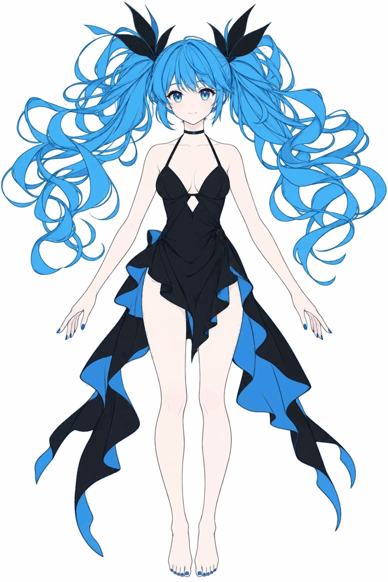
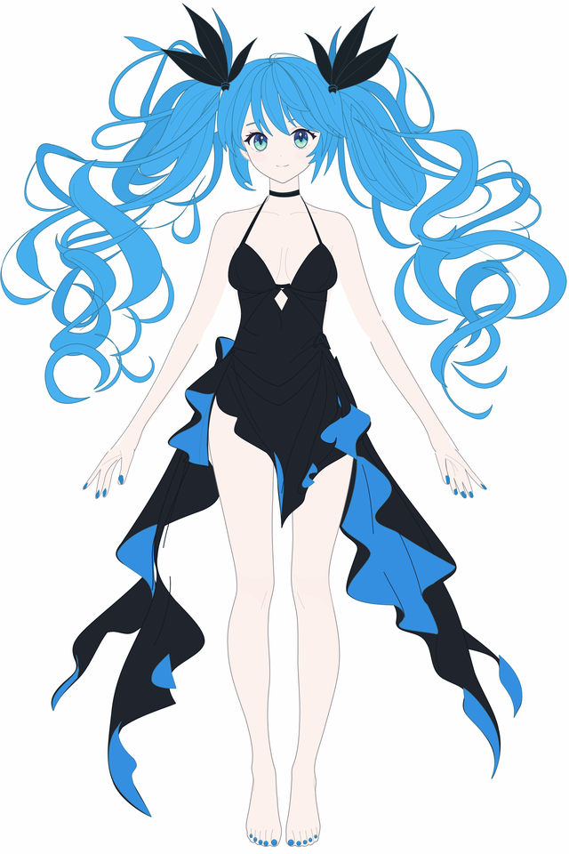

# 深海少女：两种 SVG 构建倾向的对比

这组实验比较同一角色参考下的两种路线：**还原像素外观的临摹**与**基于结构的还原绘制**。它们都输出真实矢量 SVG，但模型关注的对象不同，产生的美术效果和可编辑性也不同。这里记录的是当前两个样例的表现，不是不同模型的受控排名。

## 先看结果

| 参考图 | 像素轮廓临摹 | 结构重绘 |
| --- | --- | --- |
|  |  |  |

| 观察项 | 还原像素外观的临摹 | 基于结构的还原绘制 |
| --- | --- | --- |
| 主要做法 | 识别局部颜色与轮廓，将可见像素区域拟合成大量闭合路径 | 模型直接编写贝塞尔曲线，按发束、身体、服装、五官组织形体 |
| 外观还原 | 本例整体和局部细节更接近参考 | 本例主要姿势成立，但卷发走向、衣摆结构和脸部气质有明显偏差 |
| 结构编辑 | 本例已有语义分组与推断底形，但组内可见细节仍高度依赖像素碎片；从这些碎片恢复干净结构比较困难 | 部件与控制点更容易定位，适合继续补全、换色和修改；分组正确仍不保证结构理解准确 |
| 放大观察 | 噪点、细碎色边和原图锯齿可能被固化为路径，出现类似位图的毛刺 | 曲线更规整，但本例发束概括机械，人物描线细节明显不足 |
| 后续风险 | 在高保真外观之下，编辑成本和路径复杂度很高 | 在清楚的层次结构之下，可能掩盖还原度与美术质量不合格的问题 |

“类似位图的毛刺”并不是 SVG 被放大后变成了位图。这里的两份 SVG 都没有嵌入参考位图；毛刺来自像素细节被写进了矢量路径，放大后更容易看见。

## 文件与实现依据

| 项目 | 像素临摹 | 结构重绘 |
| --- | --- | --- |
| SVG | [深海少女_平涂分层.svg](./pixel-trace/深海少女_平涂分层.svg) | [深海少女_手绘分层.svg](./structure-redraw/深海少女_手绘分层.svg) |
| 高清预览 | [成图](./pixel-trace/深海少女_预览.png) | [成图](./structure-redraw/手绘成图.png)、[构造线展示](./structure-redraw/手绘线稿.png) |
| 主要构建代码 | [build.py](./pixel-trace/build.py)、[native_trace.py](./pixel-trace/native_trace.py) | [draw.py](./structure-redraw/draw.py)、[hair.py](./structure-redraw/hair.py)、[figure.py](./structure-redraw/figure.py) |
| 顶层分组，含背景 | 79 | 126 |
| path 数量 | 1,629 | 262 |
| 原始 SVG 大小 | 约 48.9 MiB | 约 178 KiB |

统计来自当前文件，只用于说明构建差异，不是质量评分。像素临摹版的一条 path 也可能含大量子路径，因此仅看 path 数会低估其复杂度。“手绘分层”是历史文件名，指模型直接编写曲线，不代表真人手绘。

结构版的“构造线展示”由底形解除填色、显示轮廓产生，能用于检查路径，但不能视为已经验收的艺术线稿。局部改动另见 [面部精修对照](./structure-redraw/面部精修对照.png) 和 [眼眶精修对照](./structure-redraw/眼眶精修对照.png)。

## 对当前工作流的启发

我们的目标需要同时保留外观依据与完整部件。为此，当前流程把“确认参考和部件归属”“建立完整底形与遮挡”“精修可见线稿”分开验收：先确保部件可以正确组合与拆开，再集中处理曲线、收笔和线宽。不能凭色块分得清楚就认为线稿已经成立，也不能凭成图很像就认为隐藏结构已经恢复。

本例继续作为两种倾向的对照，不作为当前主工作流的通过样例。现行流程见 [workflows](../../workflows/readme.md)。

## 查看与保留范围

两份 SVG 可直接导入 [统一预览器](../../loading/svg-preview.html)。像素临摹版文件较大，查看局部前可先看缩略图。

保留最终 SVG、参考图、关键预览、构建脚本、路径记录与像素版的 `work/part-seeds.json`。批量拟合缓存、试画备份及重复嵌入完整 SVG 的 `绘制过程.html` 留在本地并由 Git 忽略；可分别用 `make_preview.py`、`preview.py` 重建回放页。

构建脚本记录的是当时的实验：像素版使用 Python 3.12、Pillow、NumPy、SciPy、OpenCV、Skia 与 potracer；可选原生 libpotrace 通过 `ASTRA_POTRACE_LIB` 指定。结构版用 Python 构建，预览依赖 Pillow 与 Skia。`face-preview.py` 比较历史版本时还需要本地 `work/` 中的旧文件。本次归档未重新生成或修改两份 SVG 的画面。
