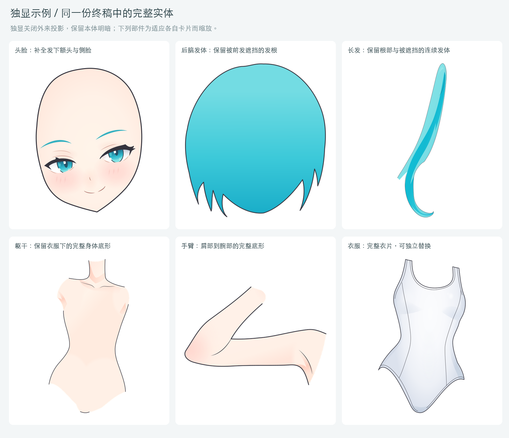

# 首次完整生成：基础连体服角色

本例已从基础角色参考走通阶段1—5，生成第一份完整分层彩图SVG。整图还原已经较好，脸部层次和材质表现已基本成立；局部不足及改进位置另见[开发进度](../../workflows/开发进度.md)与[完整链路分析](../../analysis/stage5-final-review/2026-09-13_阶段5终稿差异与流程链路分析.md)。

## 参考与生成结果

左栏是前置2的基础角色彩图，右栏是实际阶段5终稿。两栏使用同一1024×1536画布、相同比例与白色背景；点击图片可查看大图。

[原参考彩图](../../outputs/case1_miku/references/base-character.png) · [终稿SVG](./miku.svg) · [SVG预览器](../../loading/svg-preview.html)

## 完整部件树与遮挡补全

**每个实体部件均保留完整底形，并补全当前姿态中被其他部件遮挡的区域，可以独立显隐、单独提取为图层。** 头脸保留发下额头与侧脸，躯干保留衣服下的身体底形，发束保留发根与被前景挡住的连续发体。

终稿包含31个实体归属。为了保持前后穿插，它们组织成36个绘制分组；另有29个眼部、眉鼻口、手足甲片等内部子部件。下方滚动展示全部65个语义树节点，层内底形、墨线、明暗、高光和资源组不另算成实体部件。跨前后层拆分的发束保留同一归属，提取完整部件时应一并保留这些分段。

[查看完整静态长图](./parts-tree-full.png) · [GIF备用版本](./parts-tree.gif) · [使用现有SVG预览器查看真实层级](../../loading/svg-preview.html)

主展示动图使用APNG保留完整色彩，另附GIF备用版本。动图中的树由实际SVG名称、层级与绘制顺序生成；左侧是完整组合，中间是实际提取后的独显示例。所有36个主要绘制分组均已单独提取渲染。独显时在展示副本中关闭已移开遮挡物的外来投影，例如刘海在脸上的投影、右手在衣料上的投影；保留本体明暗与局部色彩，并适应窗口缩放。完整组合与正式SVG保持原样。

遮挡补全服务于当前姿态。它为换装和动画提供可编辑基础；新动作所需的形变、口腔或其他结构，以及正式动画绑定，属于后续验证范围。

## 交互查看

交互功能统一使用已有的[SVG预览器](../../loading/svg-preview.html)，导入上面的终稿与参考彩图，即可查看真实图层、滚动部件树、控制显隐，并进行同步缩放、左右对比、透明叠加和滑动分割对比。本目录只提供README展示素材，不另建独立查看页面。

## 素材来源与再生成

展示使用本目录的[miku.svg](./miku.svg)，与`outputs/case1_miku/step05-base-character/05-2_局部色彩与材质.svg`相同，SHA-256为`88b7b01fe5d24957c1997fbcca6e7d2a80661476a2273cbfb0894e5e3c2c59e9`。对比图直接渲染完整源文件；独显图只提取所属部件并关闭外来投影，没有重新绘画、修色或覆盖正式作品。节点与核对数据见[evidence.json](./evidence.json)。

在仓库根目录运行`python3 demos/first-complete-case/build.py`可重新生成本页素材。依赖Pillow、Node.js和sharp；中文字体默认使用macOS黑体，可用`ASTRA_DISPLAY_FONT`指定本机字体文件。动图为部件树的滚动展示，不代表角色已完成动画绑定。

返回[项目首页](../../readme.md)、[工作流](../../workflows/readme.md)或[案例索引](../readme.md)。
