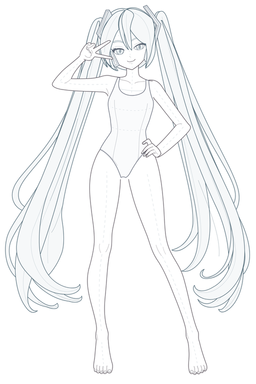

# 001：同时做分组与线稿，二者都没兼顾好

初期希望模型一次构建就完成部件分组、隐藏补全、从后到前的叠放，以及足够接近参考的结构线稿。实际结果表明，这次尝试没有兼顾好这些目标：虽然建立了许多图层，头脸、耳侧配件、前后头发等处的层次深度仍有多处失真；线稿处理也明显敷衍，轮廓机械，重复边和无关的辅助线过多。

## 保留的结果

- [step01：观察、拆分与补全填色规划](./step01/01_观察拆分与补全填色规划.md)：前期方案过重，较早展开了过多层级和填色安排。
- [step02：完整分层结构草图 SVG](./step02/02_完整分层结构草图.svg)：可查看实际部件组织与线条。
- [参考图](./step01/reference.jpg)、[草图高清预览](./step02/结构草图_预览.png)。
- [comparison](./comparison/)：当时保存的成图、头部和绘制顺序辅助对照。

## 为什么不通过

1. **图层存在不等于遮挡正确。** 形式上的分组和完整路径，不能替代对脸、耳机与头发真实前后关系的判断。
2. **草图没有形成可靠的线稿基础。** 大量线条并未帮助描述体积或特征，反而强化了机械、粗糙的观感。继续上色不能自动纠正这些结构和描线错误。
3. **过早把几何当作固定答案。** 如果后续只沿这些路径填色，错误轮廓和错误遮挡就会延续到成图。

## 后续调整

当前流程先准备基础角色彩图和经过确认的部件色块图，再由阶段2建立完整色块底形与遮挡，阶段3专门处理可见线稿。后续允许重拟合曲线和调整局部分段，同时保留部件归属与隐藏形体。结构验收与美术验收分别进行。

这些文件是失败现场记录，保留原始画面和构建代码；其中的旧契约、辅助线和较重的规划方式均不作为新流程要求。当前验证见 [outputs](../../outputs/readme.md)。
