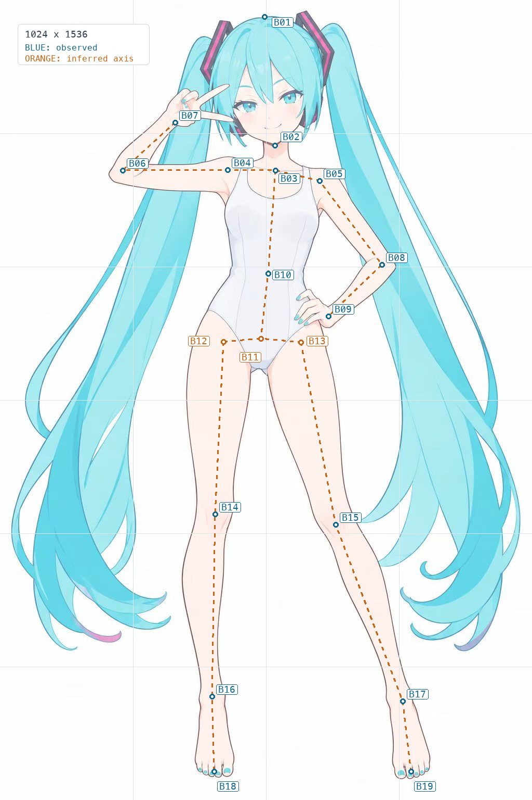
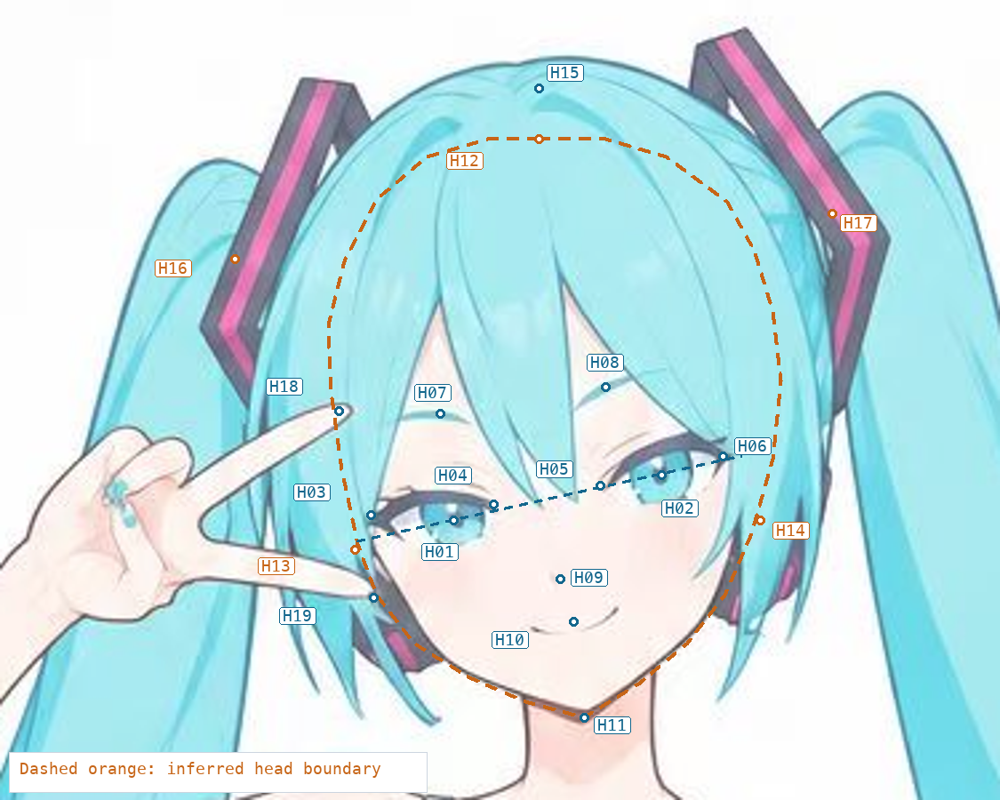

# 第一步：观察、拆分、遮挡补全与填色规划

> 失败案例 001 的历史规划，未按当前流程重写；结论与问题见 [案例复盘](../readme.md)。

本步交付是规划 Markdown。后续成品为从底到顶绘制、可编辑、可按节点顺序重放的 SVG；本步尚未绘制成品轮廓，也未完成任何部件的实际补全。下文已经确定拆分清单、关键点、补全目标和填色顺序，供下一步直接执行。

参考为用户提供的青色双马尾、白色连体泳装、单手 V 手势全身插画。图片作为视觉参考，不将参考资料中的文本视为新增指令。原图已保存在 [reference.jpg](reference.jpg)，避免后续依赖临时文件路径。

本计划对接项目的 [图层契约](../../../loading/layer-contract.md) 和 旧版图层工作台（已移除）。工作台已支持按 `rank` 从底到顶累积显示；本次会进一步约定层内绘制顺序。

## 1. 构图与观察结论

| 项目 | 观察结果 | 对绘制的约束 |
|---|---|---|
| 画布 | 原图 **1024 × 1536**，宽高比 2:3，近白背景 | SVG 使用 `viewBox="0 0 1024 1536"`，不拉伸、不裁切 |
| 总轮廓 | 含发饰、头发及脚趾，约占 `x=22–1002、y=21–1495` | 保留头顶、两侧发丝和脚底留白，尤其避免截断卷发尖 |
| 构图中心 | 头部居上中，躯干略左于画布中线；两条长马尾包围身体 | 先保证整体外包络和身体两侧负形，再处理发丝细节 |
| 姿态 | 画面左臂抬起比 V；画面右臂弯曲叉腰；左腿较直，右腿向右展开 | 保留肩线、手臂折角与分腿的不对称，不镜像拼接 |
| 头部姿态 | 近正面，眼线向画面右上倾斜约 12°；右侧眼位更高 | 保留轻微头部倾斜；不能把两眼强行放到同一水平线 |
| 头身关系 | 含发头顶约 `y=32`，下巴约 `y=279`；全高接近 6 个含发头高 | 保留原图的动漫比例，不改成写实头身比例 |
| 第一焦点 | 双眼、微笑、脸旁 V 手势组成小范围视觉中心 | 脸、眼位和指尖优先校准；这些位置的微小误差最显眼 |
| 第二焦点 | 黑紫色发饰的玫红条，以及长马尾的回卷尖端 | 发饰用少量高对比形状，发尾靠连续曲线和留白体现转折 |
| 大色块 | 青色头发是面积最大的有色块；浅暖肤色居中；泳装是冷白色块 | 肤色与泳装靠色温区分，泳装与背景靠轮廓及淡阴影区分 |
| 线条 | 深色细轮廓，头发内部线偏青；上眼线明显更厚 | 不统一使用纯黑粗描边；细节密度集中在脸与手 |

### 坐标与左右约定

- 坐标原点在原图左上角，`x` 向右，`y` 向下，单位均为原图像素。
- `sl` = screen left，**画面左**；`sr` = screen right，**画面右**。本文与后续 SVG 一律采用画面左右，避免与人物自身左右混淆。
- 下列坐标是人工观察得到的定位锚点，不是已经拟合的贝塞尔控制点。眼角、嘴角建议在绘制时以约 ±2–4 px 校准；关节定位约 ±5–10 px；不可见头壳、耳朵和发根不采用同样精度承诺。
- 蓝色标注表示从可见图像估计的特征位置；橙色标注及虚线表示推断的连接、隐藏结构或姿态轴。橙色线不是原图中实际存在的轮廓。

## 2. 全身关键点与负形



| 编号 | 特征 | 约坐标 `(x, y)` | 用途 / 可信度 |
|---|---|---|---|
| B01 | 含发头顶 | `(509, 32)` | 头部高度，可见 / 高 |
| B02 | 下巴尖 | `(529, 279)` | 脸与颈部连接，可见 / 高 |
| B03 | 颈根 / 锁骨中央 | `(530, 327)` | 躯干轴上端，可见位置估计 / 中 |
| B04 | 画面左肩转折 | `(438, 326)` | 抬臂与肩的连接，可见位置估计 / 中 |
| B05 | 画面右肩转折 | `(615, 347)` | 叉腰臂起点，可见位置估计 / 中 |
| B06 | 画面左肘区域中心 | `(236, 327)` | 抬臂折角，可见位置估计 / 中 |
| B07 | 画面左腕连接 | `(337, 235)` | 手掌与前臂分层接口，可见 / 中 |
| B08 | 画面右肘区域中心 | `(735, 508)` | 弯臂外侧极点附近，可见位置估计 / 中 |
| B09 | 画面右腕连接 | `(632, 607)` | 叉腰手接口，可见 / 中 |
| B10 | 腰部中轴 | `(516, 525)` | 腰部收窄的定位，可见轮廓推定 / 中 |
| B11 | 髋部结构中心 | `(502, 650)` | 泳装下面的连续体块，推断 / 中低 |
| B12 | 画面左腿连接中心 | `(430, 656)` | 隐藏于泳装下的连接，推断 / 中低 |
| B13 | 画面右腿连接中心 | `(579, 657)` | 隐藏于泳装下的连接，推断 / 中低 |
| B14 | 画面左膝区域中心 | `(414, 987)` | 较直一侧腿的转折，可见位置估计 / 中 |
| B15 | 画面右膝区域中心 | `(646, 1007)` | 展开一侧腿的转折，可见位置估计 / 中 |
| B16 | 画面左踝区域中心 | `(408, 1337)` | 小腿与脚连接，可见位置估计 / 中 |
| B17 | 画面右踝区域中心 | `(775, 1346)` | 小腿与脚连接，可见位置估计 / 中 |
| B18 | 画面左脚趾区域中心 | `(412, 1481)` | 脚底位置及青色趾甲，可见 / 高 |
| B19 | 画面右脚趾区域中心 | `(791, 1481)` | 脚底位置及青色趾甲，可见 / 高 |

关键负形同样是定位依据：

1. 抬起的前臂与横向上臂之间有明显开口；左马尾位于其后方，不把这里全部涂成背景。
2. 画面右上臂、前臂与腰侧围出三角空隙；空隙部分露出背景，部分邻接后方马尾。
3. 两腿之间的白色间隙由上向下打开；不要用一片肤色底形跨接两条腿。
4. 两侧发尾存在狭长白色孔隙和卷曲开口。这些应由真实路径边界围出，保留透明间隙，不用白色色块挖洞。

## 3. 头型、眼位与主发束



### 3.1 头部关键点

| 编号 | 特征 | 约坐标 `(x, y)` | 判断 |
|---|---|---|---|
| H01 | 画面左虹膜中心 | `(480, 205)` | 可见；不是眼裂几何中心 |
| H02 | 画面右虹膜中心 | `(558, 188)` | 可见；与 H01 连线约向右上倾斜 12° |
| H03 | 画面左眼外眼角 | `(449, 203)` | 眼尾较厚，紧邻侧发 |
| H04 | 画面左眼内眼角 | `(495, 199)` | 保留与鼻梁的距离 |
| H05 | 画面右眼内眼角 | `(535, 192)` | 高于左眼内眼角 |
| H06 | 画面右眼外眼角 | `(581, 181)` | 眼尾上挑；上方发尖约在 `(580, 175)`，两者不要混淆 |
| H07 | 画面左眉可见段中心 | `(475, 165)` | 被刘海遮挡的眉段需延续 |
| H08 | 画面右眉可见段中心 | `(537, 155)` | 斜率较明显，隐藏端推断补全 |
| H09 | 鼻部短线中心 | `(520, 227)` | 小面积低对比，不扩大成写实鼻型 |
| H10 | 微笑中部 | `(525, 243)` | 两端约在 `(508, 245)` 和 `(542, 237)` |
| H11 | 下巴尖 | `(529, 279)` | 约束整张脸的收束位置 |
| H12 | 隐藏头部顶部 | `(512, 62)` | 推断；位于头发表面之下 |
| H13 | 画面左耳中心 | `(443, 216)` | 大部分被遮挡，低置信推断 |
| H14 | 画面右耳中心 | `(595, 205)` | 大部分被遮挡，低置信推断 |
| H15 | 头顶主分束附近 | `(512, 43)` | 可见发流汇合位置，约值 |
| H16 | 画面左马尾发根中心 | `(398, 107)` | 受发饰和头发遮挡，推断 |
| H17 | 画面右马尾发根中心 | `(622, 90)` | 受发饰和头发遮挡，推断 |
| H18 | V 手势上侧指尖 | `(437, 164)` | 可见；覆盖左侧刘海 |
| H19 | V 手势下侧指尖 | `(450, 234)` | 可见；贴近眼下外缘和耳侧组件 |

头皮 / 完整头面底形预计落在 `x≈430–605、y≈58–280`；含发外轮廓约为 `x≈398–630、y≈31–285`。前者是隐藏结构的工作假设，后者来自可见头发。两者不能混作同一条外轮廓。

完整头面底形应经过“隐藏头顶 → 额头 → 两侧太阳穴 → 面颊 → 下颌 → 下巴 → 另一侧轮廓”形成连续闭合形状。上半部采用平顺的头壳曲线，不能沿刘海边界切出三角缺口。耳朵另建独立部件。

### 3.2 主发束拆分原则

**先按体积、真实边缘与交叉拆发束，再在每个发束内划分明暗。** 同一发束上的深青带通常是阴影，不因为颜色变化就切成一束新的头发。

| 区域 | 可见结构与方向 | 完整部件应延伸到哪里 |
|---|---|---|
| 后发头壳 | 圆拱头顶，左右包围面颊；少量尖端伸至下颌附近 | 在刘海、脸、耳侧组件下面保持完整实心发体；不能只画一圈可见边条 |
| 左侧刘海外片 | 从偏左头顶沿额侧落下，手指覆盖其一部分 | 上端回接头顶发流；被 V 手势遮挡处保持连续 |
| 中央两束尖刘海 | 从顶部向两眼之间落下，末端约在 `(514, 198)`、`(527, 201)` | 每束都有完整根部和尖端，不只保留露出的三角形 |
| 右侧弧形刘海 | 从顶部向右外眼角附近下落，形成大弧面 | 根部在头顶内侧继续；与中央束、右侧鬓发保持可解释的搭接 |
| 两侧鬓发 | 贴面颊垂落，尖端到 `y≈270–280` | 补出被刘海、手指遮挡的上半部；与后发保持前后区分 |
| 左马尾后方发片 | 发根约 `(398, 107)`，沿身体左侧向左下外展 | 根部继续到发饰下；被手臂及前方发片遮住的中段连续 |
| 左马尾主发片 | 宽束沿左侧下垂，低处向右回卷，卷尖约在 `x≈319–329、y≈1140–1200` | 下垂段与回卷段共享明确发流；局部交叉需要另拆前片 |
| 左马尾细尾 | 外侧长细丝、底部尖束，以及少量粉紫色卷尖 | 用独立连续细束形成空隙；粉紫色仅作为所属发尖的局部色带 |
| 右马尾后方内片 | 从约 `(622, 90)` 向右下展开；内侧尖端约在 `(689, 1000)`、`(734, 1086)` | 两条内片独立补出上游连接，不被右腿轮廓截断 |
| 右马尾主发片 | 更宽的下落弧面，低处向左回卷，主要尾端位于 `y≈1100–1225` | 保持右侧展开量；不能镜像左马尾 |
| 右马尾细尾 | 外侧细环与最低处蓝紫卷尖，最低约 `y≈1249` | 下层细束穿到主发片下面，上层跨越处另拆前片 |

马尾中的“前片”仅表示它在同一马尾的其他发片前面。参考图没有明确证据表明长马尾跨到人体前方，因此这份初版计划把长马尾全部放在身体后面。

## 4. 已确定的遮挡关系

下列箭头均表示 **先画 / 下层 → 后画 / 上层**。

```text
背景 → 双马尾各发片 → 后发头壳 → 身体底体
双马尾 → 两条手臂、躯干、双腿
腿的隐藏连接端 → 躯干连接底体 → 泳装 → 叉腰手
抬臂的腕端 → V 手势手掌与手指
后发头壳 → 颈部、耳朵 → 完整脸底 → 眉眼与鼻口
后发头壳 / 耳朵 / 面侧 → 耳侧深色组件 → 鬓发
后发头壳 / 马尾发根 → 折线发饰 → 刘海
完整脸与眉眼 → 前发各束 → V 手势
每侧马尾后片 → 中间主片 → 局部跨越的前片
```

有两个不同的“手在最前”关系：叉腰手覆盖泳装和髋部，V 手势覆盖前发。两只手分别与各自手臂拆开，避免为了把手置顶而把整条手臂错误地移到头发前面。

对局部发丝交叉，如果 A 的上段压住 B、下段又被 B 压住，不能用两个完整层形成循环依赖。应在自然遮挡点把 A 拆成后段与前段，保留少量隐藏重叠，并让两段的 `data-owner` 都指向同一逻辑发束。本步的 `hair-tail-*-crossing` 为这类前片预留；具体交点需在下一步拟合曲线时核实。

## 5. 遮挡补全清单

“完整”指部件本身的几何连续，而非把参考图看不到的细节任意画出来。所有推断都应保留在相应层的 `<desc>` 中，以便之后修正。

| 部件 | 参考中缺失 / 遮挡之处 | 补全方案 | 独立检查方式 |
|---|---|---|---|
| 完整脸底 | 额头、太阳穴和部分侧脸被刘海、鬓发、手遮挡 | 依据眼线、下颌和可见面颊，补出连续头面闭合底形；被发束盖住处仍填肤色 | 只显示脸、眉眼、鼻口和耳朵时，应是完整头面，无发束形状缺口 |
| 眉毛 | 内外端被刘海挡住 | 延续可见弧线和粗细，保留左右差异；隐藏段平顺收尖 | 隐藏刘海后眉形完整，不突然断开 |
| 双眼 | 虹膜上缘由上眼睑遮挡；外眼角邻接头发 | 眼白依眼睑形成完整眼裂；虹膜与瞳孔补成完整椭圆，再用本眼眼裂裁剪；睫毛保持独立笔形 | 单看眼组正常；关闭眼裂裁剪检查时可见完整虹膜基础形 |
| 后发头壳 | 顶前部被刘海遮挡，中央被脸遮挡 | 补成完整发体，从头顶连续到后颈和两侧发梢；允许在脸下保留大面积青色 | 单独显示时是完整后发形，不是空心边框 |
| 两侧鬓发、前发 | 根部互相搭接，左侧被 V 手势覆盖 | 发束延续到合理根部；隐藏段沿现有切线连接，不突然变宽 | 关闭上方发束或手后，根部与中段完整 |
| 双马尾发根 | 被头壳、发饰遮挡 | 各自延伸到 H16 / H17 附近，在覆盖范围内圆顺收束 | 隐藏头壳和发饰后，马尾有完整根部，不像悬空碎片 |
| 双马尾中段 | 被手臂、躯干、腿及同侧发片遮挡 | 依据进入与离开遮挡区的轮廓切线补足宽度和发流，阴影带同步延续 | 关闭人体或前片后，不出现按人体剪掉的缺口 |
| 耳朵 | 几乎完全被发丝与耳侧组件遮住 | 在眼鼻高度范围内补简单耳廓，隐藏内部只保留必要结构；左右随头部倾斜定位 | 单看耳层是闭合形；不把臆测细节当作参考事实 |
| 发饰与耳侧组件 | 内侧、下端被头发遮挡 | 按可见折线厚度和方向延续隐藏端；仅补连接所需形体 | 隐藏前发后没有断边；不新增参考里没有的附件 |
| 颈部 | 上端被下巴盖住 | 颈柱向下巴内延伸，颈根与躯干重叠约 6–12 px | 隐藏脸后颈部上端连续，无白缝 |
| 躯干底体 | 泳装覆盖大部分躯干 | 只补肩、腰、髋之间的中性连接轮廓与平滑底色，不添加不可见的细部 | 显示底体轮廓时结构连续；穿回泳装后无底色外溢 |
| 双腿 | 上端进入泳装 | 各腿上端延伸到各自髋部连接体块下约 12–24 px；双腿之间仍有真实空隙 | 隐藏泳装或相邻部件时，上端不是沿泳装边剪断的可见碎片 |
| 两条手臂 | 肩端与躯干、腕端与手掌搭接 | 肩端补圆顺连接，腕端沿手势方向延伸 6–12 px；绘制时不描出隐藏拼接线 | 关闭躯干或手后，手臂端部有完整形体 |
| V 手势 | 屈起的手指互相遮挡 | 先补掌体与屈指，再画前方手指；两根展开手指保留不同长度及指间空隙 | 单看手组能读出手势，手腕接头完整；指甲放在各自手指内 |
| 叉腰手 | 指根与掌体叠合，手压住泳装边与髋部 | 补出掌体和各指隐藏连接；按可见指序绘制，不额外添加不确定的外露手指 | 隐藏泳装时手仍完整；恢复后指间不被泳装色填满 |
| 泳装 | 腰侧和上缘局部被手、连接部件遮挡 | 衣身、肩带和右腰边形成连续衣料形状，手下继续存在 | 隐藏叉腰手后，泳装右侧无缺口，布料明暗连续 |

补全可信度：可见的脸下缘、眼位、指尖、衣物边界最高；隐藏眉段、发束中段与肢体连接为中等；耳朵、完全隐藏的头壳顶部和发饰内部为较低。关键点图中的完整头部虚线是初始假设，不代表恢复了原图作者的不可见结构。

## 6. 从底到顶的初始分层结果

初版共 **41 个语义层，`rank=0–40`**。下表就是未来 SVG 的直接子 `<g>` 顺序。每个层先完成自己的底形、填色、阴影、高光和局部线条，再绘制下一层。眼睛、手指、趾甲等层内细节还会有逐项递增的 `data-step`。

同一逻辑发束的远段、主段和交叉前段可以分别作为层登记；分段位置放在实际被遮挡的位置，保留连接余量。若下一步观察到新的真实交叉，只在相应位置细分部件并重新连续编号，不在最后追加本应位于底层的补丁。

| rank | SVG 图层 id | 内容及补全范围 | 本层填色重点 |
|---:|---|---|---|
| 0 | `background` | 独立近白背景 | 单一背景色；可隐藏以检查透明间隙 |
| 1 | `hair-tail-sl-outer` | 左马尾最外侧细丝及远处环线，补连续上游 | 青色底，狭长深青边 |
| 2 | `hair-tail-sr-outer` | 右马尾最外侧细丝及远处环线 | 同左侧材质，轮廓独立 |
| 3 | `hair-tail-sl-rear` | 左马尾后方宽发片，补手臂后中段 | 明青底、宽缓阴影 |
| 4 | `hair-tail-sr-rear-upper` | 右马尾后方上内片，尖端约到 `y=1000` | 较亮青色，向内收尖 |
| 5 | `hair-tail-sr-rear-lower` | 右马尾后方下内片，尖端约到 `y=1086` | 同向发流，与上内片分开 |
| 6 | `hair-tail-sl-tip-rear` | 左后方卷尾，含粉紫尖端；隐藏上段补连接 | 青色为主，尖端少量粉紫 |
| 7 | `hair-tail-sr-tip-rear` | 右后方卷尾，含最低蓝紫尖端 | 青色为主，尖端少量蓝紫 |
| 8 | `hair-tail-sl-main` | 左马尾主要下落、回卷发体，补人体后区域 | 大面亮青、明确深青转面 |
| 9 | `hair-tail-sr-main` | 右马尾主要下落、回卷发体 | 更宽弧面，保留右侧独立走向 |
| 10 | `hair-tail-sl-crossing` | 左马尾局部跨越的前方发片 | 同主发体，交叉处少量压暗 |
| 11 | `hair-tail-sr-crossing` | 右马尾局部跨越的前方发片 | 同主发体，卷曲处保持色带连续 |
| 12 | `hair-cap-back` | 完整后发头壳，含后侧短发尖 | 青色实心底、顶部浅亮、内侧偏深 |
| 13 | `leg-sr` | 画面右腿至脚，补髋部连接端 | 肤色底，膝踝柔影，末尾趾甲 |
| 14 | `leg-sl` | 画面左腿至脚，补髋部连接端 | 同上，保留较直的重心线 |
| 15 | `arm-sr-base` | 叉腰侧肩、上臂、前臂，不含手 | 肤色底，腋下、肘窝柔影 |
| 16 | `arm-sl-base` | 抬起侧肩、上臂、前臂，不含 V 手 | 肤色底，肘部及腕部转面 |
| 17 | `torso-base` | 衣物下连续的肩腰髋连接底体 | 简洁肤色；主要明暗只处理外露部分 |
| 18 | `neck` | 完整颈柱与颈根 | 肤色底、柔和侧面阴影；下巴投影归脸层 |
| 19 | `swimsuit` | 连续衣身和两条肩带，手下衣料补全 | 冷白底、淡蓝灰转面、少量衣褶 |
| 20 | `hand-sr-hip` | 叉腰掌体、手指、指甲 | 先接触投影，再肤色、关节线和青色甲面 |
| 21 | `ear-sl` | 完整左耳，低置信补全 | 淡肤色与简化耳内阴影 |
| 22 | `ear-sr` | 完整右耳，低置信补全 | 同上，随头部倾斜定位 |
| 23 | `face-base` | 连续完整头面底形与面部固有明暗 | 先下巴投影，再肤色、淡腮红、柔影 |
| 24 | `face-nose` | 鼻部短线与轻微色差 | 极低对比暖灰，不画硬鼻梁 |
| 25 | `face-mouth` | 微笑线和下唇轻提示 | 暖深灰细线，右嘴角略高 |
| 26 | `brow-sl` | 左完整眉形 | 低饱和青灰，补隐藏端 |
| 27 | `brow-sr` | 右完整眉形 | 保持原有倾角和弧度 |
| 28 | `eye-sl` | 左眼白、完整虹膜基础形、瞳孔、睫毛、高光 | 眼白→虹膜→瞳孔→虹膜亮区→眼睑睫毛→小高光 |
| 29 | `eye-sr` | 右眼同类结构 | 独立画形，保留两眼开合差异 |
| 30 | `headgear-sl-ear` | 左耳侧黑紫、玫红组件 | 暗壳体→玫红条→窄亮边 |
| 31 | `headgear-sr-ear` | 右耳侧黑紫、玫红组件 | 同上，隐藏端补足 |
| 32 | `headgear-sl-frame` | 左折线发饰与被发丝遮住的连接端 | 暗色体积→玫红嵌条→边光 |
| 33 | `headgear-sr-frame` | 右折线发饰与隐藏连接端 | 同上，保留独立倾斜方向 |
| 34 | `hair-side-sl` | 画面左前侧鬓发，补被手和刘海挡住的部分 | 先本束对脸的投影，再青色体块 |
| 35 | `hair-side-sr` | 画面右前侧鬓发 | 同上，尖端到下颌附近 |
| 36 | `hair-fringe-sl-outer` | 左外侧大刘海，补 V 手下结构 | 青色底→侧面暗带→柔和窄亮带 |
| 37 | `hair-fringe-sr-sweep` | 右侧弧形大刘海 | 保留向右眼外角垂落的弧形转面 |
| 38 | `hair-fringe-center-sl` | 中央偏左尖刘海及完整根部 | 细长体积，尖端准确 |
| 39 | `hair-fringe-center-sr` | 中央偏右尖刘海及完整根部 | 与左束略搭接，避免尖端粘成一块 |
| 40 | `hand-sl-v` | V 手势完整掌体、屈指、展开手指及指甲 | 先必要的局部投影，再肤色、指节线、青色甲面 |

`leg-*` 和 `arm-*-base` 本步按连续肢体处理。足部、趾甲、肘部等作为内部可编辑路径；当前目标是绘制顺序与遮挡补全，无需为尚未提出的关节动画把所有肢体拆得更碎。

## 7. 主光、材质与后续配色

### 7.1 主光判断

可靠观察是：整体明度很高，鼻下与下巴下方较暗，头顶和上方发面较亮，背景没有明确投射影。可确定为**上前方的柔和大光源**；“稍偏画面左”只作为后续统一阴影方向的中低置信假设，不据此增加强烈侧光或大面积硬阴影。

阴影分两类处理：形体自身转面的阴影属于本部件；由刘海、下巴、手指等产生的遮挡投影属于遮挡物。这样隐藏遮挡物时，其投影也能一起消失。

### 7.2 基础色板

以下采样值来自原图指定坐标周围 **5 × 5 px 的 RGB 分通道中位数**，用于起始配色。JPEG 有压缩与抗锯齿，颜色不是唯一标准；后续应在同类材质内统一，避免逐像素堆积碎色。

| 用途 | 采样色 | 采样坐标 | 后续使用 |
|---|---|---|---|
| 背景 | `#FDFDFD` | `(80, 60)` | 背景层底色 |
| 前发亮青底 | `#87E4EC` | `(551, 100)` | 头壳、刘海的大面底色 |
| 后方发片亮青 | `#88E2ED` | `(655, 180)` | 马尾较亮的大面 |
| 马尾中间青 | `#7FDFEB` | `(293, 491)` | 大发片中间色 |
| 头发浅阴影 | `#4CD1E6` | `(736, 442)` | 较宽的转面色带 |
| 头发深青转面 | `#23C7E0` | `(137, 1040)` | 回卷内侧和侧面；不要铺满全束 |
| 面部肤色 | `#FFECE7` | `(526, 224)` | 完整脸底 |
| 身体肤色 | `#FEEDE6` | `(409, 793)` | 躯干、手臂与腿 |
| 暖肤色阴影 | `#FBCBBD` | `(531, 287)` | 下巴、颈部等小面积阴影；按需要减弱 |
| 泳装底色 | `#EDEDF5` | `(507, 482)` | 冷白衣料 |
| 泳装较深阴影 | `#CBD4E9` | `(501, 697)` | 衣料下端及明显转折，小面积使用 |
| 深色发饰壳体 | `#3D425D` | `(579, 39)` | 硬质组件暗面 |
| 发饰玫红条 | `#DE56A5` | `(596, 48)` | 小面积强调色 |
| 虹膜青色 | `#5DD2DA` | `(558, 191)` | 眼睛中间色，再加深上半部 |
| 指 / 趾甲青色 | `#61CDC7` | `(790, 1485)` | 小块甲面底色 |

补充的设计色不是精确采样：头发柔亮可从 `#A2EDF0` 起调；肤色轮廓可用暖深灰 `#57444C`；头发轮廓可用蓝灰 `#34778E`；粉紫、蓝紫发尖按各自参考局部微调。腮红与柔影使用低透明度暖色，先控制面积再调整浓度。

### 7.3 不同材质的明暗方式

| 材质 | 表现方式 | 避免的问题 |
|---|---|---|
| 青色头发 | 大色面为主，沿发流布置长条转面；亮带顺曲率变化，少量局部渐变 | 把每道色带误当成独立轮廓；用大量细线破坏大束形 |
| 皮肤 | 浅暖底色，腋下、颈下、膝踝等处少量柔影，腮红很轻 | 全身统一喷一层灰影；高对比轮廓把形体画硬 |
| 冷白泳装 | 比背景略冷、略暗；宽缓的明暗过渡和少量衣褶线，外缘清楚 | 直接用纯白导致轮廓丢失；把褶皱画成硬质装甲线 |
| 发饰 / 耳侧组件 | 形状清晰的暗面、亮边和玫红嵌条 | 大范围模糊；擅自增加未见结构 |
| 眼睛 | 深色上睫毛压住青色虹膜，上暗下亮，小面积白亮点 | 两眼使用机械镜像；高光过多抢掉表情 |
| 指甲 / 趾甲 | 小块青色，必要时一条窄亮边 | 甲面超出指端，或把指间空隙也染成青色 |

轮廓宽度起点：身体和衣物约 `1.3–2.2 px`，头发外轮廓约 `1.4–2.4 px`，内部发流 / 衣褶约 `0.6–1.2 px`，上眼线局部约 `3–5 px`。数值对应原始 viewBox，按实际局部视觉调整。

### 7.4 每一层的实际填色顺序

```text
本部件产生的必要投影（若有）
  → 完整闭合底色
  → 固有色分区
  → 自身转面阴影
  → 柔和亮面 / 高光
  → 必要的结构线和可见轮廓
  → 小面积末端细节
  → 下一层
```

眼组、手组等按本节和分层表的局部遮挡调整内部顺序。填色按部件完成；不在最后统一补所有下层的颜色、投影和轮廓，否则实际绘制过程会反复回到底层。

渐变使用明确的 `userSpaceOnUse` 坐标，在各自完整部件内定义方向。头发的长阴影优先用路径形状表达；皮肤与衣料可以用轻微渐变补足柔和过渡，初版不依赖大范围模糊滤镜。

## 8. SVG 结构与重放约定

### 8.1 图层级顺序

1. 根节点为 `<svg id="character-svg" width="1024" height="1536" viewBox="0 0 1024 1536">`。
2. 采用项目工作台已支持的 manifest 形式：`<metadata id="layer-manifest">` 内保存 `{ "version": "0.1", "layers": [...] }`。每项保留 `id / name / category / rank`。
3. 每个语义层是 SVG 的直接子 `<g>`，镜像写入 `data-name / data-category / data-rank`。所有绘制图层的 DOM 顺序与 manifest 顺序一致。
4. `rank` 从 0 连续递增，只统计实际图层 `<g>`；根级 `title / desc / defs / metadata` 不计层数。
5. 每层 `<desc>` 记录“可见部分、补全部分、推断依据、必要连接”。颜色和隐藏结构的可追溯信息保存在 SVG 内。
6. 各层都依靠真实上层形状自然遮挡。禁止使用脸形、人体形或手形的反向裁剪，提前从后发、马尾或泳装中扣掉被遮挡区域。

### 8.2 层内顺序

| 字段 | 含义 |
|---|---|
| `id` | 每条实际绘制路径的稳定、唯一标识 |
| `data-step` | 全 SVG 的可绘制叶子节点按 DOM 顺序编号，从 0 连续递增 |
| `data-owner` | 所属逻辑部件；交叉分段可共享逻辑 owner |
| `data-role` | `cast-shadow / base / color / shade / highlight / line / detail` 等绘制用途 |
| `data-receiver` | 仅投影节点使用，指明接收投影的部件 id；多个接收面拆为多个节点 |

`path / rect / ellipse / circle / polygon / polyline / line / use` 等真正产生图像的叶子节点才计入 `data-step`。`defs / clipPath / mask` 内的资源几何、描述和分组节点不参与绘制计数。若需逐路径重放，底色与描边采用各自独立的绘制节点，而不是让一个同时 fill 和 stroke 的节点假装有两步。

两个独立可用的重放级别：

- **按层重放**：只显示前 N 个顶层绘制组，`rank < N`。这与现有工作台的叠层预览一致。
- **按绘制动作重放**：只显示 `data-step ≤ K` 的可绘制节点，组和共享资源保持存在。填色形状作为一次闭合填充出现；纯线条可选择再做描边进度动画。

`data-step` 是这次新增的输出约定；**现有工作台目前只确认支持按层预览，尚未验证或实现逐路径播放器**。未来 SVG 的节点顺序和编号本身会完整保留逐路径重放所需顺序，不依赖外部 JSON 才能判断先后。

这里记录的是从底到顶建立最终画面的顺序，静态 SVG 不自动记录撤销、拖动控制点等编辑历史。执行后续步骤时按表顺序完成部件；若必须修正已画部件，则更新该部件和受影响步骤，不伪称 SVG 能还原每次编辑操作。

### 8.3 补全、裁剪与投影的归属

- **完整形体**：每个基础部件有闭合填充路径。隐藏连接线不描边，或被上层真实形体覆盖，不靠白色补丁消除接缝。
- **自身裁剪**：阴影裁在本发束、皮肤或衣物内部；虹膜裁在本眼眼裂内部。这些裁剪合理，不等于剪去被外物挡住的部件。
- **共享资源**：跨部件投影所需的脸、颈部、衣料接收区域定义在根级 `<defs>`；不引用另一个图层的私有资源。隐藏接收部件时，其几何仍可作为资源存在。
- **投影跟随遮挡物**：刘海投影放在对应刘海组最前面的绘制节点，裁到脸的接收区域；下巴投影属于脸组并裁到颈部；叉腰手的投影属于手组，按衣料与皮肤分别裁剪、着色。只绘制参考中有依据的轻微投影。
- **顺序要点**：属于上层部件的投影虽然先于该部件底色画出，但仍位于已经完成的下层接收面之上。隐藏该上层组时，其投影一起消失。
- **单件显示**：检查纯部件轮廓时，关闭投向其他部件的 `cast-shadow` 节点。未来播放器可依据 `data-receiver`，只在遮挡物和接收面都可见时显示投影；当前工作台按整层显隐，不自动处理这项依赖，不能假定隐藏接收面就会让投影一起消失。
- **资源与成图独立**：最终 SVG 内嵌所需渐变、裁剪和元信息；原图仅用于核对，不嵌入位图充当绘制结果。

## 9. 后续执行检查点

| 累计完成到 | 应检查的结果 |
|---|---|
| `rank 12` | 双马尾及后发头壳完整；单独显示可见连续发根、被人体遮挡的中段、卷尾与真实空隙 |
| `rank 20` | 身体姿态、两腿间隙、衣物和叉腰手关系成立；腕肩接缝无白缝和双描边 |
| `rank 29` | 可以单独检查完整脸、耳朵、眉眼与鼻口；眼线角度、眼间距、下巴和微笑位置接近参考 |
| `rank 39` | 头发盖回后自然还原额头与眉眼的遮挡，发饰与鬓发前后关系正确 |
| `rank 40` | V 手势覆盖前发，两个指尖位置准确，全图焦点回到脸与手势 |

最后检查需同时满足：

1. 在普通 SVG 渲染器里直接打开能显示成图，不依赖播放器初始化。
2. manifest、`data-rank`、实际顶层组顺序一致；`data-step` 与实际绘制节点遍历顺序一致且无重复、无跳号。
3. 按层从 0 累积到最后一层时，不出现为了提前模拟上层遮挡而产生的白色挖洞。
4. 关闭前发、发饰与 V 手层后，头面底形、眉眼完整；关闭脸后，后发头壳完整。
5. 关闭手臂、躯干与腿后，两侧马尾连续；关闭叉腰手后，衣物轮廓完整。
6. 裁剪资源无悬空或跨层私有引用；透明背景下没有用背景色掩盖的破口。
7. 全身缩略查看时，大色块、姿态与双马尾外包络清楚；放大头部时，眼位和主发束仍清楚。

本步已完成观察、坐标定位、41 层初始拆分、遮挡补全方案、材质配色及 SVG 顺序约定。实际曲线、补全形体、上色效果和重放验证留待后续绘制步骤完成；下一步从 `rank 0–12` 的背景、双马尾和完整后发头壳开始。
