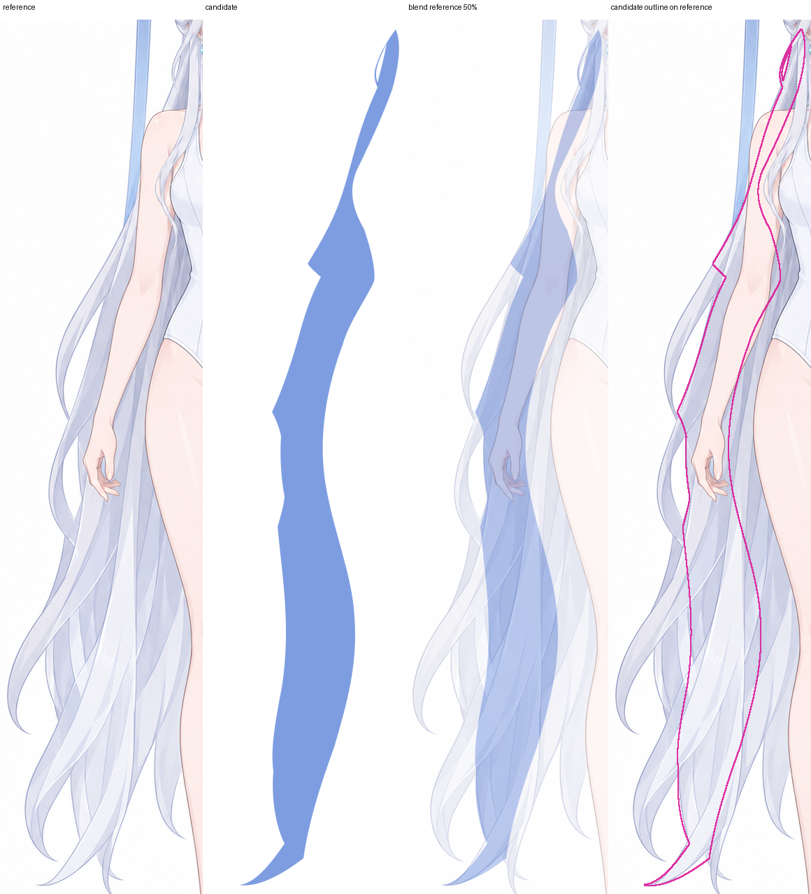
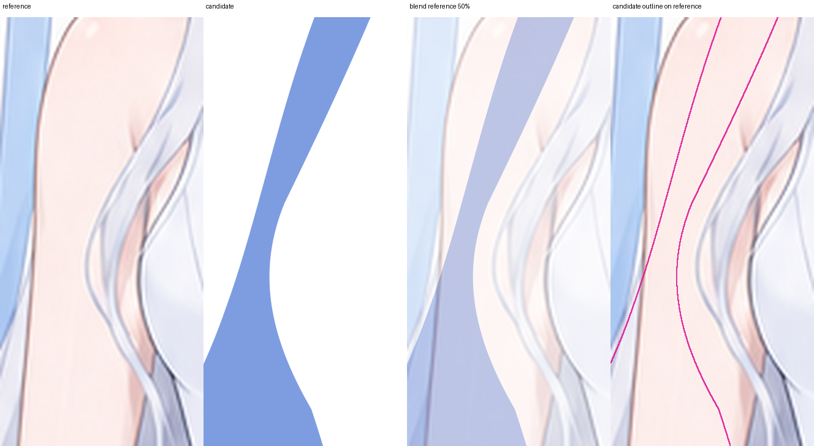
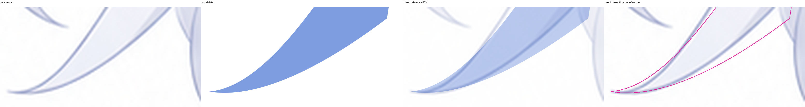

# 第 30 组：待人工查看

6 个孩子的默认轮廓检查通过。独立审查已实际查看 16 张图，完成 5 个单件；最后的斜尖长束与组合连接尚待确认。彩色块仅区分子件，后续仍需绘制正式材质。

请确认：斜尖长束的根部和尖端是否完整，回环修复是否闭合内部白楔而保留真正孔洞，六个孩子的连接是否成立。

## 斜尖长束完整对照

检查发束从耳后到斜尖连续，外轮廓和方向与参考对应。

## 斜尖长束根部

检查隐藏根面有面积，肩后连接没有切断或夹成细缝。

## 斜尖长束尖端 · 8×

检查尖端保持锐利、曲线平顺，局部修正没有造成台阶。

## 回环连接修复对照 · 8×

查看图中候选与前版对照：确认上、下回环的内部白楔已闭合，真正的透空孔仍开放。

## 整组与参考对照

结合下方无父层 SVG，检查所有发束接合、两处回环孔、双叉和各尖端。

[仅六个孩子的 SVG](refinement/groups/head/rear_hair_left/outer_back_curtain/2.%E7%9B%B4%E5%B1%9E%E6%8B%86%E5%88%86%E4%B8%8E%E8%89%B2%E5%9D%97/2.2.%E7%9B%B4%E5%B1%9E%E8%BD%AE%E5%BB%93%E8%89%B2%E5%9D%97/candidate-children-only.svg) · [完整候选](refinement/groups/head/rear_hair_left/outer_back_curtain/2.%E7%9B%B4%E5%B1%9E%E6%8B%86%E5%88%86%E4%B8%8E%E8%89%B2%E5%9D%97/2.2.%E7%9B%B4%E5%B1%9E%E8%BD%AE%E5%BB%93%E8%89%B2%E5%9D%97/candidate-groups.svg) · [部分独审记录](reviews/group_child_layers/head/rear_hair_left/outer_back_curtain/%E5%AE%A1%E6%9F%A5.md)

候选 SHA-256：`4da747b49621ec49eec03cbdeeac09a0563c0c4527afc57e24a3b4442a781679`

本次图像处理返回 `Image processing blocked due to content policy violation`，没有重试被拒图像，也没有记为通过。原始错误和具体调用见 [记录](reviews/group_child_layers/head/rear_hair_left/outer_back_curtain/runtime-policy-failure-20261007.json)。此确认范围仅为第 30 组 2.2 的剩余视觉审查。
