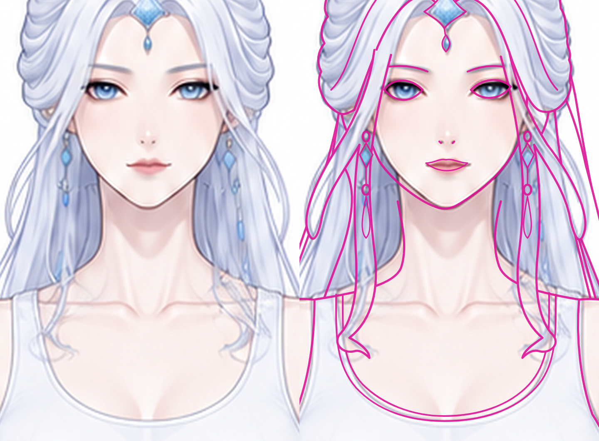
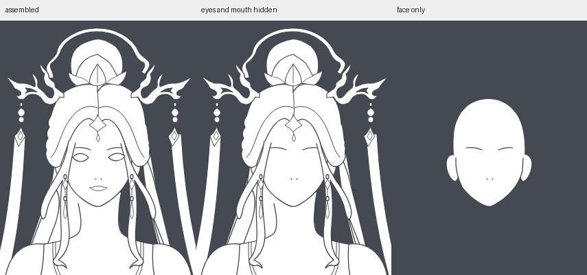
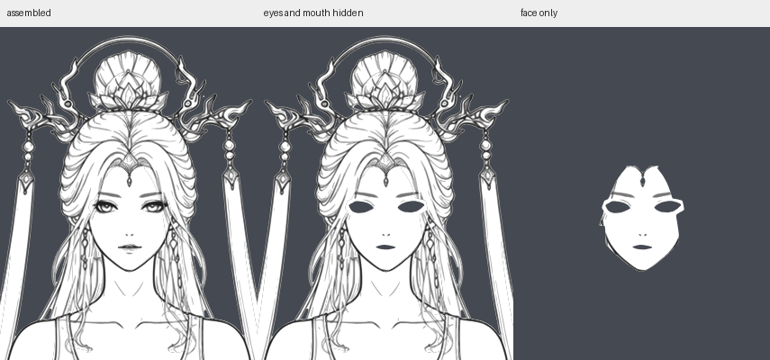
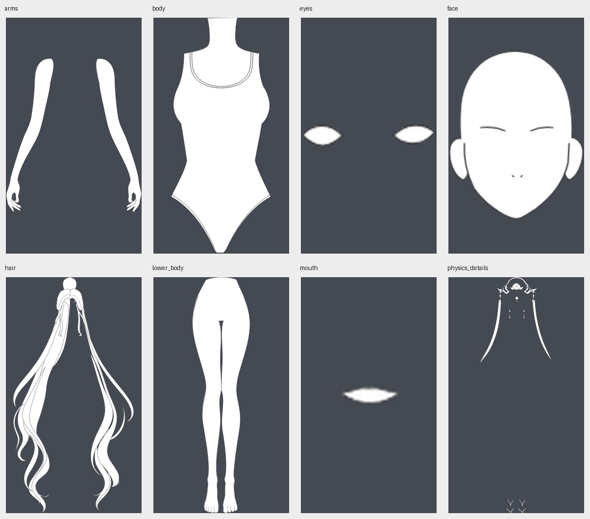
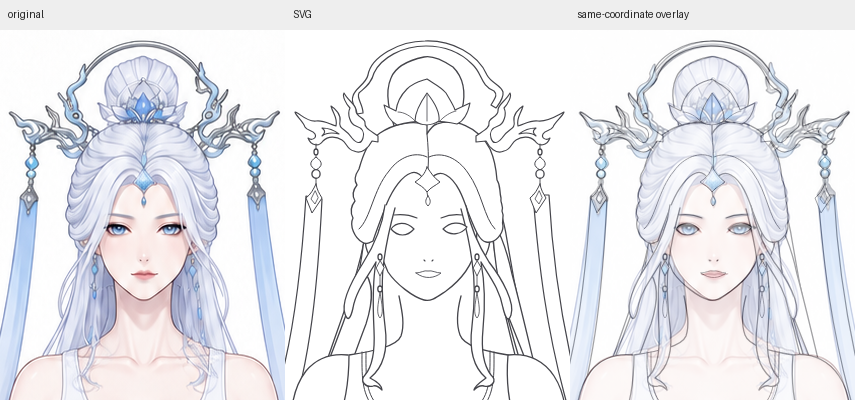

# kind 大层轮廓试验

**本次试绘不通过：可见轮廓明显失真，线条存在错接和悬空，不能作为通过稿进入后续制作。** 此前“头脸与主体轮廓大体贴合”“仅有局部简化”的判断撤回。旧版隐藏眼嘴后脸上留洞的问题确实已修复，但这一项不能代表成稿合格。

## 放大复核发现

| 问题 | 当前稿的实际差异 |
| --- | --- |
| 五官外形 | 眼形被概括为近似杏仁形，上下眼睑与眼角的走势偏离参考；嘴唇也被替换为概括的闭合形状。这些属于当前稿应保留的造型，不是后续眼内细节。 |
| 脸侧与鬓发 | 鬓发的转折、宽窄和覆盖关系被重画，改变脸侧露出范围；不能以大类分组为理由降低这部分轮廓精度。 |
| 颈肩连接 | 颈部描线在下颌附近悬空，颈宽及向肩部转折的位置偏离彩图。底形完整并未保证描线接续正确。 |
| 头发与饰物 | 鬓发被概括成长环和钩状末梢，冠枝与部分下端卷发也存在轮廓替换，影响实际形状与穿插关系。 |

左为原彩图，右为同坐标可见墨线叠加；只将 SVG 实际可见的线标为洋红色，保留彩图亮度。两侧使用同一裁切范围并等比例放大。

实际绘制使用预设坐标的贝塞尔曲线概括造型；底形和描边分别构造，未充分对齐参考中的可见边界与遮挡交点。问题在于曲线所表达的形状不准确，贝塞尔表示本身不是问题。初次验收过于关注闭合、分组和脸底覆盖，没有落实放大轮廓对照的返修要求。

## 本次执行

- 复用原角色彩图、部件清单和拆解参考；按当前生图提示词原文生成一次 `references/kind-contours.png`。
- 由独立上下文的 GPT-6 Astra-xhigh 读取绘制提示词路径，构建新的闭合曲线。旧 `line-art/` 失败样例保留，未复用其路径。
- 交付 [SVG](character.svg) 与 [组合预览](preview.png)。绘制流程和提示词在测试期间未修改。

## 实际检查

| 检查项 | 结果 |
| --- | --- |
| 画布与类别 | 941 × 1672；8 个 kind 与 parts.yaml 一致，按遮挡排序为 14 个绘制组 |
| 底形与描边 | 64 条闭合底形，统一白色填充；深色轮廓另行组织，无嵌入位图 |
| 隐藏眼睛与嘴巴 | 原位置均由连续脸底覆盖，没有透明洞 |
| 脸层独显 | 有完整头形与耳部，发际以上的底形保留 |
| 类别间补全 | 头脸与头发、肩臂与躯干、腰胯与身体存在真实的重叠区域；各 kind 独显已查看 |
| 真实孔洞 | 已查看冠环及主要发束间隙的透出关系 |
| 组合轮廓与衔接 | 不通过。五官、鬓发和颈肩存在明显形状偏差与衔接错误，详见上方放大复核 |

对眼、嘴图层的不透明区域，检查其下方是否存在不透明脸底：新版两者覆盖率均为 **100%**；旧版分别约为 **12.2%** 与 **17.7%**。该数值检查底形覆盖，不代表造型相似度。每版使用自身眼、嘴图层的区域，排除抗锯齿边缘像素。

新版 SVG 约 **50 KB**，旧版约 **1.81 MB**。这次是按类别构造闭合轮廓，内部精细结构仍留待后续；文件变小本身不作为结构通过的依据。

## 显隐证据

各列依次为：完整组合、隐藏眼嘴、只显示 face。深灰色是透明区域的查看背景。

新版：

旧版失败样例：

各 kind 独显分别适窗展示，仅用于检查各层内容；位置还原使用下方同坐标叠加。

## 轮廓对照

各列为原彩图、SVG、同坐标叠加，使用相同裁切范围。

[整图叠加](validation/overlay.png) · [验证数据与候选 SHA-256](validation/result.json)

以上结构数据只说明部分底形和显隐机制成立，不构成整体通过结论。眼内细节、内部发丝、功能细拆和动作测试尚未制作或验证；已发现的可见轮廓与衔接错误必须在本稿修正。

已新增绘制后的独立 review，并以本候选快照单独试审。独立结论同为**需返修**，共列出六项具体问题，另发现右脚缺趾及右腿口断线。原 SVG 保留，未在本次复核中返修。详见[独立审查报告](../reviews/kind_layers/审查.md)。修订后的绘制提示词尚未重跑。
