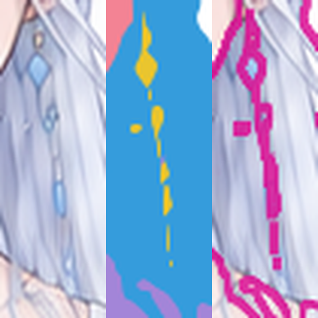
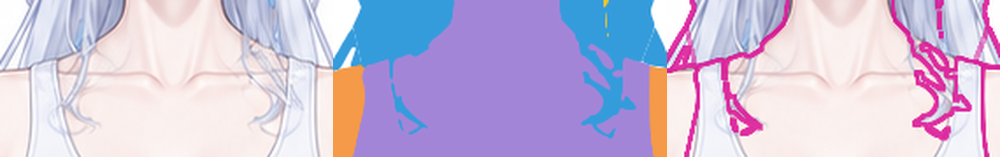
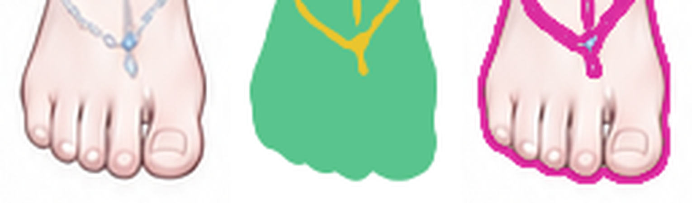
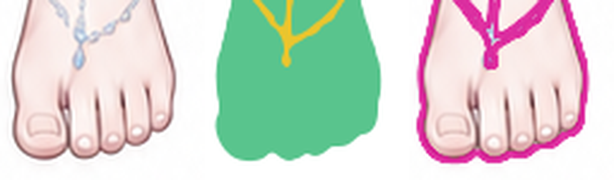

# kind 色块分层独立审查

**结论：需返修。** 主要躯干、头脸、四肢和长发的整体位置接近彩图；但耳坠、胸前鬓发和足趾外缘存在可见形状损失。问题不涉及原配色、明暗、内部细节线或功能细拆。

## 候选与方法

- 版本：`candidate-v1`。
- 候选：`reviews/kind_blocks/candidate-v1.svg`。
- 实测 SHA-256：`8dee89bed2f112b84a659cdca6b247b7175cd8c76fd0d39b766592f39d6c0431`，与 `candidate-v1.json` 一致。
- 形状依据：`references/base-subject.png`；归属依据：`structure/parts.yaml`。
- 原图和 SVG 均为 **941 × 1672**；候选由审查端重新渲染到该尺寸，未移动、缩放对齐或修改候选。
- 先检查整图，再以相同原图坐标裁切头脸、手、足、肩胸连接区及两侧长发；查看彩图、候选、边界叠加和 40% 候选透明叠加。另生成八类独显、关闭前发及饰物、后发独显、躯干底形独显。
- 本次为该色块候选的初验；没有同阶段旧问题需要销项。

证据总览：[整图同坐标对照](evidence-v1/full/comparison.png)、[整图透明叠加](evidence-v1/full/blend.png)、[八类独显](evidence-v1/isolated-kinds-board.png)。所有 `comparison.png` 的顺序为 **彩图／候选／候选可见色界叠加**；`blend.png` 是对应透明叠加。裁切坐标均以原图左上角为 `(0,0)`，格式为 `(x,y,w,h)`。

## 三项结论

| 项目 | 结论 | 依据 |
| --- | --- | --- |
| 形状还原 | **需返修** | 主轮廓大体贴合，眼、嘴的基本外形未见明显替换；但 R1 耳坠、R2 鬓发末端、R3 趾端轮廓失真。 |
| 遮挡与空隙 | **需局部返修** | 后发在身体及手臂后，前发在脸前，手部开口、腿间空隙、两侧大段发束孔隙和冠环开口保留。R1 链环的中空形态丢失，R2 出现参考中没有的断口，R3 趾间外缘回凹被填浅。 |
| 底形分层 | **主体成立，细窄部件需返修** | 八类齐全且存在真实跨类重叠；完整头形、耳根、颈胸躯干、肩臂和骨盆可以独显。R1 耳坠独显仍断为碎片，R2 前鬓发独显仍有断裂，不能视为完整底形。 |

## 有证据的问题

### R1 — 画面右耳坠断裂，链环与垂珠外形被削成碎片

- **位置：**角色左耳坠，原图约 `x=485–503, y=224–307`；同坐标裁切 `(480,218,35,105)`，放大 6 倍。
- **kind／路径：**`physics_details` / `earring_left`，位于 `ornaments-front`。
- **实际差异：**彩图中上方菱形坠下接细链和可辨认的中空链环，再接细长垂珠；候选的下半段变成数段互不相接的窄条、半片形状及孤立小点，中空链环变成实心斑块。尤其菱形坠以下、细长垂珠上下的连接不能连续追踪，垂珠的完整宽度也没有保留。
- **独显核对：**`earring_left` 含 8 个闭合子路径；单独显示后这些断裂仍然存在，并非其他前景遮挡造成。此处要恢复饰物自身的完整底形、链环真实开口和正确遮挡，不能仅用分散可见像素代替。
- **返修要求：**沿彩图核对挂点至末端的轮廓，重建细链连接、链环和垂珠完整形状；需被鬓发遮住的部分也应保留可用底形。

[透明叠加](evidence-v1/earring-left/blend.png) · [耳坠路径独显](evidence-v1/earring-isolation.png)

### R2 — 胸前鬓发断裂，末梢转折和宽窄偏离参考

- **位置：**画面左胸前 `x≈374–401, y≈315–362`，画面右胸前 `x≈485–514, y≈313–364`；同坐标裁切 `(345,285,190,90)`，放大 5 倍。
- **kind／路径：**`hair` / `hair_side_right`、`hair_side_left`，位于 `hair-front`。
- **实际差异：**画面左细长发束在肩带下方应继续向下弯转，候选中间出现横向断口，末梢旁又留下一枚离散短片；画面右参考中的纤细交叉弧线被画成较宽的尖角块，末端回弯的方向与范围也偏离原轮廓。叠加中能看到参考发束有一部分落到候选蓝块以外，而新增蓝色尖角盖到了周围胸口区域。
- **独显核对：**仅显示前发和鬓发时，左侧断口及离散片仍存在；右侧末梢的尖角和厚度也不因关闭后发而消失。属于发束实体外缘和连接问题。
- **返修要求：**先恢复细束连续性，再按原图调整外缘宽度、交叉处转折和末梢回弯，保留真实露出的胸口空隙。

[透明叠加](evidence-v1/front-locks/blend.png) · [前发与鬓发独显](evidence-v1/locks-isolation.png)

### R3 — 双脚趾端的外缘回凹被填浅

- **位置：**双脚最前缘，原图约 `y=1600–1637`；画面左裁切 `(355,1570,85,75)`，画面右裁切 `(445,1570,85,75)`，均放大 6 倍。
- **kind／路径：**`lower_body` / `leg_right`、`leg_left`。
- **实际差异：**彩图中各趾端呈独立的圆弧，相邻趾端之间的外轮廓明显向上回凹；候选把这些外缘凹口填浅、连成较平缓的波边。画面左第 2–4 个小趾以及画面右的小趾群最清楚，趾端的大小和独立圆头形状被削弱。
- **判定范围：**这里要求恢复的是最下缘连接到背景的凹口及趾头外缘，不要求绘制指甲、趾缝内部线或把脚趾分成功能层。
- **返修要求：**按原图调整趾端外轮廓，保留圆钝端部和相邻趾头之间的外缘回凹；不应把各趾全部改成分离长槽。

[双脚透明叠加](evidence-v1/feet/blend.png)

## 已核对成立的部分与边界

- SVG 为 12 个顺序组、28 个唯一 ID 的路径，八个 `data-kind` 与部件清单一致；路径子轮廓均闭合，无嵌入位图、遮罩、滤镜或引用对象。分组与闭合检查仅作结构佐证，未代替上述目视判定。
- [关闭前发和饰物](evidence-v1/no-front-hair-ornaments-white.png)后，脸和耳根不随可见发际被裁空，颈部与躯干连续；[躯干底形](evidence-v1/body-base-isolation.png)并非仅剩领口可见的皮肤区域。
- [后发独显](evidence-v1/rear-hair-only-white.png)在头肩与躯干后有成片延伸；[身体、双臂、下身组合](evidence-v1/body-arms-lower-white.png)显示肩根、骨盆和腿根之间有覆盖关系。原分辨率二值 alpha 交集：`hair∩arms=42,651 px`、`hair∩body=47,408 px`、`face∩body=2,143 px`、`arms∩body=2,948 px`、`body∩lower_body=25,354 px`，证明这些类并非只拼接组合图中的可见区域。交集数不作为底形质量评分。
- [头脸](evidence-v1/head/comparison.png)、[画面左手](evidence-v1/right-hand/comparison.png)、[画面右手](evidence-v1/left-hand/comparison.png)、[画面左长发](evidence-v1/left-hair/comparison.png)、[画面右长发](evidence-v1/right-hair/comparison.png)已逐区检查；双手拇指侧开口及主要手势方向保留，两侧长发主要外缘和大孔隙对齐。手指内部层次、眉鼻细线、眼内结构、服装内线、原配色与明暗未列为问题。
- 当前参考足以支持 R1–R3 的判定，无须因缺少新参考而暂停。隐藏区域的精确设计没有唯一彩图答案，本报告仅确认其连续性、归属和重叠是否足以支持本阶段。

## 复验范围

修订后以新的候选版本及 SHA-256 复验 R1–R3，并检查相邻区域：耳坠与耳根／鬓发的遮挡、两侧鬓发与肩带／胸口的交叉、脚趾与脚背链及外侧足缘。保留已经对齐的整体位置、主要发束孔隙和主体重叠。

证据与结构记录：`evidence-v1/manifest.json`、`evidence-v1/structure-check.json`；重新渲染输出为 `evidence-v1/candidate-render.png`。候选原文件保持不变。
