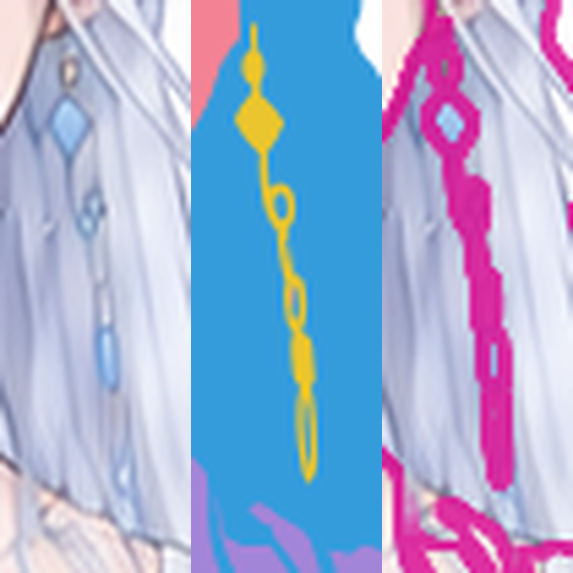
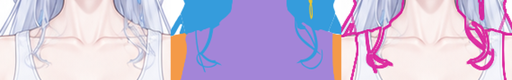
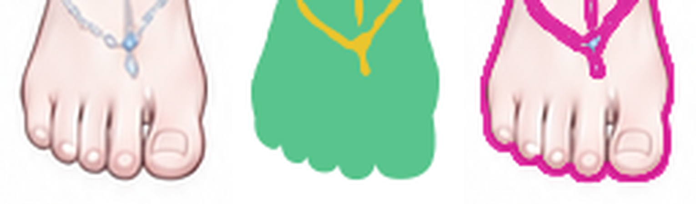
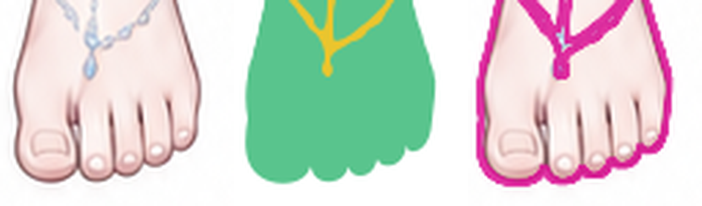

# kind 色块分层复验

> **后续核对：撤回通过，当前候选需返修。** 放大 SVG 后可见连续细碎凹凸；身体与连体服同属 `body`，绘制脚本将两者的颜色区域合并后按高度截取。实际独显的 `bodysuit` 缺少正确领口和肩带，`neck_torso` 在腰部水平截断，再与粗略骨盆搭接，未按独立身体和服装重建。原复验只确认类别底形与跨类重叠，遗漏了衣物和身体分别独显的形状检查。下方保留原复验记录，其“通过”与“无未解决问题”结论已失效。候选 SVG 未修改。

**原复验结论（已撤回）：通过。** 当时记录：`candidate-v2` 已解决前轮 R1–R3；重新渲染、逐类独显及受影响邻接区域检查未发现新的明显形状或遮挡问题，满足本阶段按 kind 建立色块底形的要求。

## 候选与复验方法

- 当前版本：`candidate-v2`。
- 候选：`reviews/kind_blocks/candidate-v2.svg`。
- 实测 SHA-256：`f5c670f3f46f93b4afe671c122816d1f261eb6021ba0722eaaf228a23def23cd`，与 `candidate-v2.json` 一致。
- 前轮报告：`reviews/kind_blocks/审查-v1.md`；前轮候选 SHA-256：`8dee89bed2f112b84a659cdca6b247b7175cd8c76fd0d39b766592f39d6c0431`。
- 形状依据：`references/base-subject.png`；归属依据：`structure/parts.yaml`。
- 原画布为 **941 × 1672**。本轮从新候选重新渲染到原尺寸，未调整对齐或修改候选。先看整图，再核对与前轮相同坐标的头脸、手、足、肩胸、两侧发束裁切及透明叠加；另看八类独显、前发独显、耳坠独显、关闭前发和饰物后的底形。
- 本轮路径变更集中在 `earring_left`、`hair_side_right`、`hair_side_left`、`leg_right`、`leg_left`；分组、其他路径和前后顺序保留。

证据：[整图对照](evidence-v2/full/comparison.png) · [整图透明叠加](evidence-v2/full/blend.png) · [八类独显](evidence-v2/isolated-kinds-board.png)。

所有 `comparison.png` 从左至右为 **彩图／v2 候选／候选色界叠加**；`*-revision-comparison.png` 从左至右为 **彩图／v1／v2**。局部范围均为原图坐标 `(x,y,w,h)`，没有为不同图分别裁切或重对齐。

## 三项结论

| 检查项 | 结论 | 复验证据 |
| --- | --- | --- |
| 形状还原 | **通过** | 主轮廓位置及宽窄保持；耳坠恢复连续形状、鬓发恢复细束弧线、脚趾恢复圆头及外缘凹口。头脸、眼口、手部及主要长发轮廓未见新的明显偏差。 |
| 遮挡与空隙 | **通过** | 耳坠链环的孔洞恢复，鬓发不再出现前轮断口，胸口真实空隙保留；手部开口、腿间空隙、长发大孔隙和冠环开口仍在。前发盖脸、后发位于身体及双臂之后，饰链盖脚面的关系正确。 |
| 底形分层 | **通过** | 八类完整，主体跨类重叠保持；头形、耳根、颈胸、肩臂、骨盆可独显。修订耳坠与前鬓发单独显示时连续，不再依赖组合图中的可见碎片。 |

## 前轮问题销项

### R1 — 画面右耳坠碎片化及链环形状丢失：已解决

- **kind／路径：**`physics_details` / `earring_left`。
- **同坐标范围：**`(480,218,35,105)`，对照放大 6 倍。
- **本轮结果：**上方菱形坠、连接细链、链环、细长垂珠及下端环形成连续可追踪的形状；前轮的离散小点、半片及连接断裂已消除，链环保留中空区域。耳坠独显也保持连续。
- **邻接检查：**耳根附近挂点、脸侧边缘和鬓发相邻处未出现新增缺口或大片误覆盖；后发仍能从环孔内透出。

[透明叠加](evidence-v2/earring-left/blend.png) · [耳坠独显](evidence-v2/earring-isolation.png) · [彩图／v1／v2](evidence-v2/earring-left-revision-comparison.png)

### R2 — 胸前鬓发断裂及末梢偏形：已解决

- **kind／路径：**`hair` / `hair_side_right`、`hair_side_left`。
- **同坐标范围：**`(345,285,190,90)`，对照放大 5 倍。
- **本轮结果：**画面左发束在肩带下方的断口已连接，离散短片被整理为连续末梢；画面右粗尖角被调整为细束转折与回弯。两侧发束的主要走向、交叉位置及末端弧线与彩图相符，不再将相邻胸口填成宽块。
- **独显与邻接检查：**前发独显仍保留上述连接及束间开口；胸口、肩带区域和侧颈连接未出现新的断缝、突出块或背景漏孔。肩胸主体轮廓保留。

[透明叠加](evidence-v2/front-locks/blend.png) · [前发独显](evidence-v2/locks-isolation.png) · [彩图／v1／v2](evidence-v2/front-locks-revision-comparison.png) · [肩胸邻接范围](evidence-v2/torso/comparison.png)

### R3 — 双脚趾端外缘回凹填浅：已解决

- **kind／路径：**`lower_body` / `leg_right`、`leg_left`。
- **同坐标范围：**画面左 `(355,1570,85,75)`，画面右 `(445,1570,85,75)`，对照放大 6 倍。
- **本轮结果：**两脚五个趾端的圆弧和相邻趾头之间向上回凹的外缘重新可辨。前轮较平缓的连续波边已改回与彩图接近的趾端轮廓，没有切成过深的分离长槽。
- **邻接检查：**脚背、踝部和脚链的相对位置保持，外侧足缘连接正常。按原分辨率 alpha≥128 比较，`lower_body` 在 `y<1570` 的实体覆盖像素与 v1 相同，轮廓调整集中于脚趾区域；整图检查也未见腿部位置改变。

[双脚及饰链邻接对照](evidence-v2/feet/comparison.png) · [双脚透明叠加](evidence-v2/feet/blend.png) · [彩图／v1／v2](evidence-v2/feet-revision-comparison.png)

## 底形与结构核对

- 12 个顺序组、28 个唯一 ID 路径、8 个 `data-kind`；各路径子轮廓闭合，无嵌入位图、遮罩、滤镜或引用对象。归属与部件清单一致。
- [关闭前发和饰物](evidence-v2/no-front-hair-ornaments-white.png)后，完整头形与耳根、连续颈胸保持；[躯干底形](evidence-v2/body-base-isolation.png)并非只保留领口可见皮肤；[后发独显](evidence-v2/rear-hair-only-white.png)仍有头肩及躯干后的成片延伸。
- [身体、双臂与下身组合](evidence-v2/body-arms-lower-white.png)显示肩根、骨盆和腿根覆盖关系。二值 alpha 交集保留：`hair∩arms=42,651 px`、`hair∩body=47,408 px`、`face∩body=2,143 px`、`arms∩body=2,948 px`、`body∩lower_body=25,354 px`。这些数值仅佐证存在真实重叠，完整性判定同时依据独显目视检查。
- [头脸](evidence-v2/head/comparison.png)、[画面左手](evidence-v2/right-hand/comparison.png)、[画面右手](evidence-v2/left-hand/comparison.png)、[画面左长发](evidence-v2/left-hair/comparison.png)、[画面右长发](evidence-v2/right-hair/comparison.png)完成复查，未见受修订影响的新增明显差异。
- 本结论针对 kind 色块稿。原配色、明暗、内部细节线及功能细拆不属本轮通过条件；没有将这些省略项列作返修要求。

**未解决问题：无。新增返修项：无。待核对项：无。**

证据位于 `reviews/kind_blocks/evidence-v2`，原尺寸新渲染为 `candidate-render.png`，版本记录与结构记录为 `manifest.json`、`structure-check.json`。当前候选及前轮候选均未改动。
