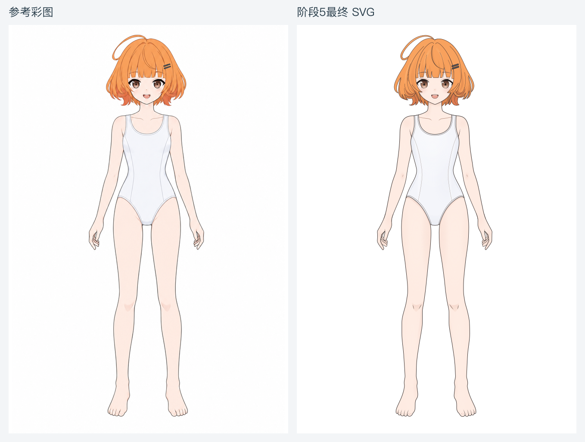
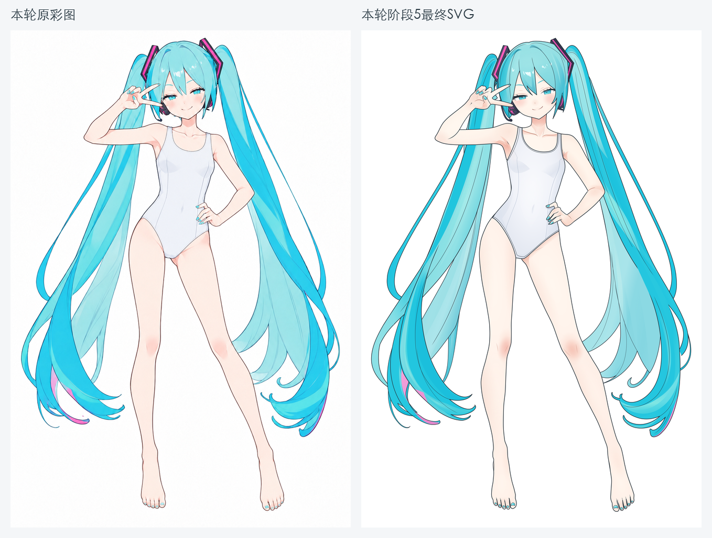
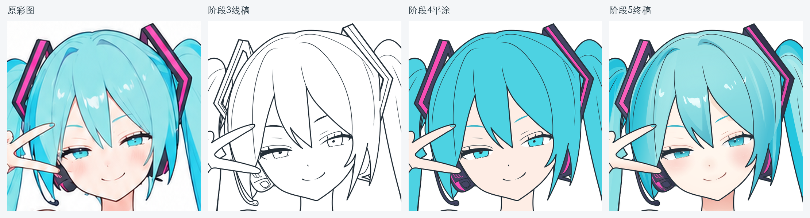

# AstraLayering

利用AI将角色参考重绘成**可编辑、可分层、具备遮挡补全的SVG**，为人物还原、服装替换和后续2D动画探索提供部件基础。

主要入口是 **`svg-layering` 自动化skill**：提供角色图和目标，由总控依次调度参考准备、SVG绘制、独立审查与返修。各节点的提示词、模型配置、素材和工具统一收在skill内的 `workflows/` 资料包中。

[效果展示](#效果展示) · [使用skill](#使用svg-layering) · [运行投入](#运行时间与额度) · [调度规则](./.agents/skills/svg-layering/SKILL.md) · [开发进度](./.agents/skills/svg-layering/workflows/开发进度.md) · [SVG预览器](./loading/svg-preview.html)

## 效果展示

每组左侧为本轮基础角色彩图，右侧为阶段5最终SVG的实际渲染。点击图片可查看大图。

### Milly v1

自动调度完成参考准备、阶段1—5及四个节点的独立review。整体姿态和主要轮廓保持较好，眼部层次与肤色细节已补上；头发线质、光泽及手足局部仍有差异。

[](./demos/milly-complete-case/reference-vs-svg.png)

[查看终稿SVG](./outputs/milly_v1/step05-base-character/05-2_局部色彩与材质.svg) · [查看目标彩图](./outputs/milly_v1/references/base-character.png) · [阶段产物与审查记录](./outputs/milly_v1/readme.md)

### Miku v3

已完成阶段1—5，重点改进脸型、头型和发束包脸关系，阶段3实际采用了头型、面部、其余轮廓、内部线、全局精修五步流程。

[](./analysis/miku-v3-review/01_整图对照.png)

[查看终稿SVG](./outputs/miku_v3/step05-base-character/05-2_局部色彩与材质.svg) · [查看目标彩图](./outputs/miku_v3/references/base-character.png) · [全部参考与阶段产物](./outputs/miku_v3/readme.md)

同坐标复核确认：上一轮左脸颊的外鼓明显收回，头顶、刘海和鬓发与脸的关系更贴近参考；校准后的脸型在后续上色中保持。下图依次为原彩图、阶段3线稿、阶段4平涂和阶段5终稿。

[](./analysis/miku-v3-review/02_头部阶段对照.png)

眼睑与睫毛、手足线条以及头发色带和光泽仍有差异。具体证据见[本轮复核](./analysis/miku-v3-review/readme.md)；v3与v2采用不同基础彩图，跨轮评价分别以各自原图为准。

## 使用svg-layering

在Codex中打开本仓库，调用 `$svg-layering`，提供实际图片、执行目标和工作根目录。例如，将下列路径替换为自己的路径：

```text
使用 $svg-layering，从前置开始，完成到阶段4平涂。
原角色图：/绝对路径/角色.png
工作根目录：/绝对路径/本轮输出
服装采用已有的基础连体服。
```

要生成完整彩图，将目标改为“完成到阶段5”。续跑时说明起点并提供已有案例目录及对应素材，例如：

```text
使用 $svg-layering，从阶段3继续，完成到阶段5。
工作根目录：/绝对路径/已有案例
使用该目录中本轮已完成的参考图、规划和阶段2结果。
```

总控按[流程表](./.agents/skills/svg-layering/references/流程.md)准备或复用前置素材，再顺序派发绘制任务。在阶段2、阶段3 step2、阶段4及阶段5 step1完成后，调用独立reviewer；需要返修时交回原worker，复验通过后继续。

每轮产物统一写入工作根目录，包含 `references/`、`reference-palette/` 和各 `stepXX-base-character/`。缺少参考图或绝对输出路径时，总控会先询问，信息齐备后开始调度。总控向子agent传递实际输入和节点提示词路径。

**模型配置：** 各节点从 `.model` 文件名读取模型。当前前置语言任务使用 `gpt-5.6-sol`／`xhigh`，SVG绘制与审查使用 `gpt-6-astra`／`xhigh`；生图指定 `image2.5`，需要可确认该模型的生图入口，也可提供对应的已生成图片继续。

skill位于 [.agents/skills/svg-layering/](./.agents/skills/svg-layering/)，其中 `SKILL.md`定义通用调度规则，`references/流程.md`定义顺序与输入输出，`workflows/`保存各节点资料。提示词和工具只在这份资料包中维护。

## 运行时间与额度

以Milly完整运行至阶段5的一次实跑为参考：

| 项目 | 估算 |
| --- | --- |
| 完整运行耗时 | 约2小时50分钟 |
| 额度消耗 | Pro5x约10%额度 |
| Token消耗 | 约5kw token |

这些是本轮用户实测估算，额度周期与token统计口径未细分；实际投入会随角色复杂度、模型配置和返修次数变化。

## 工作流

skill先准备基础角色彩图、部件色块参考、线稿参考和基础色盘，再按下列阶段生成可继续编辑的产物。

| 阶段 | 主要工作 | 产物 |
| --- | --- | --- |
| 1. 规划范围 | 确认基础角色、关键遮挡与补全范围 | 规划Markdown |
| 2. 完整部件与遮挡 | 建立闭合底形、隐藏补全和叠放关系，校准头脸与发束 | 分层色块SVG＋检查图 |
| 3. 可用线稿 | 头型与发型 → 面部与表情 → 其余主轮廓 → 其余内部线 → 全局精修 | 五轮线稿SVG＋检查图 |
| 4. 基础填色 | 依据彩图与色盘恢复部件基础色 | 分层平涂SVG＋检查图 |
| 5. 明暗与材质 | 大明暗与体积 → 局部色彩、眼部层次与材质光泽 | 两轮彩图SVG＋检查图 |

彩图决定可见造型与遮挡，色块图辅助分件，线稿辅助辨认轮廓。通过同坐标并排、透明叠加和部件独显，分别检查参考贴合与分层完整性。

各阶段输入、输出和执行提示词见[工作流说明](./.agents/skills/svg-layering/workflows/readme.md)。阶段6的线色与边缘收尾仍为候选，尚未制定或执行。

## 完整部件与遮挡补全

SVG按实体部件组织，保留当前姿态所需的隐藏底形：例如发下额头、衣下躯干、被前景遮挡的发根与发束中段。部件可独立显隐、提取图层，底形、墨线、明暗与材质随所属部件保存；同一部件的跨层分段保持关联。

以下动图来自**首次完整案例 case1_miku**，展示其部件树和真实独显效果。它用于说明分层方式；Miku v3的实际结构请加载对应SVG查看。


[首例完整展示](./demos/first-complete-case/readme.md) · [部件树长图](./demos/first-complete-case/parts-tree-full.png) · [独显示例大图](./demos/first-complete-case/isolated-parts.png)

## 查看与对比结果

用浏览器打开[loading/svg-preview.html](./loading/svg-preview.html)，拖入生成的SVG与对应彩图，检查整体、局部贴合和图层显隐。预览器可离线使用，无需构建或启动服务。

<details>
<summary>SVG预览器功能与常用操作</summary>

- SVG和位图都可放入A／B槽位，支持左右、透明叠加与滑动对比，共用缩放和平移。
- 图层树读取A中SVG的原生嵌套分组，支持搜索、逐项显隐、全部显示／隐藏和恢复；交换A／B可检查另一份SVG。
- 两图按各自最长边等权归一化并居中，不拉伸。不同构图不会因此自动配准；精确对照应使用同版、同画布参考。
- 滚轮缩放、拖动平移；`B`框选放大，`F`或`0`适应窗口，`1`恢复实际大小。触屏支持双指捏合，右下导航可快速定位。
- 可切换棋盘格、浅灰、深色及白色背景，支持全屏和直接输入缩放比例。
- “识别独立图块”按空间关系估计分块；重叠部件和复合路径仍需结合语义判断。

文件在本地处理，SVG原生层级无需额外图层清单。矢量内容随视图重绘，内嵌位图仍受原始分辨率限制；外部资源及脚本不会加载或执行。

</details>

## 当前不足与后续方向

| 方向 | 下一步关注 |
| --- | --- |
| 人物还原与线条质量 | 保留已改善的头脸，继续校准眼睑睫毛、手足及局部接线；阶段3 step2后的头部独立review已在Milly实跑 |
| 色彩与材质还原 | 改善头发色带、亮斑范围、皮肤与服装的软硬过渡，并核对投影显隐关系 |
| 衣服自由更替 | 基于完整身体与独立衣片，探索服装适配、遮挡及换装后的明暗更新 |
| 2D动画 | 在 [rigging](./rigging/readme.md) 里做初步的模型能力与建模尝试，尚未接入主流程 |

目前验证的是静态分层彩图。自动换装、动画绑定和跨角色稳定性仍需进一步验证；独立审查是否执行按各案例记录，v3终稿注明该轮独立审查不可用。

绘制与审查由[svg-layering skill](./.agents/skills/svg-layering/SKILL.md)顺序调度，工具随各[审查节点](./.agents/skills/svg-layering/references/流程.md#再运行主流程)的review目录提供；完整实跑记录见[Milly v1](./outputs/milly_v1/readme.md)。

详细问题、证据与阶段定位见[开发进度](./.agents/skills/svg-layering/workflows/开发进度.md)和[最新复核](./analysis/miku-v3-review/readme.md)。

## 案例与仓库导航

| 案例 | 验证范围 |
| --- | --- |
| [Milly v1](./outputs/milly_v1/readme.md) | 自动调度完整流程、四个指定review节点及本轮运行投入 |
| [Miku v3](./outputs/miku_v3/readme.md) | 完整阶段1—5；头脸校准、阶段3五步与最终彩图 |
| [Miku v2](./outputs/case3_miku_v2/readme.md) | 到阶段4；线稿参考、程序色盘及旧版头脸问题 |
| [首次完整Miku](./demos/first-complete-case/readme.md) | 阶段1—5首例、部件树与独显展示 |
| [case2](./outputs/case2/readme.md) | 另一角色的参考与阶段1—2产物 |

| 入口 | 内容 |
| --- | --- |
| [svg-layering skill](./.agents/skills/svg-layering/SKILL.md) | 自动调度入口、模型读取、素材交接与审查返修规则 |
| [skill内的workflows](./.agents/skills/svg-layering/workflows/readme.md) | 节点资料包：参考准备、绘制与审查提示词、输入说明和工具 |
| [outputs](./outputs/readme.md) | 各案例的原始参考、逐阶段SVG、检查图和归档记录 |
| [analysis](./analysis/readme.md) | 实际差异与原因追溯、失败复盘、Suzuran／physics-band画法研究 |
| [demos](./demos/readme.md) | 完整部件展示、深海少女等历史示例与画法对比 |
| [output_bad_cases](./output_bad_cases/readme.md) | 早期失败产物及问题记录 |

<details>
<summary>历史提示词与格式</summary>

[prompt.txt](./prompt.txt)仅保留作历史参考；当前提示词统一放在[workflows](./.agents/skills/svg-layering/workflows/readme.md)。[图层契约](./loading/layer-contract.md)和[契约示例](./loading/examples.md)用于阅读早期Demos，不是现行流程要求。当前预览器直接读取SVG原生层级。

</details>

## 参与实验

欢迎通过 [Issues](https://github.com/wu-tian807/AstraLayering/issues) 讨论问题，或通过 [Pull Requests](https://github.com/wu-tian807/AstraLayering/pulls) 提交工作流改进、SVG 示例、失败案例和动画绑定实验。

分享结果时请注明参考图、所用模型与提示词、阶段目标和实际问题。展示结果放入 `demos/`，当前流程的逐阶段验证放入 `outputs/`，失败复盘放入 `output_bad_cases/`。
