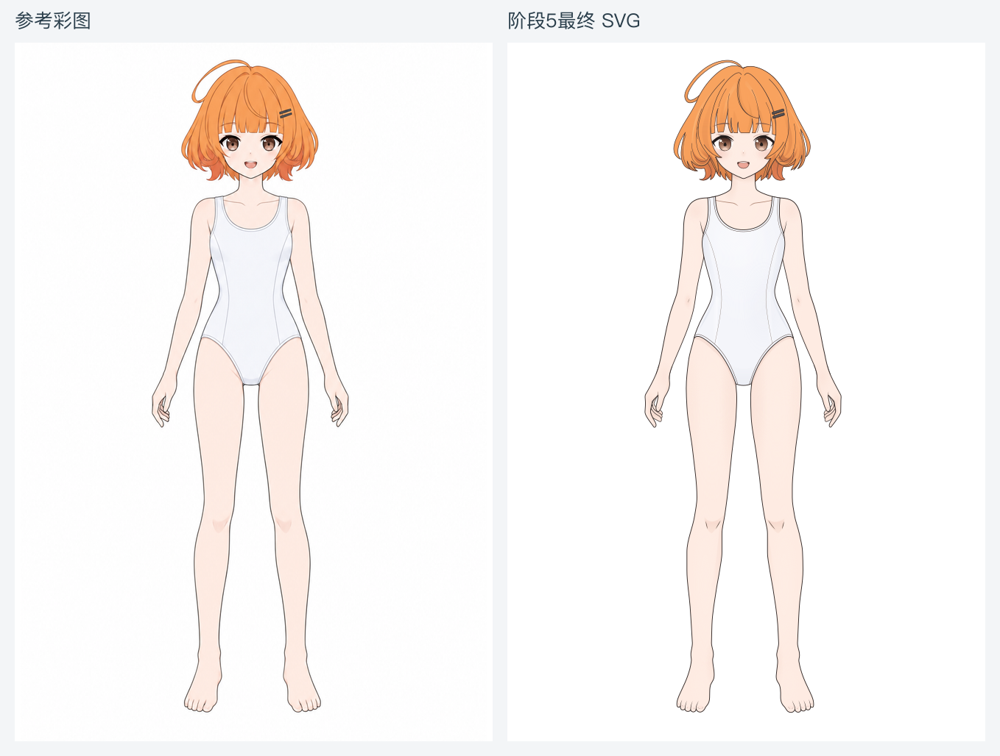
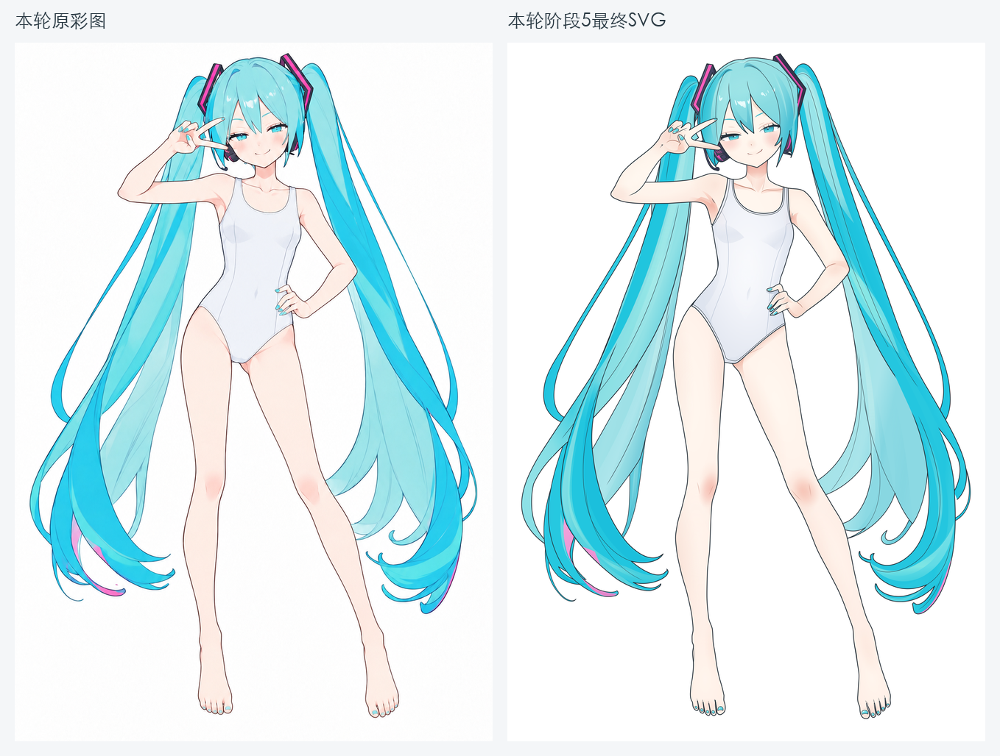
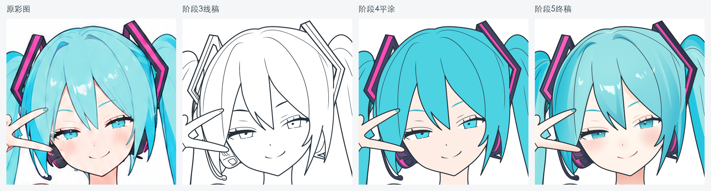
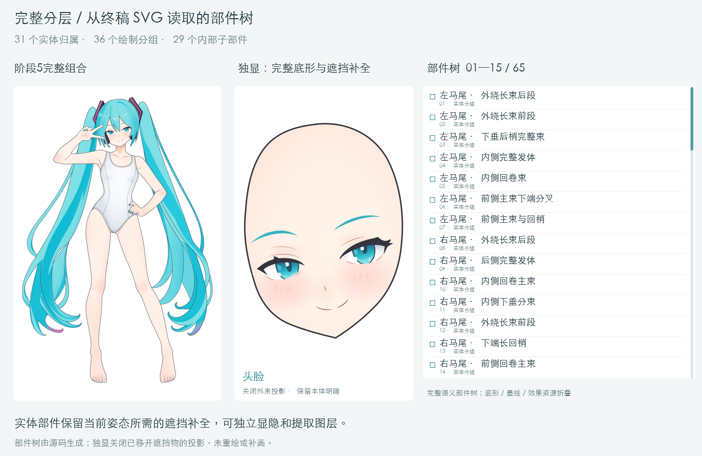

# AstraLayering

利用 AI 将角色参考重绘成**可编辑、可分层、具备遮挡补全的 SVG**，为人物还原、服装替换和后续 2D 动画提供部件基础。

当前有三个技能：**`live2d-layering` 制作人物素体，`live2d-clothing` 制作可替换衣装，`live2d-expressions` 绑定标准基础面部参数**；它们各自按节点配置调度绘制，通用执行规则放在 SKILL.md，具体步骤和制作要求放在对应节点。

人物分层技能的初始分组已改为 `group` 树，第 3 步按最底层 group 绘制和检查色稿；第 4 步及后续接口仍待迁移。

[新旧成果](#效果展示) · [使用技能](#使用技能) · [人物分层流程](./.agents/skills/live2d-layering/readme.md) · [衣装流程](./.agents/skills/live2d-clothing/readme.md) · [SVG 与分组预览器](./loading/svg-preview.html)

## 效果展示

### Jianma：新版人物分层与衣装还原

左侧为穿衣参考，中间为人物分层流程交付的素体，右侧为衣装流程交付的完整 SVG 渲染；以下图片和 SVG 保存自实际运行结果。

[](./demos/jianma-current-case/overview.png)

[查看完整穿戴 SVG](./demos/jianma-current-case/character.svg) · [查看素体 SVG](./demos/jianma-current-case/base.svg) · [独立衣装 SVG](./demos/jianma-current-case/clothing.svg) · [案例说明与原图对照](./demos/jianma-current-case/readme.md)

人物部分已完成眼口内部件、分区头发、身体与手足及配饰的实际细化；衣装包含内外多层、背面补全、袖口前后片和独立附件。当前是默认姿态的静态素材，后续仍须绑定和动态验证；例如纱袖长尾的底形与纹样需统一运动控制，不能只移动底形组。

### 历史流程成果

以下 Milly 与 Miku 案例保留其原始结果和阶段记录，图中左侧为该轮基础角色彩图，右侧为旧流程阶段 5 的 SVG 渲染；当前调用入口统一使用当前对应技能。

### Milly v1

自动调度完成参考准备、阶段1—5及四个节点的独立review。整体姿态和主要轮廓保持较好，眼部层次与肤色细节已补上；头发线质、光泽及手足局部仍有差异。

[](./demos/milly-complete-case/reference-vs-svg.png)

[查看终稿SVG](./outputs/milly_v1/step05-base-character/05-2_局部色彩与材质.svg) · [查看目标彩图](./outputs/milly_v1/references/base-character.png) · [阶段产物与审查记录](./outputs/milly_v1/readme.md)

### Miku v3

已完成阶段1—5，重点改进脸型、头型和发束包脸关系，阶段3实际采用了头型、面部、其余轮廓、内部线、全局精修五步流程。

[](./analysis/miku-v3-review/01_整图对照.png)

[查看终稿SVG](./outputs/miku_v3/step05-base-character/05-2_局部色彩与材质.svg) · [查看目标彩图](./outputs/miku_v3/references/base-character.png) · [全部参考与阶段产物](./outputs/miku_v3/readme.md)

同坐标复核确认：上一轮左脸颊的外鼓明显收回，头顶、刘海和鬓发与脸的关系更贴近参考；校准后的脸型在后续上色中保持。下图依次为原彩图、阶段3线稿、阶段4平涂和阶段5终稿。

[](./analysis/miku-v3-review/02_头部阶段对照.png)

眼睑与睫毛、手足线条以及头发色带和光泽仍有差异。具体证据见[本轮复核](./analysis/miku-v3-review/readme.md)；v3与v2采用不同基础彩图，跨轮评价分别以各自原图为准。

## 使用技能

在 Codex 中打开本仓库，技能位于 `.agents/skills/`；将示例里的路径替换为自己的绝对路径。

### 1. 从角色图制作分层素体

```text
使用 $live2d-layering，完成角色分层与素体制作。
角色参考图：/绝对路径/角色.png
输出目录：/绝对路径/人物输出
```

必需输入是**一张角色图与输出目录**；已有适配参考图时可额外提供。流程按实际部件识别并调度专项，眼口、头发、身体、手足与附属件各有自己的制作方法；临时衣物仅用于中间参考，最终整理为可复用素体。

### 2. 在素体上制作衣装

```text
使用 $live2d-clothing，按参考完成衣装还原。
素体 SVG：/绝对路径/人物素体.svg
穿衣参考图：/绝对路径/衣装参考.png
输出目录：/绝对路径/衣装输出
```

只需**素体 SVG、穿衣参考图、输出目录**，无需提供旧任务、归档或额外交接文件。参考可以是原衣装，也可以是用户指定的新款式；技能负责实际衣层、依附附件、必要补形及穿插，不改变输入素体文件。

衣装最终交付 `final/character.svg`、`clothing.svg`、`clothing-index.json`、预览和对照图；独立衣装需按索引穿插到素体各层之间，不能直接当作一张置顶图片。

### 3. 给已有 SVG 绑定基础面部参数

```text
使用 $live2d-expressions，保持原 SVG 不变，完成标准基础表情参数绑定。
原 SVG：/绝对路径/完整角色.svg
输出目录：/绝对路径/表情输出
```

模型设计参数边界关键形，程序编译连续插值。`basic-face-v1` 包含双眼开合与曲率、双眉高度/角度/曲率、嘴部开合与嘴型，共 12 轴；闭眼时曲率仍能调整。不生成情绪预设，不重画原 SVG，不需要用户手调最大张口或眼睑控制点。

[技能与安装依赖](./.agents/skills/live2d-expressions/SKILL.md) · [边界 JSON 契约](./.agents/skills/live2d-expressions/docs/boundary-rig.md) · [独立参数预览](./.agents/skills/live2d-expressions/tools/preview/boundary-preview.html)。数值通过后仍须逐图和连续调参审查；不承诺任意角色自动获得相同美术质量。

### 续跑、环境与维护

续跑时使用对应技能，提供原输出目录并说明继续位置，例如：

```text
使用 $live2d-layering，继续 /绝对路径/人物输出 中尚未完成的部件。
```

总控根据本轮实际产物、运行记录和当前节点配置接续；模型及推理强度读取各节点 `.model`，独立审查只按配置触发。技能使用语言子 agent 和生图工具，图像生成能力需在运行环境中可用。

各技能自行携带所需 `tools/`；单步骤工具位于该编号步骤的 `tools/`。复制技能时携带对应技能目录即可。运行工具使用 Python、Pillow、Node.js 与 sharp；流程配置校验需要 PyYAML。

`SKILL.md` 仅放通用规则；节点的 `流程.yaml`、提示词、模型标记维护具体制作方法。根目录原 `workflows/` 和 `workflow_clothing/` 已分别迁入两个技能，不保留另一份执行副本；旧 `svg-layering` 已移至 [archive/svg-layering](./archive/svg-layering/SKILL.md)，不再注册为技能。

## 当前工作流

| 技能 | 处理过程 | 最终用途 |
| --- | --- | --- |
| [live2d-layering](./.agents/skills/live2d-layering/SKILL.md) | 参考准备 → 结构识别 → 大层分层 → 按组细化与素体整理 | 具备完整底形、连接面及独立效果的人物素体 |
| [live2d-clothing](./.agents/skills/live2d-clothing/SKILL.md) | 结构与穿戴分析 → 按需补全参考 → 分批线稿及集中结构审查 → 色盘 → 分批着色与导出 | 可替换衣装与完整穿戴稿 |
| [live2d-expressions](./.agents/skills/live2d-expressions/SKILL.md) | 盘点 → 标准参数规划 → 原稿准备 → 边界创作 → 编译与扫描 → 独立审查 | 原 SVG、作者配方、连续可调 controls 与便携预览 |

当前生效的人物分层技能恢复为工具归位后的旧流程。[新流程建设稿](./workflow-next/live2d-layering/readme.md)放在仓库根目录，1—3 步和树游标已建立，第 4 步专项模板仍待迁移。独立衣装由衣装技能制作。

运行时只向 worker 交接对应节点提示词、本轮素材、上游产物和工具；拆分、补全、材质和投影知识已落实在对应提示词，教程原文仅作维护者的设计参考。

## 运行时间与额度

以下为**旧流程 Milly 案例**的一次用户实测估算，不代表当前技能的耗时：

| 项目 | 历史估算 |
| --- | --- |
| 完整运行至旧阶段 5 | 约 2 小时 50 分钟 |
| 额度消耗 | Pro 5x 约 10% |
| Token 消耗 | 约 5kw token |

额度周期与 token 统计口径未细分；实际投入随角色复杂度、模型、制作范围和返修次数变化。

## 完整部件与遮挡补全

SVG按实体部件组织，保留当前姿态所需的隐藏底形：例如发下额头、衣下躯干、被前景遮挡的发根与发束中段。部件可独立显隐、提取图层，底形、墨线、明暗与材质随所属部件保存；同一部件的跨层分段保持关联。

以下动图来自**首次完整案例 case1_miku**，展示其部件树和真实独显效果。它用于说明分层方式；Miku v3的实际结构请加载对应SVG查看。



[首例完整展示](./demos/first-complete-case/readme.md) · [部件树长图](./demos/first-complete-case/parts-tree-full.png) · [独显示例大图](./demos/first-complete-case/isolated-parts.png)

## 查看与对比结果

用浏览器打开[loading/svg-preview.html](./loading/svg-preview.html)，选择或拖入 `structure/groups.json`，右侧图层列表会按 group 树展示；载入匹配的 SVG 后，实际绘制段出现在所属 group 下，可逐级展开、搜索和控制显隐。拖入生成的 SVG 与对应彩图，还可检查整体与局部贴合。页面可离线使用，无需构建或启动服务。

<details>
<summary>SVG预览器功能与常用操作</summary>

- SVG和位图都可放入A／B槽位，支持左右、透明叠加与滑动对比，共用缩放和平移。
- 图层树读取A中SVG的原生嵌套分组，支持搜索、逐项显隐、全部显示／隐藏和恢复；交换A／B可检查另一份SVG。
- 两图按各自最长边等权归一化并居中，不拉伸。不同构图不会因此自动配准；精确对照应使用同版、同画布参考。
- 滚轮缩放、拖动平移；`B`框选放大，`F`或`0`适应窗口，`1`恢复实际大小。触屏支持双指捏合，右下导航可快速定位。
- 可切换棋盘格、浅灰、深色及白色背景，支持全屏和直接输入缩放比例。
- “识别独立图块”按空间关系估计分块；重叠部件和复合路径仍需结合语义判断。

文件在本地处理，SVG原生层级无需额外图层清单。矢量内容随视图重绘，内嵌位图仍受原始分辨率限制；外部资源及脚本不会加载或执行。

</details>

## 当前状态与后续方向

目前验证的是静态分层素材与默认穿戴画面；隐藏补形和独立图层为动画提供基础，X/Y 转向、网格变形、物理摆动、动态遮挡与投影跟随仍需在绑定阶段实际验证，相关实验见 [rigging](./rigging/readme.md)。

衣装细节和复杂材质的还原仍有差异，跨角色的稳定性也需要更多案例；历史案例的审查状态按各自记录保留，Miku v3 终稿注明该轮独立审查不可用。

## 案例与仓库导航

| 入口 | 内容 |
| --- | --- |
| [Jianma 新版成果](./demos/jianma-current-case/readme.md) | 分层素体、独立衣装、默认穿戴及实际使用限制 |
| [Milly v1](./outputs/milly_v1/readme.md) | 旧流程完整运行、指定 review 及历史投入 |
| [Miku v3](./outputs/miku_v3/readme.md) | 旧阶段 1—5、头脸校准与最终彩图 |
| [人物分层技能](./.agents/skills/live2d-layering/readme.md) | 人物分组模板、节点配置、提示词与公共工具 |
| [衣装技能](./.agents/skills/live2d-clothing/readme.md) | 多层衣装、附件、补形与穿插的制作节点 |
| [工作流配置格式](./.agents/skills/live2d-layering/docs/workflow-dsl.md) | 输入输出、条件、循环、会话复用与审查规则 |
| [outputs](./outputs/readme.md) | 案例逐阶段参考、SVG 与记录 |
| [analysis](./analysis/readme.md) | 复核、问题原因与画法研究 |
| [demos](./demos/readme.md) | 新旧成果、完整部件展示与画法对比 |
| [output_bad_cases](./output_bad_cases/readme.md) | 早期失败产物及问题记录 |

<details>
<summary>历史资料</summary>

[旧 svg-layering 资料包](./archive/svg-layering/workflows/readme.md)与 [prompt.txt](./prompt.txt)保留作回溯；[图层契约](./loading/layer-contract.md)和[契约示例](./loading/examples.md)用于阅读早期示例。现行执行入口为两个新技能，预览器读取 SVG 原生分组。

</details>

## 参与实验

欢迎通过 [Issues](https://github.com/wu-tian807/AstraLayering/issues) 讨论问题，或通过 [Pull Requests](https://github.com/wu-tian807/AstraLayering/pulls) 提交工作流改进、SVG 示例、失败案例和动画绑定实验。

分享结果时请注明参考图、所用模型与提示词、阶段目标和实际问题。展示结果放入 `demos/`，当前流程的逐阶段验证放入 `outputs/`，失败复盘放入 `output_bad_cases/`。


## 教程与学习资料

参见 [tutorial](./tutorial/readme.md)：原文字教程、绘画资料与真实 Live2D 资料学习索引，供流程设计者按需查阅。
