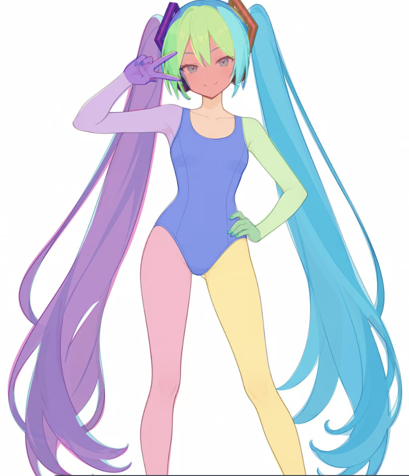

# 当前工作流

这里保存正在逐阶段验证的提示词与输入说明。前置流程准备参考图片；主流程由 Astra 构建 SVG。目前主流程只完成了阶段1、阶段2的模板与首次验证，后续阶段仍待实测。

## 前置流程

| 环节 | 输入与用途 | 入口 |
| --- | --- | --- |
| 前置0：人物平涂生成 | 从角色参考准备平涂人物图；检查人物一致性 | [提示词](./前置0.人物平涂生成/提示词.txt) |
| 前置1：贴身服装生成 | 准备独立的基础连体服款式，可复用已有结果 | [提示词](./前置1.贴身服装生成/贴身服装生成prompt.txt)、[可复用结果](./前置1.贴身服装生成/可复用结果.jpg) |
| 前置2：人物服装替换 | 角色图＋服装单品图，生成姿势与身份保持一致的基础角色彩图 | [提示词](./前置2.人物服装替换/生成提示词.txt) |
| 前置3 / step1：识别可见部件 | 基础角色彩图交给 LLM，输出一句简短部件清单 | [LLM 提示词](./前置3.人物部件色块拆分图/step1/提示词_llm.txt) |
| 前置3 / step2：生成色块图 | 同一张基础角色彩图＋step1 清单，生成原位可见部件标记图 | [生图提示词](./前置3.人物部件色块拆分图/step2/生成提示词.txt) |

色块图只说明当前可见部分的归属。它不补全隐藏形体，颜色也不代表深度；应先确认与基础角色彩图一致，再交给 SVG 阶段。

## 主流程

| 阶段 | 当前工作与交付 | 状态 |
| --- | --- | --- |
| [1. 确定基础角色与补全范围](./1.确定基础角色与补全范围/生成提示词.txt) | 基础角色彩图 → 关键点、补全范围、关键遮挡的简短 Markdown | 已有模板和验证结果 |
| [2. 建立完整部件与遮挡](./2.建立完整部件与遮挡/生成提示词.txt) | 基础角色彩图＋确认后的色块图＋阶段1 Markdown → 完整分层色块 SVG 和四格检查图 | 首次验证基本通过，局部搭接待修 |
| 3. 建立可用线稿 | 依据原图精修可见轮廓和内部线条，保留完整部件 | 待制定、验证 |
| 4. 完整底形与基础填色 | 沿用完整底形赋色，检查色块与可见线条的一致性 | 待制定、验证 |
| 5. 大明暗与材质 | 在各部件内部建立体积与材质表达 | 待制定、验证 |
| 6. 最终边缘与细节 | 调整线色、边缘与焦点细节，核对全图及局部 | 待制定、验证 |

阶段2的底形允许在阶段3重新拟合曲线、调整局部分段。隐藏补全边和部件拼接边不自动成为最终线稿，不能给所有闭合路径统一描边。

### 本次主流程实测记录

以下耗时由用户记录。两个阶段均在 **Codex** 中运行，模型为 **Astra**，推理强度为 **极高**。

| 阶段 | 本次耗时 |
| --- | --- |
| 1. 确定基础角色与补全范围 | 30 分钟 |
| 2. 建立完整部件与遮挡 | 约 60 分钟 |

### 阶段2：与参考图叠加核对

下图为用户提供的阶段2 SVG 与基础角色彩图的叠加截图。人物姿态、身体轮廓与主发束走向的吻合度很高，可以直观看到本次结构构建的外观还原程度。

图中的五官、线稿与明暗细节来自叠加的参考彩图；阶段2 SVG 本身仍是完整分层色块底形。隐藏部件的完整性另见 [四格结构检查图](../outputs/step02-base-character/02_结构检查.png)。

## 如何提供输入

- `.placeholder` 是输入说明：通过外部文件或图片附件提供所需素材，不能把占位文件本身当成实际参考。
- 图片输入不使用 `{参考图1}` 等文本变量。前置3的 `{step1}` 只替换为上一步 LLM 生成的部件清单。
- 主流程阶段1与“前置1”是不同环节；阶段2需要的规划是主流程阶段1产出的 Markdown。
- 实际产物和当前验证状态见 [outputs](../outputs/readme.md)。旧 [prompt.txt](../prompt.txt) 已废弃，不作为现行流程入口。
